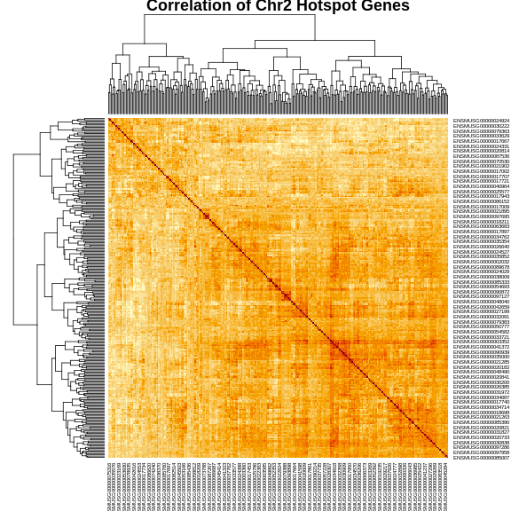
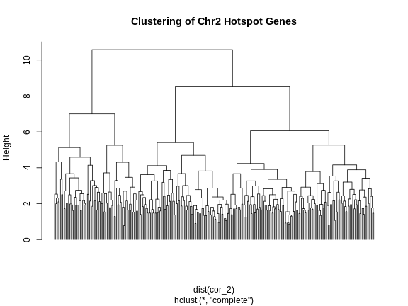
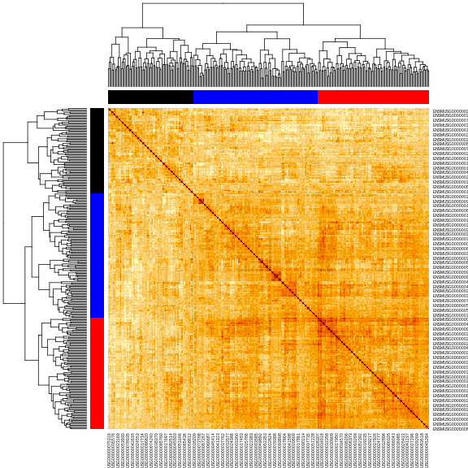

:::::::::::::::::::::::::::::::::::::: questions 

- How do I create and interpret a transcriptome map?

::::::::::::::::::::::::::::::::::::::::::::::::

::::::::::::::::::::::::::::::::::::: objectives

- Describe a transcriptome map.
- Interpret a transcriptome map.

::::::::::::::::::::::::::::::::::::::::::::::::


``` error
Error in readRDS(file = url("https://thejacksonlaboratory.box.com/shared/static/4hy4hbjyrxjbrzh570i4g02r62bx3lgk.rds")): cannot read from connection
```

### Local and Distant eQTL

In the previous lesson, we saw that the QTL peak for a gene can lie directly
over the gene that is being mapped. This is called a _local eQTL_ because the
QTL peak is located near the gene. When the QTL peak is located far from the
gene being mapped, we call this a _distal eQTL_. When the QTL peak is located
on the same chromosome as the gene, there are different heuristics regarding the
distance between the gene and its QTL peak that we use to call an eQTL local
or distal. This depends on the type of cross and the resolution of the 
recombination block structure.

In this episode, we will create a table containing the QTL peaks for all genes
and the gene positions. We will then classify QTL into local or distal and 
will make a plot of all off the eQTL in relation to the gene positions. First
let's load the libraries and data again in case these are no longer in your
environment.


``` r
library(tidyverse)
library(qtl2)

pheno    = readRDS('data/attie_do_pheno.rds')
addcovar = readRDS('data/attie_do_addcovar.rds')
annot    = readRDS('data/attie_do_expr_annot.rds')
expr_rz  = readRDS('data/attie_do_expr_rz.rds')
probs    = readRDS('data/attie_DO500_genoprobs_v5.rds')
map      = readRDS('data/attie_do_map.rds')
K        = readRDS('data/attie_do_kinship.rds')
peaks    = readRDS('data/attie_do_eqtl_peaks.rds')
```

### Transcriptome Map

We have encapsulated the code to create a transcriptome map in a file in this
lesson. You can copy this file from the Github repository to use in your eQTL 
mapping project. We will read this file in now.


``` r
source("https://raw.githubusercontent.com/smcclatchy/eqtl-mapping/refs/heads/main/episodes/code/gg_transcriptome_map.R")
```

This file loads in a function called `ggtmap`, which requires the input data
to be in a specific format. 

In order to use the `ggtmap` function, we need to provide specific column names. 
These are documented in the `gg_transcriptome_map.R` file in the code directory 
of this workshop. The required column names are:

* `data`: data.frame (or tibble) with the following columns:
    * `gene_id`: (required) character string containing the Ensembl gene ID.
    * `qtl_chr`: (required) character string containing QTL chromosome.
    * `qtl_pos`: (required) floating point number containing the QTL position in 
    Mb.
    * `qtl_lod`: (optional) floating point number containing the LOD score.
    * `gene_chr`:  (optional) character string containing transcript chromosome.
    * `gene_start`: (optional) character string containing transcript start 
    position in Mb.
    * `gene_end`:  (optional) character string containing transcript end 
    position in Mb.

First, we will get the gene positions from the annotation and rename the 
columns to match what `ggtmap` requires. We need to have columns named 
`gene_id`, `gene_chr`, and `gene_pos`. We must rename the columns because, when 
we are finished, we will have `chr` and `pos` columns for both the gene and its 
QTL. We will also add the `symbol` column since it is nice to have gene symbols 
in the data. 


``` r
gene_pos <- annot |>
              select(gene_id, symbol, 
                     gene_chr   = chr, 
                     gene_start = start,
                     gene_end   = end)
```

Next, we will rename the columns in the filtered peaks and will join them with
the gene positions from above. 


``` r
eqtl <- peaks |>
          select(gene_id = lodcolumn,
                 qtl_chr = chr,
                 qtl_pos = pos,
                 qtl_lod = lod) |> 
          left_join(gene_pos, by = "gene_id") |> 
          mutate(marker.id = str_c(qtl_chr,   qtl_pos * 1e6, sep = "_"),
                 gene_chr  = factor(gene_chr, levels = c(1:19, "X")),
                 qtl_chr   = factor(qtl_chr,  levels = c(1:19, "X")))

rm(gene_pos)
```


::::::::::::::::::::::::::::::::::::: challenge 

#### Challenge 1: How many genes have QTL on the same chromosome?

Write a command to count the number of genes which are located on the same
chromosome as their corresponding QTL peak.

:::::::::::::::::::::::: solution 


``` r
sum(eqtl$qtl_chr == eqtl$gene_chr, na.rm = TRUE)
```

``` output
[1] 15105
```

15105 genes have QTL on the same
chromosome.

:::::::::::::::::::::::::::::::::
::::::::::::::::::::::::::::::::::::::::::::::::

We can tabulate the number of local and distal eQTL that we have and add this to 
our QTL summary table. A local eQTL occurs when the QTL peaks is directly over 
the gene position. But what if it is 2 Mb away? Or 10 Mb? It's possible that a 
gene may have a distal eQTL on the same chromosome if the QTL is "far enough" 
from the gene. In 
[Keller et al](https://pmc.ncbi.nlm.nih.gov/articles/PMC5937189/), 
the authors selected a 4 Mb distance from the corresponding gene and we will use 
this threshold.


``` r
eqtl <- eqtl |> 
          mutate(local = if_else(qtl_chr == gene_chr & 
                                 abs(gene_start - qtl_pos) < 4, 
                                     TRUE, 
                                     FALSE))
count(eqtl, local)
```

``` output
  local     n
1 FALSE 28875
2  TRUE 14066
```

### Plot Transcriptome Map

In [Keller et al](https://pmc.ncbi.nlm.nih.gov/articles/PMC5937189/), the 
authors used a LOD threshold of 7.2 to select genes to use in their 
transcriptome map. We will use this threshold to reproduce their results as 
closely as possible.


``` r
eqtl_thr = 7.2

ggtmap(data = eqtl |> 
                filter(qtl_lod      >= eqtl_thr), 
                       local.points = TRUE, 
                       local.radius = 4)
```


The plot above is called a *transcriptome map* because it shows the positions of 
the genes (or transcripts) and their corresponding QTL. The QTL position is 
shown on the X-axis and the gene position is shown on the Y-axis. The 
chromosomes are listed along the top and right of the plot. 


:::::::::::::::::::::::::::::::::::::::::::::::::::::::::::::: challenge

#### Challenge 2: What are the blue points on the diagonal?

What type of QTL are the genes with QTL that are located along the diagonal?

::::::::::::::::::::::::::::::::::::: solution

Points on the diagonal have QTL that are located in the same position as the
gene, and so are local eQTL.

::::::::::::::::::::::::::::::::::::::::::::::

#### Challenge 3: Are there any genome locations with many QTL?

Look at the transcriptome map and see if you can find any vertical stripes?
What do these vertical stripes mean and what might cause them?

::::::::::::::::::::::::::::::::::::: solution

There are vertical stripes on chromosomes 2, 5, and 11. There may be more, 
depending on how you look at the plot. Since the QTL position is on the X-axis,
these stripes represent genes which are located through out the genome, but all
have a QTL in the same location.

These stripes imply that there is some genomic feature at the QTL position
which regulates the expression levels of many genes. This might be a 
transcription factor or some other molecule which can regulate transcription,
possibly through multiple steps.

::::::::::::::::::::::::::::::::::::::::::::::
::::::::::::::::::::::::::::::::::::::::::::::::::::::::::::::::::::::::

If you look at the plot, there are vertical bands of points which stack over a
single QTL location. These are called *eQTL hotspots*. Rather than look at the
transcriptome map, it may be easier to look at the density of the eQTL along
the genome. We have provided a function called `eqtl_density_plot` to do this.


``` r
eqtl_density_plot(eqtl, lod_thr = eqtl_thr)
```


The plot above shows the mouse genome on the X-axis and the number of 
transcripts in a 4 Mb window on the Y-axis. It is difficult to say how many 
genes must be involved to call something and eQTL hotspot. There are
permutation-based methods which require a large amount of time and memory. In
this case, we have called hotspots involving more than 100 genes eQTL hotspots.

Note that there appears to be an eQTL hotspot on chromosome 7 in the plot above,
but this is not evident in the transcriptome map.


``` r
eqtl_density_plot(filter(eqtl, local == FALSE),
                  lod_thr = eqtl_thr) +
  labs(title = "Distant eQTL Density")
```


``` r
eqtl_density_plot(filter(eqtl, local == TRUE), 
                  lod_thr = eqtl_thr) +
  labs(title = "Local eQTL Density")
```


From these two plots, it appears that the eQTL hotspots on most chromosomes 
contain distant eQTL. 

::::::::::::::::::::::::::::::::::::::::::::::::::::: challenge

#### Challenge 4: Compare results to Keller et al.

Look at figure 3 in [Keller et al](https://pmc.ncbi.nlm.nih.gov/articles/PMC5937189/).
How do the eQTL density plots compare to their results?

::::::::::::::::::::::::::::::::::::::: solution

The eQTL density plots are largely similar. The hotspot on chromosome 11 
contains more genes in our analysis than in the paper.

::::::::::::::::::::::::::::::::::::::::::::::::

:::::::::::::::::::::::::::::::::::::::::::::::::::::::::::::::

How can we find the location of the eQTL hotspots and the genes which lie
within each eQTL? We have written a function called `get_eqtl_hotspots` to help 
you and have provides it in `gg_transcriptome_map.R`. It requires the eQTL data,
a LOD threshold to filter the peaks, the number of genes required to call a
locus a hotspot, and the radius in Mb around the hotspot to use when selecting
genes which are part of the hotspot. We will use a 2 MB radius around the
hotspot, but may refine that later.


``` r
hotspots <- get_eqtl_hotspots(data           = eqtl, 
                              lod_thr        = 7, 
                              hotspot_thr    = 200,
                              hotspot_radius = 2)
```

Let's see how many hotspots we have and how many genes are in each hotspot.


``` r
sapply(hotspots, nrow)
```

``` output
  2   5   7  11 
271 257 273 268 
```

In the table above, the first row of values are the chromosomes on which 
hotspots occur. The second row contains the number of genes in each hotspot.

Where does each hotspot occur? We can get this information by taking the mean
of the eQTL positions in each hotspot.


``` r
sapply(hotspots, function(z) { mean(z$qtl_pos) })
```

``` output
        2         5         7        11 
164.00699 146.30691  45.49353  70.47718 
```

Let's look at some of the genes in the chromosome 2 hotspot.


``` r
head(hotspots[["2"]])
```

``` output
             gene_id qtl_chr  qtl_pos   qtl_lod        symbol gene_chr
1 ENSMUSG00000082514       2 162.0824 10.816809       Gm11452        2
2 ENSMUSG00000021902       2 162.3910  7.192061          Phf7       14
3 ENSMUSG00000021285       2 162.3945  7.576862      Ppp1r13b       12
4 ENSMUSG00000094856       2 162.5281 51.759581       Gm21962        3
5 ENSMUSG00000053141       2 162.6222 79.169112         Ptprt        2
6 ENSMUSG00000087267       2 162.6222 74.916874 4933427J07Rik        2
  gene_start  gene_end   marker.id local
1   162.9079 162.90861 2_162082435  TRUE
2    31.2377  31.25122 2_162391032 FALSE
3   111.8285 111.90805 2_162394483 FALSE
4   137.6715 137.67254 2_162528109 FALSE
5   161.5220 162.66115 2_162622197  TRUE
6   128.9557 128.95786 2_162622197 FALSE
```

Let's also look at the positions of the eQTL for these genes by making a
histogram of the positions.


``` r
par(plt = c(0.1, 0.99, 0.22, 0.9))
plot(table(hotspots[["2"]]$qtl_pos), 
     las    = 2,
     main   = "Positions of Chr 2 eQTL",
     xlab   = "",
     ylab   = "Number of Genes")
```


From the plot above, we can see that many genes have eQTL which stack up around 
164 Mb. Are the other genes part of the same regulatory network? 

Let's look at the correlation of all of these genes with each other. First, we
will get the genes from the expression data.


``` r
expr_2 <- expr_rz[,hotspots[["2"]]$gene_id]
```

Next, we will get the correlation of the genes with each other an make a 
heatmap.


``` r
cor_2 <- cor(expr_2)
heatmap(cor_2, symm = TRUE, main = "Correlation of Chr2 Hotspot Genes")
```



The plot above shows a clustered heatmap in which red indicates positive
correlation and yellow indicates negative correlation.There are "dendrograms"
on the top and left, indicating the sort order. 

We can split the genes into clusters by telling R how many clusters we want.
It will use the dendrogram to select a split which gives the requested number
of clusters. We are arbitrarily selecting three clusters.


``` r
cl     <- hclust(dist(cor_2))
plot(cl, labels = FALSE, hang = -1, main = "Clustering of Chr2 Hotspot Genes")
```



``` r
cl_cut <- cutree(tree = cl, k = 3)
```

Let's look at the number of genes and the median eQTL position of these clusters. 


``` r
cl_spl <- split(cl_cut, cl_cut)
for(subcl in cl_spl) {
  
  cl_annot <- filter(hotspots[["2"]], gene_id %in% names(subcl))
  cl_expr  <- expr_2[,names(subcl)]
  
  print(paste(nrow(cl_annot), median(cl_annot$qtl_pos)))

} # for(i)
```

``` output
[1] "72 164.0704045"
[1] "94 164.022416"
[1] "105 164.022416"
```

``` r
rm(cl_spl)
```

Next, let's make the heatmap again and place the cluster colors on the axes.


``` r
cols <- c('black', 'red', 'blue', 'orange')[cl_cut]
heatmap(cor_2, symm = TRUE, RowSideColors = cols, ColSideColors = cols)
```



In this case, we will filter the chromosome 2 hotspot to only include the genes 
with an eQTL between 163.5 and 164.5 Mb.


``` r
hot_2 <- hotspots[["2"]] |>
           filter(abs(qtl_pos - 164) < 0.5)
```

How many genes are there in the chromosome 2 hotspot now?


``` r
nrow(hot_2)
```

``` output
[1] 149
```

### Principal Component of eQTL Hotspot Genes

One way to summarize the expression of genes in an eQTL hotspot is to take the
first principal component (PC1) of all of the genes in the hotspot. PC1 should
capture the largest amount of variance in the eQTL hotspot and we can use this
as a phenotype to map the hotspot.


``` r
expr_2 <- expr_rz[,hot_2$gene_id]
pca_2  <- princomp(expr_2)
pc1_2  <- pca_2$scores[,1,drop = FALSE]
```

We can then map PC1 as a phenotype and we should have a large QTL peak in the 
same location as the hotspot.


``` r
pc1_lod <- scan1(genoprobs = probs,
                 pheno     = pc1_2,
                 kinship   = K,
                 addcovar  = addcovar)
```

``` error
Error: object 'probs' not found
```

``` r
plot_scan1(pc1_lod, map, main = "PC1 of Chr 2 Hotspot")
```

``` error
Error: object 'pc1_lod' not found
```

We can also look at the founder allele effects at the peak. We will use a 
function in `gg_transcriptome_map.R` called `plot_fit1()`.


``` r
peaks <- find_peaks(pc1_lod, map, threshold = 20)
```

``` error
Error: object 'pc1_lod' not found
```

``` r
pr    <- pull_genoprobpos(genoprobs = probs, 
                          map       = map, 
                          chr       = peaks$chr[1], 
                          pos       = peaks$pos[1])
```

``` error
Error: object 'probs' not found
```

``` r
mod   <- fit1(genoprobs = pr,
              pheno     = pc1_2, 
              kinship   = K[[peaks$chr[1]]], 
              addcovar  = addcovar)
```

``` error
Error: object 'pr' not found
```

``` r
plot_fit1(mod) +
  labs(title = "Chr 2 Hotspot Allele Effects",
       x     = "Founder",
       y     = "Founder Allele Effects") +
  theme(text = element_text(size = 20))
```

``` error
Error: object 'mod' not found
```

From the plot above, we can see that NZO and WSB have allele effects which are
different from the other strains. The direction of the allele effects is
arbitrary in the principal components, so we can't determine the direction of
the allele effects from this plot.

::::::::::::::::::::::::::::::::::::: keypoints 

- Transcriptome maps aid in understanding gene expression regulation.
- Local eQTL occur more frequently than distant eQTL.
- Local eQTL appear along the diagonal in a transcriptome map and distant eQTL
appear on the off-diagonal.
- Stacks of eQTL which appear over a single locus are called *eQTL hotspots* and
represent sets of genes which are transcriptionally regulated by a single locus.
- The first principal component of genes in and eQTL hotspot can be used to 
summarize the genes in the hotspot.

::::::::::::::::::::::::::::::::::::::::::::::::
