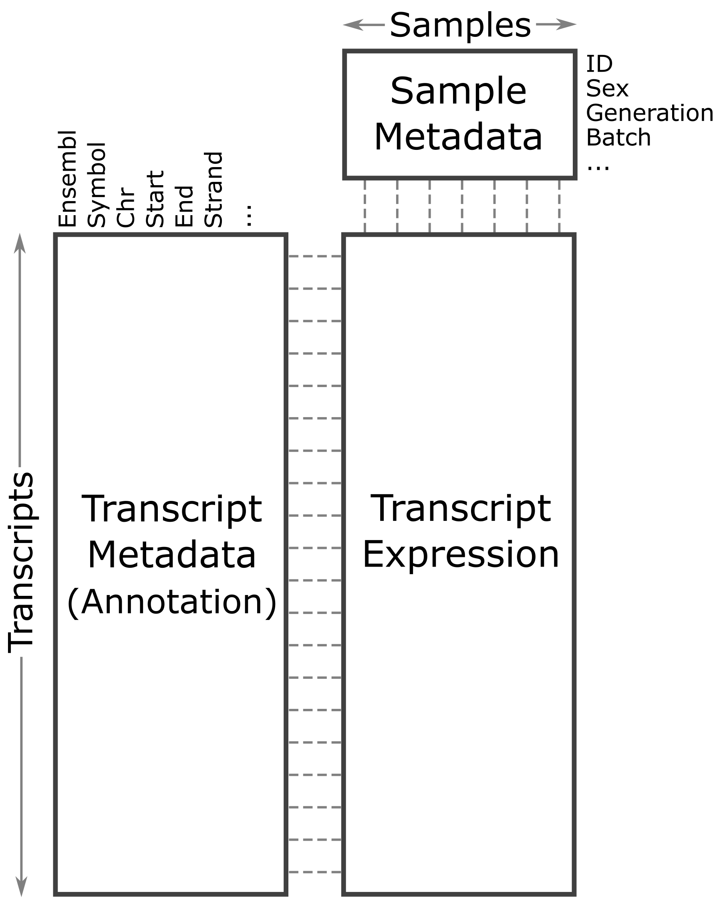

:::::::::::::::::::::::::::::::::::::: questions 

- What data are required for eqtl mapping?

::::::::::::::::::::::::::::::::::::::::::::::::

::::::::::::::::::::::::::::::::::::: objectives

- To provide an example and exploration of data used for eqtl mapping.

::::::::::::::::::::::::::::::::::::::::::::::::

```{r load_libraries}
suppressPackageStartupMessages(library(knitr))
suppressPackageStartupMessages(library(ggbeeswarm))
suppressPackageStartupMessages(library(tidyverse))
suppressPackageStartupMessages(library(qtl2))
suppressPackageStartupMessages(library(DESeq2))
```

## Physiological Phenotypes

The complete data used in these analyses are available from 
[Data Dryad](https://doi.org/10.5061/dryad.pj105). 

Load in the physiological phenotypes.

```{r load_pheno}
# load the data
pheno       <- readRDS(file = 'data/attie_do_pheno.rds')
pheno_dict  <- readRDS(file = 'data/attie_do_pheno_dict.rds')
covar       <- readRDS(file = 'data/attie_do_covar.rds')
```

See the [data dictionary](data/Attie-232_Attie_DO_Islets-dictionary.csv) to 
see a description of each of these phenotypes. You can also view a table of
the data dictionary.

```{r dict_phenos}
pheno_dict |> 
  select(description, formula) |> 
  kable()
```

### Phenotype Distributions

Boxplots are a great way to view the distribution of the data and to identify 
any outliers. We will be using the total area under the curve of insulin from 
the glucose tolerance test (Ins_tAUC). 

We will log-transform the data using the 
[scale_y_log10()](https://ggplot2.tidyverse.org/reference/scale_continuous.html)
function. We have also overlaid the data points using ggbeeswarm's
[geom_beeswarm](https://www.rdocumentation.org/packages/ggbeeswarm/versions/0.7.2/topics/geom_beeswarm).
We have told `geom_beeswarm()` to plot the points with some transparency using 
the argument "alpha = 0.2". The alpha argument ranges between 0 (completely 
transparent) to 1 (completely opaque). A value of 0.1 means mostly transparent.

```{r Ins_tAUC_boxplot,fig.width=8,fig.height=6,warning=FALSE}
# plot Insulin on a log 10 scale
ggplot(pheno, aes(sex, Ins_tAUC)) +
  geom_boxplot() +
  geom_beeswarm(alpha = 0.2) +
  scale_y_log10() +
  labs(title = "Insulin tAUC", y = "Insulin tAUC") +
  theme(text = element_text(size = 20))
```

::::::::::::::::::::::::::::::::::::: challenge 

## Challenge 1

How many orders of magnitude (powers of 10) does Insulin tAUC span?  

:::::::::::::::::::::::: solution 

Insulin tAUC spans three orders of magnitude, from near 10 to over 1000.  

:::::::::::::::::::::::::::::::::


## Challenge 2

Which sex has higher median Insulin tAUC values?  

:::::::::::::::::::::::: solution 

Males have higher Insulin tAUC than females.  

:::::::::::::::::::::::::::::::::
::::::::::::::::::::::::::::::::::::::::::::::::

The boxplot is a useful visualizations which you can use to visualize 
the distribution of your data.

### Quality Control of Data

Many statistical tests rely upon the data having a "normal" (or Gaussian) 
distribution. Many biological phenotypes do not follow this distribution and
must be transformed before analysis. This is why we log-transformed the data
in the plots above. 

While we can "eyeball" the distributions in the boxplot, it would be 
better to use a "quantile-quantile" plot. 

```{r qqplot,fig.width=8,fig.height=6,warning=FALSE}
pheno |> 
  ggplot(aes(sample = Ins_tAUC)) +
    stat_qq() +
    geom_qq_line() +
    facet_wrap(~sex) +
    labs(title = "Quantile-Quantile Plot of Ins_tAUC",
         x     = "Normal Quantiles",
         y     = "Ins_tAUC") +
    theme(text = element_text(size = 20))
```

In these plots, the "quantiles" of the normal distribution are plotted on the
X-axis and the data are plotted on the Y-axis. The line indicates the 
quantiles that would be followed by a normal distribution. The untransformed
data do **not** follow a normal distribution because the points are far from
the line.  

Next, we will log-transform the data and then create a quantile-quantile plot.

```{r qqplot_log,fig.height=6,fig.width=8,warning=FALSE}
pheno |> 
  mutate(Ins_tAUC = log(Ins_tAUC)) |> 
  ggplot(aes(sample = Ins_tAUC)) +
    stat_qq() +
    geom_qq_line() +
    facet_wrap(~sex) +
    labs(title = "Quantile-Quantile Plot of log(Ins_tAUC)",
         x     = "Normal Quantiles",
         y     = "log(Ins_tAUC)") +
    theme(text = element_text(size = 20))
```

::::::::::::::::::::::::::::::::::::: challenge 

## Challenge 3

Does the log transformation make the data more Normally distributed? Explain 
your answer.

:::::::::::::::::::::::: solution 

Yes. The log transformation makes the data more normally distributed because
the data points follow the normality line more closely. 

:::::::::::::::::::::::::::::::::

## Challenge 4

Do any data points look suspicious to you? Explain your answer.

:::::::::::::::::::::::: solution 

The data points that deviate from the normality line would be worth
investigating. All data deviates somewhat from normality, but the three
lowest points in the male data plot would be worth investigating. They may
be real, but there may also have been mishap in the assay.

:::::::::::::::::::::::::::::::::
::::::::::::::::::::::::::::::::::::::::::::::::

Another way to identify outliers is to standardize the data and look for data 
points that are more than four standard deviations from the mean.

To do this, we will log transform and standardize Insulin tAUC. 

```{r pheno_std,fig.width=8,fig.height=6,warning=FALSE}
ins_tauc = pheno |> 
             select(mouse, sex, Ins_tAUC) |>
             group_by(sex) |> 
             mutate(Ins_tAUC = log(Ins_tAUC),
                    Ins_tAUC = scale(Ins_tAUC))

ins_tauc |> 
  ggplot(aes(x = sex, y = Ins_tAUC)) +
    geom_boxplot() +
    geom_beeswarm(alpha = 0.2) +
    geom_hline(aes(yintercept = -4), color = 'red') +
    geom_hline(aes(yintercept =  4), color = 'red') +
    labs(title = "Distribution of Standardized Ins_tAUC") +
    theme(text = element_text(size = 20))
```

There are no data points outside of the four standard deviation limits.

## Gene Expression Data

Let's read in the gene expression data. This has been compiled in

```{r load_expression_data}
annot <- readRDS(file = 'data/attie_do_expr_annot.rds')
raw   <- readRDS(file = 'data/attie_do_expr_raw.rds')
```

We have loaded in two data objects: 

1. annot: data.frame containing gene annotation,
2. raw: numeric matrix containing the un-normalized expression counts,

::::::::::::::::::::::::::::::::::::: challenge 

## Challenge 5: How many samples and genes are there?

:::::::::::::::::::::::: solution 

Use the `dim` command or the Environment tab to determine the number of samples 
and genes in `raw`.

```{r challenge5}
dim(raw)
```

There are 378 samples and 21,771 genes.

:::::::::::::::::::::::::::::::::
::::::::::::::::::::::::::::::::::::::::::::::::

The expression objects that we have loaded in are organized such that the 
transcripts and samples are aligned between the objects. The figure below may
help you to visualize the relationship between the expression, annotation,
and covariates.

{alt="Figure showing relationship between samples, expression, and transcripts."}

Let's look at the rows in the gene annotation object.

```{r view_annot_rawCounts_metadata}
head(annot)
```

There are many columns in the gene annotation file, including the Ensembl ID,
gene symbol, chromosome, start and end of the gene.

Next, let's look at the sample covariates.

```{r view_covar}
head(covar)
```

The sample covariates have information about the sex and DO generation, 
indicated as "DOwave", of each mouse.

In order to make reasonable gene comparisons between samples, the count data 
needs to be normalized. In the quantile-quantile (Q-Q) plot below, count data for 
the first gene are plotted over a diagonal line tracing a normal distribution 
for those counts. Notice that most of the count data values lie off of this 
line, indicating that these gene counts are not normally distributed. 

```{r view_manual_qqplot_raw,fig.height=6,fig.width=8,echo=FALSE,warning=FALSE}
raw |> 
  as.data.frame() |> 
  ggplot(aes(sample = ENSMUSG00000000001)) +
    stat_qq() +
    geom_qq_line() +
    labs(title = 'Count distribution for gene ENSMUSG00000000001',
         xlab = 'Normal percentiles', y = 'Count percentiles') +
    theme(text = element_text(size = 20))
```

Q-Q plots for the first six genes show that count data for these genes are not
normally distributed. They are also not on the same scale. The y-axis values for
each subplot range to 20,000 counts in the first subplot, 250 in the second, 90
in the third, and so on. 

```{r view_qqplots_raw,fig.width=8,fig.height=6}
raw |> 
  as.data.frame() |>
  select(ENSMUSG00000000001:ENSMUSG00000000058) |> 
  pivot_longer(cols = everything(), names_to = 'gene', values_to = 'value') |> 
  ggplot(aes(sample = value)) +
    stat_qq() +
    geom_qq_line() +
    facet_wrap(~gene, scales = 'free') +
    labs(title = 'Count distribution for six genes',
         xlab = 'Normal percentiles', y = 'Count percentiles') +
    theme(text = element_text(size = 20))
```

Since each gene has a different distribution, we will need to normalized the
gene expression data. We will do this in a future lesson.

::::::::::::::::::::::::::::::::::::: keypoints 

- It is important to inspect the phenotype distributions and to transform them
to be nearly normal.

::::::::::::::::::::::::::::::::::::::::::::::::

[r-markdown]: https://rmarkdown.rstudio.com/
