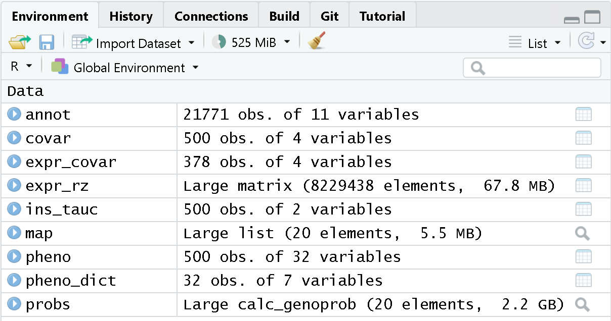

:::::::::::::::::::::::::::::::::::::: questions 

- What are the steps in QTL mapping?
- How do I map one gene expression trait?

::::::::::::::::::::::::::::::::::::::::::::::::

::::::::::::::::::::::::::::::::::::: objectives

- Review the steps in QTL mapping.
- Run a QTL analysis for expression data.

::::::::::::::::::::::::::::::::::::::::::::::::

```{r setup, echo=FALSE, warning=FALSE}
# Load libraries & data for website build.
suppressPackageStartupMessages(library(knitr))
suppressPackageStartupMessages(library(tidyverse))
suppressPackageStartupMessages(library(qtl2))
suppressPackageStartupMessages(library(DESeq2))
pheno      <- readRDS(file = 'data/attie_do_pheno.rds')
pheno_dict <- readRDS(file = 'data/attie_do_pheno_dict.rds')
covar      <- readRDS(file = 'data/attie_do_covar.rds')
covar$DOwave <- factor(covar$DOwave)
addcovar   <- model.matrix(~sex + DOwave, data = covar)[,-1]
annot      <- readRDS(file = 'data/attie_do_expr_annot.rds')
raw        <- readRDS(file = 'data/attie_do_expr_raw.rds')
map        <- readRDS(file = 'data/attie_do_map.rds')
probs      <- readRDS(file = url('https://thejacksonlaboratory.box.com/shared/static/4hy4hbjyrxjbrzh570i4g02r62bx3lgk.rds'))
K          <- readRDS(file = 'data/attie_do_kinship.rds')
ins_tauc <- pheno[, 'Ins_tAUC', drop = FALSE]
ins_tauc$Ins_tAUC_log <- log(ins_tauc$Ins_tAUC)
```


## Expression Data

In this lesson we review mapping steps and apply those steps to a gene 
expression trait. In a previous lesson, we loaded in the raw transcript
expression data and noticed that the distribution of each gene was non-Gaussian
and different.

There is another issue that we must also address. Each sample has a 
different total number of counts. This affects our ability to compare values 
between samples. For example, say that we look at the expression of Gene1 in 
two samples and find that both samples have 500 counts for Gene1. It appears 
that Gene1 is equally expressed in both samples. However, suppose that the total
counts (_i.e._ the sum of counts for all genes in each sample) is 10 million for
sample 1 and 20 million for sample 2. The sum of all counts across all genes in 
a sample is also called the *library size*. Then we need to scale the counts for Gene1 by the total counts. This is shown in the table below.

 Sample | Gene1 Counts | Total Counts | Proportion
--------+--------------+--------------+------------
    1   |     500      |    10e6      |   5e-05
    2   |     500      |    20e6      |  2.5e-05

In this case, we can see that Gene1 has lower expression in sample 2 compared
to sample 1. Although the actual adjustment for library size (i.e. total
counts) is more complicated, this is the rationale for adjusting each sample.

Let's plot a histogram of the total counts in each sample.

```{r hist_total_counts, fig.width=8, fig.height=6}
hist(rowSums(raw) * 1e-6,
     breaks = 50, 
     main   = "Histogram of Total Counts per Sample",
     xlab   = "Total Counts (Millions)")
```

As you can see, total counts range from 15 to 50 million reads.

To recap, before we perform any analysis using the transcript expression data,
we need to:  

1. normalize it by adjusting for library size and  
2. transform the expression of each gene to be Gaussian.

### Normalizing Gene Expression

We will use the 
[DESeq2](https://bioconductor.org/packages/release/bioc/html/DESeq2.html) 
package to adjust the counts for library size. DESeq2 is a large package which
performs many types of analyses. Further details are in the
[DESeq2 Tutorial](https://bioconductor.org/packages/devel/bioc/vignettes/DESeq2/inst/doc/DESeq2.html).

First, we must create a DESeq object. We need the raw counts, rounded so that
all values are integers, and the sample covariate data. We will have to subset
the sample covariates to include only the expression samples, since we don't
have expression data for every mouse.

Recall that there are 500 mice in the covariate data. The mouse IDs are in the
rownames of the raw expression data, but not all 500 mice have expression data.

```{r mouse_ids}
dim(covar)
head(covar$mouse)
head(rownames(raw))
length(rownames(raw))
sum(covar$mouse %in% rownames(raw))
```

Here we subset the covariates to include only those with expression data. 

```{r subset_data}
expr_covar = subset(covar, mouse %in% rownames(raw))
expr_covar = expr_covar[match(rownames(raw), expr_covar$mouse),]
```

In order to create the DESeq2 object, we will need to transpose (`t()`) the expression data so that the mouse IDs (samples) are moved to the columns. This 
is because DESeq2 requires that the samples be in columns and the genes in rows. We will also tell DESeq2 what the design variables are for our data, although they are not used in this case. These would be used if we were searching for
differentially expressed genes. We specify no design with `design = ~ 1`.

```{r create_deseq_obj}
dds  = DESeqDataSetFromMatrix(countData = t(round(raw)), 
                              colData   = expr_covar, 
                              design    = ~ 1)
```

The object `dds` contains the counts for all mice with expression data. Genes
are in rows and samples are in columns.

```{r explore_deseq_obj}
dds
dim(dds)
```

This is a complex data object. Let's look at the counts for the first gene in 
the first 5 samples.

```{r first_sample_counts}
dds@assays@data$counts[1, 1:5]
```

Now look at the counts for the first five genes in sample 1.

```{r first_gene_counts}
dds@assays@data$counts[1:5, 1]
```

Next, we will run DESeq2 and let it adjust the expression data for differing
library sizes.

```{r run_deseq, warning=FALSE, results='hide'}
dds  = DESeq(dds)
```

Once this is done, we will get the expression data after it has been transformed
using the
[Variance Stabilizing Transformation](https://en.wikipedia.org/wiki/Variance-stabilizing_transformation)
(VST). The VST adjusts the variance of the genes such that it is not related to
the mean gene expression level.

:::::::::::::::::::::::::::::::::::::::::::::::::::::::: instructor

The students don't have to type the next block. You can show the plot in the 
lesson or type it to show the plot live.

:::::::::::::::::::::::::::::::::::::::::::::::::::::::::::::::::::

```{r show_expr_mean_var, fig.width=8, fig.height=6, warning=FALSE}
expr = assays(dds)[[1]]
tibble(mean = rowMeans(expr),
       sd   = apply(expr, 1, sd)) |>
  ggplot(aes(mean, sd)) +
    geom_point() +
    scale_x_log10() +
    scale_y_log10() +
    labs(title = "Mean vs. Std. Dev. of Before VST",
         x     = "log(Mean)", y = "log(Std. Dev.)") +
    theme(text = element_text(size = 20))

rm(expr)
```

The plot above shows the mean expression value for each gene versus the standard
deviation of each gene. Both axes are log-transformed. As you can see, there is 
a positive correlation between the mean and the standard deviation. We would 
like each gene to have the same variance, regardless of the mean, for each gene.

Next, we will apply the variance stabilizing transformation and will transpose
the expression values.

```{r expr_vst}
expr = assays(vst(dds))[[1]]
expr = t(expr)
```

Let's look at the mean versus the standard deviation of each gene after 
normalization.

```{r mean_sd_after_vst, fig.height=6, fig.width=8, warning=FALSE}
tibble(mean = colMeans(expr),
       sd   = apply(expr, 2, sd)) |>
  ggplot(aes(mean, sd)) +
    geom_point() +
    scale_x_log10() +
    scale_y_log10() +
    labs(title = "Mean vs. Std. Dev. of After VST",
         x     = "log(Mean)", y = "log(Std. Dev.)") +
    theme(text = element_text(size = 20))
```

The standard deviation is now largely unrelated to the mean. At lower expression
levels, the standard deviation is somewhat related to the mean.

At this point, while each gene has been normalized, each gene has a different 
distribution. In QTL mapping, we often use permutations to estimate significance
thresholds. This approach works for one phenotype. However, if other phenotypes
have different distributions, then the significance threshold for one phenotype
cannot be used for another. This means that we would have to perform 1,000
permutations for **each** gene. While modern computing clusters can do  this, 
it is time consuming. 

Another approach is to force the distribution of each gene to be identical. 
Then, we can perform permutations on one gene and get a significance threshold 
for all genes. 

We can force the distribution of each gene to be Gaussian and identical for all
genes using an inverse-normal or rank-Z transformation.

```{r rankz_function}
rankZ = function(x) {
  x = rank(x,
           na.last     = "keep",
           ties.method = "average") / (sum(!is.na(x)) + 1)
  return(qnorm(x))
}

expr_rz = apply(expr, 2, rankZ)
```

Boxplots of raw counts for six example genes are shown at left below. Notice 
that the median count values (horizontal black bar in each boxplot) are not 
comparable between the genes because the counts are not on the same scale. At
right, boxplots for the same genes show normalized count data on the same 
scale.

::::::::::::::::::::::::::::::::::::::::::::::::instructor

Show this in the lesson website. Don't type all of this out or have the students
type it either.

:::::::::::::::::::::::::::::::::::::::::::::::::::


```{r view_example_boxplots, fig.width=8, fig.height=6}
tmp = raw |> 
        as.data.frame() |> 
        select(ENSMUSG00000000001:ENSMUSG00000000058) |> 
        pivot_longer(cols      = everything(),
                     names_to  = 'gene',
                     values_to = 'value') |> 
        mutate(type = 'raw')

norm = expr |> 
         as.data.frame() |> 
         select(ENSMUSG00000000001:ENSMUSG00000000058) |> 
         pivot_longer(cols      = everything(),
                      names_to  = 'gene',
                      values_to = 'value') |> 
         mutate(type = 'normalized')

bind_rows(tmp, norm) |>
  mutate(type = factor(type, levels = c('raw', 'normalized'))) |> 
  ggplot(aes(gene, value)) +
    geom_boxplot() +
    facet_wrap(~type, scales = 'free') +
    labs(title = 'Count distributions for example genes') +
    theme(text = element_text(size = 20),
          axis.text.x = element_text(angle = 90, hjust = 0.5, vjust = 1))

rm(tmp, norm)
```

In the rankZ-transformed data, every gene has the same distribution.

::::::::::::::::::::::::::::::::::::::::::::::::instructor

Show this in the lesson website. Don't type all of this out or have the students
type it either.

::::::::::::::::::::::::::::::::::::::::::::::::::::::::::

```{r rankz_expr, fig.width=8, fig.height=6}
expr_rz |> 
  as.data.frame() |> 
  select(ENSMUSG00000000001:ENSMUSG00000000058) |> 
  pivot_longer(cols      = everything(),
               names_to  = 'gene',
               values_to = 'value') |>
  ggplot(aes(gene, value)) +
    geom_boxplot() +
    labs(title = 'RankZ distributions for example genes') +
    theme(text = element_text(size = 20),
          axis.text.x = element_text(angle = 90, hjust = 0.5, vjust = 1))
  
```

Before moving on, let's remove data objects that we won't be using again.

```{r rm_obj}
rm(dds, raw, expr)
```

### The Marker Map  

The marker map contains a list of the genetic marker positions for each marker
in the genoprobs. Let's read it in now.

```{r read_map}
map <- readRDS(file = 'data/attie_do_map.rds')
```

The marker map for each chromosome is stored in the `map` object. This is used 
to plot the LOD scores calculated at each marker during QTL mapping. Each list 
element is a numeric vector with each marker position in megabases (Mb). Here we 
are using the 69K grid marker file. Often when there are numerous genotype 
arrays used in a study, we interpolate all to a 69k grid file so we are able to 
combine all samples across different array types. 

Look at the structure of `map` in the Environment tab by clicking the triangle 
to the left or by running `str(map)` in the Console.  

Each element in map contains a list of marker positions and names.

```{r head_map}
head(map[[1]])
```

The names of the markers consist of the chromosome and the bp position, 
separated by an underscore (_).

::::::::::::::::::::::::::::::::::::::::::: callout

The marker positions in the map must be in Mb.

:::::::::::::::::::::::::::::::::::::::::::::::::::

### Genotype probabilities  

Previously, we loaded in the physiological phenotypes, the sample covariates,
and the transcript expression data and annotation. We also normalized and rankZ 
transformed the expression data.

In order to perform QTL mapping, we also need the genotype probabilities 
(i.e genoprobs). In this lesson, we have already processed the genotypes and 
produced the genoprobs using 
[calc_genoprob](https://github.com/kbroman/qtl2/blob/main/R/calc_genoprob.R).

<!-- We don't evaluate this block when building the website because the file is 
too large (1.7 GB). We load the probs from Box above . -->

```{r load_genoprobs, eval=FALSE, message=FALSE}
probs <- readRDS("data/attie_DO500_genoprobs_v5.rds")
```

At this point, you should have several data objects in your environment. Look at
the Environment tab to see what data objects are in your environment. It should
look like the figure below.

{alt="Picture of Environment tab with data objects."}
Each element of `probs` is a 3-dimensional array containing the founder allele 
dosages for each sample at each marker on one chromosome. These are the 8 state 
allele probabilities (not 32) using the 69k marker grid for the same 500 DO mice 
that also have clinical phenotypes. We have already calculated genotype 
probabilities for you, so you can skip the step for
[calculating genotype probabilities](https://smcclatchy.github.io/qtl-mapping/calc-genoprob/) 
and the optional step for calculating allele probabilities.

Next, we look at the dimensions of `probs` for chromosome 1: 

```{r dim_genoprobs}
dim(probs[[1]])
```

Each list element of the genoprobs has 500 samples, eight founders, and a 
variable number of markers, depending on the chromosome.

As a reminder, this is what the genoprobs of one mouse look like along one
chromosome.

```{r geno_plot, fig.width=8, fig.height=6}
plot_genoprob(probs, map, ind = 1, chr = 1)
```

In the plot above, the founder contributions, which range between 0 and 1, are 
colored from white (= 0) to black (= 1.0). A value of ~0.5 is grey. The markers 
are on the X-axis and the eight founders (denoted by the letters A through H) on 
the Y-axis. Starting at the left, we see that this sample has genotype GH 
because the rows for G and H are grey, indicating values of 0.5 for both 
alleles. Moving along the genome to the right, the genotype becomes HH where the 
row is black indicating a value of 1.0.  This is followed by CD, DD, DG, AD, AH,
CE, etc. The values at each marker sum to 1.0.  

### Kinship Matrix

We also use a kinship matrix in the mapping model to adjust for the relatedness
between mice. We also use a different kinship matrix on each chromosome by 
including all of the markers except the ones on the current chromosome. This 
is called the "Leave-One-Chromosome-Out" (LOCO) method. We use the genoprobs 
to create the kinship matrices in the 
[calc-kinship](https://github.com/kbroman/qtl2/blob/main/R/calc_kinship.R) 
function.

::::::::::::::::::::::::::::::::::::::::::::::::: instructor

We load in kinship at the top of the lesson to build the website. This will
take the students a while to build.

:::::::::::::::::::::::::::::::::::::::::::::::::

```{r calc_kinship, eval=FALSE}
K <- calc_kinship(probs = probs,
                  type = 'loco')
```

And let's save the kinship matrices so that we don't have to build them again.

```{r save_kinship, eval=FALSE}
saveRDS(K, file = "data/attie_do_kinship.rds")
```

Let's look at a part of one of the kinship matrices.

```{r kinship_probs, fig.width=8, fig.height=8}
n_samples <- 50
heatmap(K[[1]][1:n_samples, 1:n_samples], main = "Kinship Between Mice")
```

The figure above shows kinship between all pairs of samples. Light yellow 
indicates low kinship and dark red indicates higher kinship. Orange values 
indicate varying levels of kinship between 0 and 1. The dark red diagonal of the 
matrix indicates that each sample is identical to itself. The orange blocks 
along the diagonal may indicate close relatives (i.e. siblings or cousins).

### Covariates    

Next, we need to create additive covariates that will be used in the mapping 
model.  First, we need to see which covariates are significant. In the data set, 
we have `sex`, `DOwave` (_i.e._, batch) of DO mice) and `diet_days` 
(number of days on diet) to test whether there are any sex, batch or diet 
effects.

We will use `sex` and `DOwave` as additive covariates. Sex and DO outbreeding
generation are often sensible covariates to add. We will convert `sex` and 
`DOwave` to factors and then use 
[model.matrix](https://rdrr.io/r/stats/model.matrix.html)
to create the covariates matrix that `qtl2` will use.


```{r covariates}
pheno$sex    <- factor(pheno$sex)
pheno$DOwave <- factor(pheno$DOwave)

addcovar     <- model.matrix(~sex + DOwave, data = pheno)[,-1]
```

::::::::::::::::::::::::::::::::::::::::::::::: callout

The sample IDs must be in the rownames of `pheno`, `addcovar`, `genoprobs` and 
`K`. `qtl2` uses the sample IDs to align the samples between objects.

:::::::::::::::::::::::::::::::::::::::::::::::::::::::

<!-- DMG: Not sure about this yet. -->

Considering the paper included the covariate `diet_days` we will include that 
as well. 

```{r head_covar}
head(addcovar)
```

## Performing a Genome Scan

We will perform a genome scan for insulin tAUC, comparing the results of the
untransformed and log-transformed results. Use the
[scan1](https://github.com/kbroman/qtl2/blob/main/R/scan1.R) function to map 
insulin tAUC.

::::::::::::::::::::::::::::::::::::::::::::::::::::: instructor

This takes about 15 to 30 seconds.

::::::::::::::::::::::::::::::::::::::::::::::::::::::::::::::::

```{r map_ins_tauc, warning=FALSE}
lod_ins <- scan1(genoprobs = probs,
                 pheno     = ins_tauc,
                 kinship   = K,
                 addcovar  = addcovar)
```

After the genome scan, `lod_ins` contains the LOD scores for both the 
untransformed and log-transformed insulin values. 

```{r head_ins_tauc}
head(lod_ins)
```

Let's plot both LOD curves.

::::::::::::::::::::::::::::::::::::::::::::::::::::: instructor

You don't have to have the students type out the legend and title code. Also, 
use "red3" instead of "rgb(0.8, 0, 0, 0.5)".

:::::::::::::::::::::::::::::::::::::::::::::::::::::::::::::::


```{r plot_ins_tauc, fig.width=8, fig.height=6}
plot_scan1(x         = lod_ins, 
           map       = map,
           lodcolumn = "Ins_tAUC_log",
           main      = "Insulin tAUC")
plot_scan1(x         = lod_ins, 
           map       = map,
           lodcolumn = "Ins_tAUC",
           col       = rgb(0.8, 0, 0, 0.5),
           lty       = "dashed",
           add       = TRUE)
legend("topleft", 
       legend = c("log-transformed", "untransformed"), 
       col    = c("black",           "red3"), 
       lwd    = 2)
```

:::::::::::::::::::::::::::::::::::::::::::::::: challenge

#### Challenge 1: Which phenotype has the higher LOD score on chromosomes 11 and 17?

::::::::::::::::::::::::::: solution

The log-transformed data has a higher LOD score on chromosome 11. However,
the untransformed data has a higher LOD on chromosome 17.

::::::::::::::::::::::::::::::::::::
::::::::::::::::::::::::::::::::::::::::::::::::::::::::::

The challenge above shows the value of transforming data to make it more
normally distributed. We do not have a peak for `log(ins_tauc)` on chromosome 11
which we will work with for the rest of the lesson.

Because we are working with the `insulin tAUC` phenotype, which has a QTL peak
on chromosome 11, we will map a gene on chromosome 11 which may influence 
insulin and glucose levels. This gene is called
[Hnf1b](https://www.alliancegenome.org/gene/MGI:98505). Since the expression
data uses Ensembl IDs in its column names, we need to find the Ensembl ID for 
this gene:

```{r hnf1b}
ensid <- annot |>
           subset(symbol == "Hnf1b") |>
           pull(gene_id)
ensid
```

Next, we will create a variable which contains the rankZ-transformed Hnf1b 
expression values to reduce our typing.

```{r make_hnf1b}
hnf1b = expr_rz[, ensid, drop = FALSE]
```

:::::::::::::::::::::::::::::::::::::::::::::::::::: callout

Remember to use the `drop = FALSE` argument so that R will not convert the
expression data from a matrix to a vector.

::::::::::::::::::::::::::::::::::::::::::::::::::::::::::::

```{r hnf1s_scan, warning=FALSE}
lod_hnf1b = scan1(genoprobs = probs,
                  pheno     = hnf1b,
                  kinship   = K,
                  addcovar  = addcovar)
```

:::::::::::::::::::::::::::::::::::::::::::::::: challenge

#### Challenge 2: Plot Hnf1b Genome Scan

Use the [plot_scan1](https://github.com/kbroman/qtl2/blob/main/R/plot_scan1.R) 
function to plot the Hnf1b genome scan.

::::::::::::::::::::::::::: solution

```{r challenge2}
plot_scan1(x    = lod_hnf1b,
           map  = map,
           main = "Hnf1b")
```

::::::::::::::::::::::::::::::::::::
::::::::::::::::::::::::::::::::::::::::::::::::::::::::::

### Permutations

We now have a peaks on chromosome 11 for both insulin tAUC and Hnf1b, but we do
not know if the LODs are significant. In order to assess significance, we will
use permutations.

:::::::::::::::::::::::::::::::::::::::::::::::::::: callout

Don't run the permutation block below. It will take hours to complete. We have
pre-computed the permutations and have code for you to load them in below.

::::::::::::::::::::::::::::::::::::::::::::::::::::::::::::


```{r ins_perm, warning=FALSE, eval=FALSE}
iperm <- scan1perm(genoprobs = probs, 
                   pheno     = ins_tauc[,2, drop = FALSE], 
                   addcovar  = addcovar,
                   n_perm    = 1000)
```

Since calculating permutations takes a long time, we will read in pre-computed
permutations.

```{r read_ins_perm}
iperm <- readRDS(file = 'data/ins_tauc_log_perm_1000.rds')
```

We then obtain the permutation thresholds using the 
[summary](https://github.com/kbroman/qtl2/blob/main/R/summary_scan1perm.R)
function.  Let's find the significance level for 0.1, 0.05 and 0.01.  

```{r thr_ins}
thr_ins <- summary(object = iperm,
                   alpha  = c(0.1, 0.05, 0.01))
thr_ins
```

We also need to perform permutations of the Hnf1b values since they have a 
different distribution than insulin tAUC.

:::::::::::::::::::::::::::::::::::::::::::::::::::: callout

Don't run the permutation block below. It will take hours to complete. We have
pre-computed the permutations and have code for you to load them in below.

::::::::::::::::::::::::::::::::::::::::::::::::::::::::::::

```{r hnf1b_perm, warning=FALSE, error=FALSE, eval=FALSE}
eperm <- scan1perm(genoprobs = probs, 
                   pheno     = expr_rz[, ensid, drop = FALSE], 
                   addcovar  = addcovar,
                   n_perm    = 1000)
```

*Note* DO NOT RUN THIS (it will take too long).  Instead, I have run it earlier 
and will load it in here.  We will also perform a summary to find the summary 
level for 0.1, 0.05 and 0.01 significance.

```{r read_hnf1b_perm, warning=FALSE}
eperm <- readRDS(file = str_c("data/", ensid, "_perm_1000.rds"))
```


```{r thr_hnf1b}
thr_hnf1b <- summary(eperm, 
                     alpha = c(0.1, 0.05, 0.01))
thr_hnf1b
```

### Finding Significant Peaks

Let's use `find_peaks` to identify the significant peaks in the insulin tAUC
genome scan. We will use the 0.05 significance threshold.

```{r ins_peaks}
peaks_ins <- find_peaks(scan1_output = lod_ins, 
                        map          = map, 
                        threshold    = thr_ins[2], 
                        prob         = 0.95)
peaks_ins |> 
  dplyr::select(-lodindex) |>
  arrange(chr, pos) |>
  kable(caption = "Insulin tAUC QTL Peaks")
```

We can see that we have a peak for insulin tAUC on chromosome 
`r peaks_ins$chr[1]` at `r peaks_ins$pos[1]` Mb.

:::::::::::::::::::::::::::::::::::::::::::::: challenge

#### Challenge 3: Significant Peaks for Hnf1b

Use the [find_peaks](https://github.com/kbroman/qtl2/blob/main/R/find_peaks.R) 
function to find the significant peaks for Hnf1b at the `alpha = 0.05` 
threshold. Make a note of the QTL support interval.

:::::::::::::::::::::::::::: solution

```{r challenge3}
peaks_hnf1b <- find_peaks(scan1_output = lod_hnf1b,
                          map          = map,
                          threshold    = thr_hnf1b[2],
                          prob         = 0.95)

peaks_hnf1b |> 
  dplyr::select(-lodindex) |>
  arrange(chr, pos) |>
  kable(caption = "Hnf1b QTL Peaks")
```


:::::::::::::::::::::::::::::::::::::

#### Challenge 4: Genomic Position of Hnf1b

Find the position of the Hnf1b gene in the gene annotation. You may want to
use the `filter` or `subset` functions on the `annot` object.

Where is Hnf1b in relation to the QTL interval in Challenge 3?

::::::::::::::::::::::::::::: solution

```{r}
pos_hnf1b <- filter(annot, symbol == "Hnf1b")
pos_hnf1b
```

The support interval ranges from `r peaks_hnf1b$ci_lo` to `r peaks_hnf1b$ci_hi`
Mb. Hnf1b is located on chromosome `r pos_hnf1b$chr` at `r pos_hnf1b$start` Mb,
which is within the support interval.

::::::::::::::::::::::::::::::::::::::

::::::::::::::::::::::::::::::::::::::::::::::::::::::::

In the challenges above, we saw that Hnf1b has a QTL peak directly over the 
gene's genomic position. When this happens, we call is a *local eQTL* because
the QTL is co-located with the gene. We will revisit this phenomenon more in
later episodes.

### Estimating Founder Allele Effects

Let's look at the QTL effects for insulin tAUC on chromosome 11.

:::::::::::::::::::::::::::::::::::::::::::::::::: instructor

This takes 40 minutes to run. Have the students read in the pre-computed
results.

:::::::::::::::::::::::::::::::::::::::::::::::::::::::::::::

Below is the code that you would use. It will take too long to run in this 
class, so we will read the results in below.

```{r ins_qtl_effects, eval=FALSE}
chr      <- peaks_ins$chr[2]
blup_ins <- scan1blup(genoprobs = probs[,chr],
                      pheno     = ins_tauc[,2,drop = FALSE],
                      kinship   = K[[chr]],
                      addcovar  = addcovar)
```

Read in the insulin tAUC founder allele effects.

```{r read_ins_blup}
blup_ins <- readRDS(file = 'data/ins_tauc_blup_chr11.rds')
```

Next, we will plot the founder allele effects.

```{r plot_ins_blup, fig.width=8, fig.height=6}
plot_coefCC(x      = blup_ins, 
            map    = map, 
            legend = "bottomleft",
            scan1_output = lod_ins[, 2, drop = FALSE],
            main   = "Insulin tAUC")

```

Next we will estimate the founder allele effects for Hnf1b.

:::::::::::::::::::::::::::::::::::::::::::::::::: instructor

This takes 10 minutes to run. Have the students read in the pre-computed
results.

:::::::::::::::::::::::::::::::::::::::::::::::::::::::::::::

Below is the code that you would use. It will take too long to run in this 
class, so we will read the results in below.

```{r hnf1b_qtl_effects, eval=FALSE}
t1 = proc.time()
chr      <- peaks_hnf1b$chr[1]
blup_hnf1b <- scan1blup(genoprobs = probs[,chr],
                      pheno     = hnf1b,
                      kinship   = K[[chr]],
                      addcovar  = addcovar)
t2 = proc.time()
print(t2  - t1)
saveRDS(blup_hnf1b, file = 'data/hnf1b_blup_chr11.rds')
```

Read in the Hnf1b founder allele effects.

```{r read_hnf1b_blup}
blup_hnf1b <- readRDS(file = 'data/hnf1b_blup_chr11.rds')
```

Next, we will plot the founder allele effects.

```{r plot_hnf1b_blup, fig.width=8, fig.height=6}
plot_coefCC(x      = blup_hnf1b, 
            map    = map, 
            legend = "bottomleft",
            scan1_output = lod_hnf1b,
            main   = "Hnf1b")
```

::::::::::::::::::::::::::::::::::::: challenge 

#### Challenge 5: Compare Founder Allele Effects

Compare at the pattern of founder allele effects at the QTL position for insulin
tAUC and Hnf1b.

:::::::::::::::::::::::: solution 

In the Insulin tAUC allele effects, the A/J, C57BL/6J, 129S1/SvmJ, and 
NOD/ShiLtJ alleles contribute to higher insulin tAUC.

:::::::::::::::::::::::::::::::::

::::::::::::::::::::::::::::::::::::::::::::::::


::::::::::::::::::::::::::::::::::::: keypoints 

- Gene expression values must be normalized to account for the library size of
each sample.
- After normalization, gene expression values can be rankZ transformed to make
the distribution of every gene the same.

::::::::::::::::::::::::::::::::::::::::::::::::

