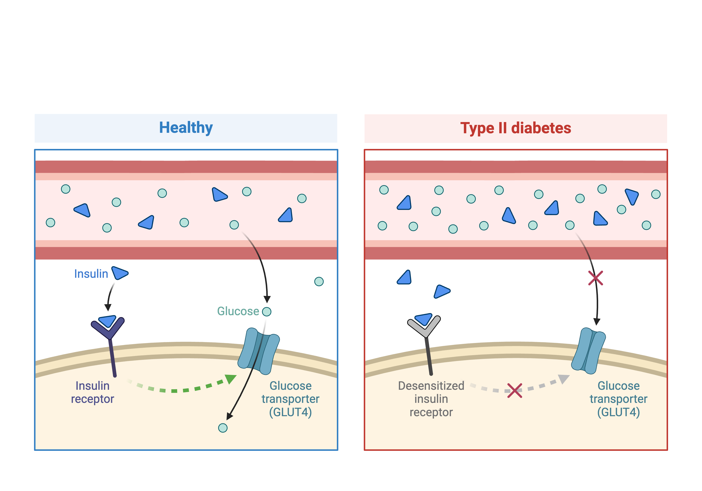
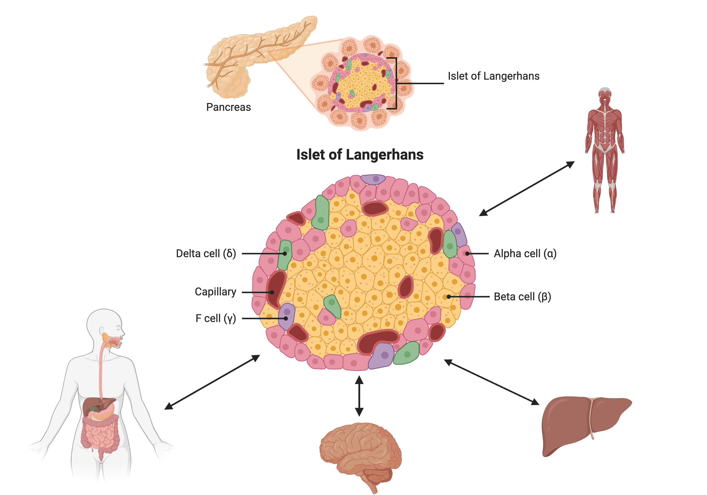
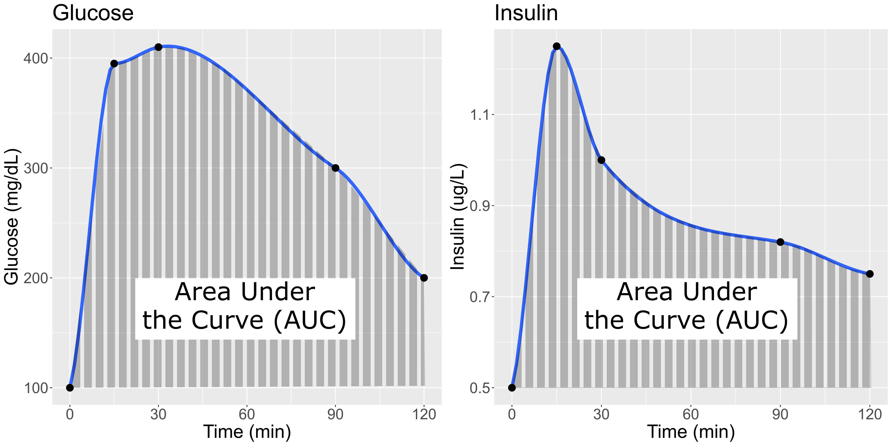
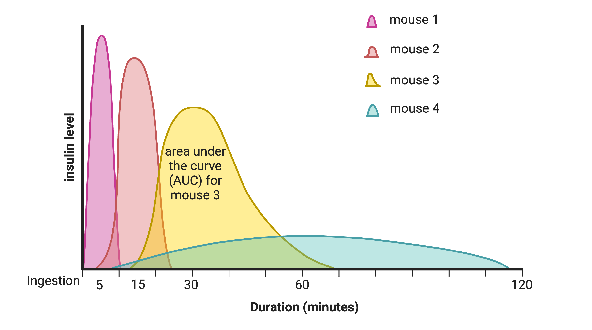

---
title: "Genetic Drivers of Pancreatic Islet Function"
teaching: 15
exercises: 0
---

:::::::::::::::::::::::::::::::::::::: questions 

- What is the hypothesis of an example eQTL study?

::::::::::::::::::::::::::::::::::::::::::::::::

::::::::::::::::::::::::::::::::::::: objectives

- Describe an example eQTL study in Diversity Outbred mice.
- State the hypothesis from an example eQTL study in Diversity Outbred mice.

::::::::::::::::::::::::::::::::::::::::::::::::

Genome-wide association studies (GWAS) often identify variants in non-coding 
regions of the genome, indicating that regulation of gene expression 
predominates in common diseases like type II diabetes. In type II diabetes (T2D) 
the pancreas produces less insulin and the body becomes less responsive to 
insulin.

{alt="Figure showing Type 2 diabetes and insulin."}
Created in [BioRender](https://BioRender.com)

Most of the more than 100 genetic loci associated with T2D affect the function 
of pancreatic islets. This study offers supporting evidence for T2D-associated 
loci in human GWAS, most of which affect pancreatic islet function. Pancreatic 
islet cells produce endocrine hormones including insulin. A feedback loop of 
glucose and insulin activates beta cells that produce insulin and inhibits alpha 
cells in the pancreas.

{alt="Figure showing the Islet of Langerhans in the pancreas, which is composed of alpha, beta, delta and gamma cells."}
Created in [BioRender](https://BioRender.com)

Susceptibility to type II diabetes (T2D) increases with obesity, such that 
T2D-associated genetic loci operate mainly under conditions of obesity (See 
[Keller, Mark P et al. “Genetic Drivers of Pancreatic Islet Function.” Genetics vol. 209,1 (2018): 335-356](https://www.ncbi.nlm.nih.gov/pmc/articles/PMC5937189/)). Like most GWAS 
loci, the T2D-associated genetic loci identified from GWAS have very small 
effect sizes and odds ratios just slightly more than 1.

This study explored islet gene expression in diabetes. The authors hypothesized 
that gene expression changes in response to dietary challenge would reveal 
signaling pathways involved in stress responses. The expression of many genes
often map to the same locus, indicating that expression of these genes is
controlled in common. If their mRNAs encode proteins with common physiological 
functions, the function of the controlling gene(s) is revealed. Variation in 
expression of the controlling gene(s), rather than a genetic variant, can be 
tested as an immediate cause of a disease-related phenotype.

In this study, Diversity Outbred (DO) mice were fed a high-fat, high-sugar diet 
as a stressor, sensitizing the mice to develop diabetic traits. Body weight and 
plasma glucose, insulin, and triglyceride measurements were taken biweekly. 
Food intake could be measured since animals were individually housed. A glucose 
tolerance test at 18 weeks of age provided measurement of dynamic glucose and 
insulin changes at 5, 15, 30, 60 and 120 minutes after glucose administration. 
Area under the curve (AUC) was determined from these time points for both plasma 
glucose and insulin levels. 

{alt="Figure showing glucose and insulin changes over time."}

In the figure above, time is plotted on the X-axis and glucose or insulin levels
are plotted on the Y-axis. Blood is taken at the beginning of the test and at
several time points after the glucose bolus. The glucose or insulin AUC is the 
area under the measured points down to the baseline level. A diversity of 
responses to the glucose tolerance test is illustrated below.

{alt="A plot showing four different curves reflecting insulin levels after administration of glucose starting at time zero"}

[Homeostatic model assessment](https://en.wikipedia.org/wiki/Homeostatic_model_assessment)
(HOMA) quantifies insulin resistance (IR) and beta cell ($\beta$) function. For
IR, the equation quantifying insulin resistance is the product of glucose and
insulin in mg/dL divided by 405.

$HOMA-IR = (glucose \times insulin) / 405$

For beta cell function, the equation is 

$HOMA-\beta = (360 \times insulin) / (glucose - 63)$

expressed as a percentage. Insulin resistance and beta cell function were 
determined after the glucose tolerance test was given. Islet cells were isolated 
from pancreas, and RNA extracted and libraries constructed from isolated RNA for 
gene expression measurements.

Genome scans were performed with the leave-one-chromosome-out (LOCO) method for
kinship correction. Sex and experimental cohort (DO wave) were used as 
covariates. The results of one scan for insulin area under the curve (AUC) is 
shown below with a strong peak on chromosome 11. In this lesson, we will look
into genes located under this peak.

{alt="Insulin AUC QTL plot"}

::::::::::::::::::::::::::::::::::::: challenge 

#### Challenge 1: Reviewing a LOD plot

Refer to the figure above.

1). What is a LOD score? What two things does it compare?   
2). What is the red horizontal line at y = 6? What does it indicate?     

:::::::::::::::::::::::: solution 

1). A LOD score, or logarithm of odds score, compares the null hypothesis of no
QTL anywhere in the genome with the alternative hypothesis that there is a QTL.  
2). The red horizontal line at y = 6 is a LOD score threshold indicating 
significance of LOD scores. Any LOD score beneath this value is likely to occur
just by random chance.

:::::::::::::::::::::::::::::::::

::::::::::::::::::::::::::::::::::::::::::::::::

{alt="Keller et al, figure S7"}

::::::::::::::::::::::::::::::::::::: challenge 

#### Challenge 2: 

Refer to the figure above.

1). What does panel B show? What conclusions could you draw from panel B?    
2). How are panels A and B related to one another? What story do they tell 
together?  

:::::::::::::::::::::::: solution 

1). Panel B shows the founder allele effects at the chromosome 11 QTL. PWK and
CAST alleles show high phenotype values at the QTL, and WSB and NOD have low
values at the QTL.
  
2). Panels A and B show a chromosome 11 QTL with a high LOD score, along with
the founder allele contributions to this LOD peak. The large range of phenotype
values between different founders resulted in a strong LOD score.

:::::::::::::::::::::::::::::::::

::::::::::::::::::::::::::::::::::::::::::::::::

::::::::::::::::::::::::::::::::::::: keypoints 

- Many GWAS studies identify SNPs which to no lie within coding regions of the
genome.
- This implies that the SNPs lie within regulatory sequences which affect gene
expression levels.
- Merging gene expression with physiological trait QTL mapping can help to
identify genes which affect physiological trait variation.

::::::::::::::::::::::::::::::::::::::::::::::::
