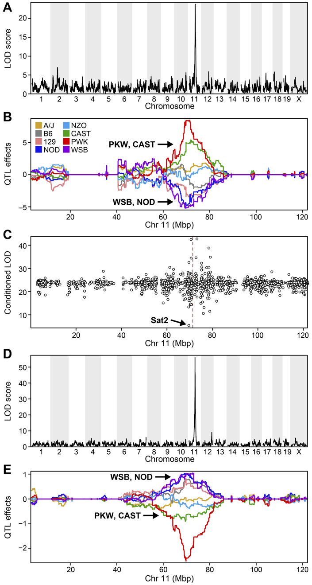

:::::::::::::::::::::::::::::::::::::: questions 

- How do I interpret qtl2 results?

::::::::::::::::::::::::::::::::::::::::::::::::

::::::::::::::::::::::::::::::::::::: objectives

- Interpret the relationship between sequence, expression and phenotype 
variation from qtl2 mapping results.

::::::::::::::::::::::::::::::::::::::::::::::::

{alt="Keller et al, figure S7"}
::::::::::::::::::::::::::::::::::::: challenge 

## Challenge: Interpreting qtl2 results

Refer to the figure above.

1). What does panel A show? What conclusions could you draw from panel A?   
2). What does panel B show? What conclusions could you draw from panel B?   
3). What does panel C show? What conclusions could you draw from panel C?  
4). How are panels A through C related to one another? What story do they tell 
together?

:::::::::::::::::::::::: solution 

:::::::::::::::::::::::::::::::::

::::::::::::::::::::::::::::::::::::::::::::::::

::::::::::::::::::::::::::::::::::::: keypoints 

- Use `.md` files for episodes when you want static content
- Use `.Rmd` files for episodes when you need to generate output
- Run `sandpaper::check_lesson()` to identify any issues with your lesson
- Run `sandpaper::build_lesson()` to preview your lesson locally

::::::::::::::::::::::::::::::::::::::::::::::::
