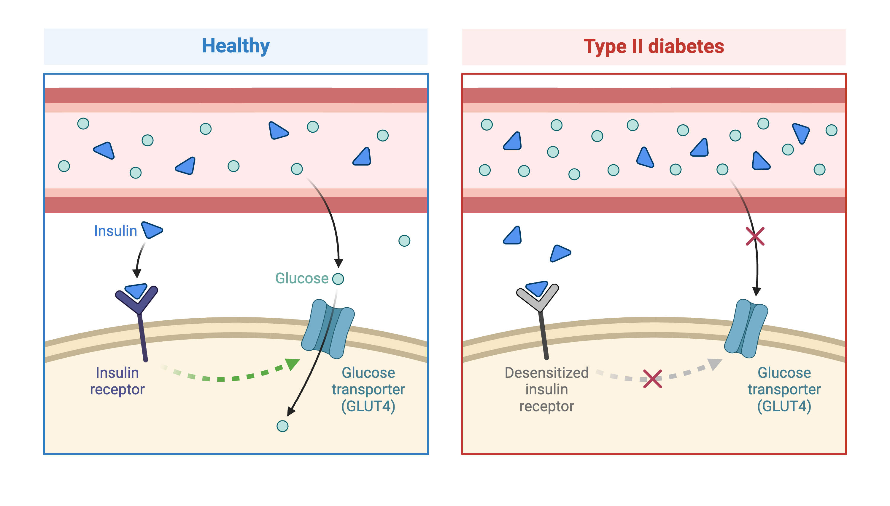

:::::::::::::::::::::::::::::::::::::: questions 

- What are expression quantitative trait loci (eQTL)?
- How are eQTL used in genetic studies?

::::::::::::::::::::::::::::::::::::::::::::::::

::::::::::::::::::::::::::::::::::::: objectives

- Describe how an expression quantitative trait locus (eQTL) impacts gene expression.
- Describe how eQTL are used in genetic studies.

::::::::::::::::::::::::::::::::::::::::::::::::

## Introduction

Differences in disease risk between individuals are often caused by genetic
variants. Identifying the effects of genetic variants is key to understanding 
disease phenotypes and their underlying biology. The effects of variants in many 
single-gene disorders, such as cystic fibrosis, are generally well-characterized
and their disease biology well understood. For example, in cystic fibrosis,
mutations in the coding region of the CFTR gene alter the three-dimensional 
structure of the chloride channel proteins in epithelial cells, affecting not
only chloride transport, but also sodium and potassium transport in the lungs, 
pancreas and skin. The path from gene mutation to altered protein to disease 
phenotype is relatively simple and well understood. 

{alt="Cystic fibrosis is caused by a mutation in the CFTR gene that prevents passage of chloride ions from the airway lumen of the lungs. This results in a loss of water from the airway lumens and a thick sticky mucus in the airway."}
Created in [BioRender](https://BioRender.com)

The most common human disorders, however, involve many genes interacting with
each other and with the environment, a far more complicated path to follow than
the path from a single gene mutation to its protein to a disease phenotype. 
Cardiovascular disease, Alzheimer's disease, arthritis, diabetes and cancer
involve a complex interplay of genes with environment, and their mechanisms are 
not well understood. One method of understanding the relationship between 
genetic variants and disease is a genome-wide association study (GWAS), which 
associates genetic variants with disease traits. It is tempting to think that 
these genetic variants would fall in coding regions. However, most GWAS variants 
for common diseases like diabetes are located in **non-coding** regions of the 
genome. These variants are therefore likely to fall in regulatory sequences 
which are involved in gene regulation. 

{alt="Figures showing the GWAS Catalog"}

{alt="Figure showing regulation of gene by a SNP"}
Created in [BioRender](https://BioRender.com)

Gene regulation controls the quantity, timing and locale of gene expression. 
Analyzing the association between gene expression and genetic variants is known 
as expression quantitative trait locus (eQTL) mapping. eQTL mapping searches for
associations between the expression of one or more genes and a genetic locus.
Specifically, genetic variants underlying eQTL peak explain some of the 
variation in gene expression levels. eQTL studies can reveal the architecture 
of quantitative traits, connect DNA sequence variation to phenotypic variation,
and shed light on transcriptional regulation and regulatory variation.
Traditional analytic techniques like linkage and association mapping can be 
applied to thousands of gene expression traits (transcripts) in eQTL analysis,
such that gene expression can be mapped in much the same way as a physiological
phenotype like blood pressure or heart rate. Joining gene expression and 
physiological phenotypes with genetic variation can identify genes with variants
affecting disease phenotypes.

To the simple diagram above we'll add two more details. Non-coding SNPs can 
regulate gene expression from nearby locations on the same chromosome (in cis):

{alt="Figure showing SNP regulating gene which affects disease"}
Created in [BioRender](https://BioRender.com)

SNPs that affect gene expression from afar, often from a different chromosome 
from the gene that they regulate are called distal (trans) regulators.

{alt="Figure showing trans regulation"}

Created in [BioRender](https://BioRender.com)

In this lesson we revisit genetic mapping of quantitative traits and apply its
methods to gene expression. The examples are from 
[Genetic Drivers of Pancreatic Islet Function](https://doi.org/10.1534/genetics.118.300864)
by Keller, et al. In Type 2 diabetes (T2D) the pancreas produces less insulin 
and the body becomes less responsive to insulin.

{alt="Figure showing Type 2 diabetes & insulin."}
Created in [BioRender](https://BioRender.com)

This study offers supporting evidence for type 2 diabetes-associated loci in 
human GWAS, most of which affect pancreatic islet function. Pancreatic islet
cells produce endocrine hormones including insulin. A feedback loop of glucose
and insulin activates beta cells that produce insulin and inhibits alpha cells.

{alt="Figure showing the Islet of Langerhans in the pancreas, which is composed of alpha, beta, delta and gamma cells."}
Created in [BioRender](https://BioRender.com)

The study assessed pancreatic islet gene expression in Diversity Outbred mice on 
either a regular chow or high-fat, high-sugar diet. Islet mRNA abundance was 
quantified and analyzed. The study identified more than 18,000 eQTL peaks.

Genome-wide association studies (GWAS) often identify variants in non-coding 
regions of the genome, indicating that regulation of gene expression 
predominates in common diseases like type II diabetes. Most of the more than 100 
genetic loci associated with type II diabetes affect the function of pancreatic 
islets, which produce insulin for regulating blood glucose levels. 
Susceptibility to type II diabetes (T2D) increases with obesity, such that 
T2D-associated genetic loci operate mainly under conditions of obesity (See 
[Keller, Mark P et al. “Genetic Drivers of Pancreatic Islet Function.” Genetics vol. 209,1 (2018): 335-356](https://www.ncbi.nlm.nih.gov/pmc/articles/PMC5937189/)). Like 
most GWAS loci, the T2D-associated genetic loci identified from genome-wide 
association studies (GWAS) have very small effect sizes and odds ratios just 
slightly more than 1.

This study explored islet gene expression in diabetes. The authors hypothesized 
that gene expression changes in response to dietary challenge would reveal 
signaling pathways involved in stress responses. The expression of many genes
often map to the same locus, indicating that expression of these genes is
controlled in common. If their mRNAs encode proteins with common physiological 
functions, the function of the controlling gene(s) is revealed. Variation in 
expression of the controlling gene(s), rather than a genetic variant, can be 
tested as an immediate cause of a disease-related phenotype.

In this study, Diversity Outbred (DO) mice were fed a high-fat, high-sugar diet 
as a stressor, sensitizing the mice to develop diabetic traits. Body weight and 
plasma glucose, insulin, and triglyceride measurements were taken biweekly. 
Food intake could be measured since animals were individually housed. A glucose 
tolerance test at 18 weeks of age provided measurement of dynamic glucose and 
insulin changes at 5, 15, 30, 60 and 120 minutes after glucose ingestion. 
Area under the curve (AUC) was determined from these time points for both plasma 
glucose and insulin levels. 

{alt="A plot showing four different curves reflecting insulin levels after administration of glucose starting at time zero"}

[Homeostatic model assessment](https://en.wikipedia.org/wiki/Homeostatic_model_assessment)
(HOMA) quantifies insulin resistance (IR) and beta cell ($\beta$) function. For
IR, the equation quantifying insulin resistance is the product of glucose and
insulin in mg/dL divided by 405.

$HOMA-IR = (glucose \times insulin) / 405$

For beta cell function, the equation is 

$HOMA-\beta = (360 \times insulin) / (glucose - 63)$

expressed as a percentage. Insulin resistance and beta cell function were 
determined after the glucose tolerance test was given. Islet cells were isolated 
from pancreas, and RNA extracted and libraries constructed from isolated RNA for 
gene expression measurements.

Genome scans were performed with the leave-one-chromosome-out (LOCO) method for
kinship correction. Sex and experimental cohort (DO wave) were used as 
covariates. The results of one scan for insulin area under the curve (AUC) is 
shown below with a strong peak on chromosome 11. In this lesson, we will look
into genes located under this peak.

{alt="Insulin AUC LOD plot"}

::::::::::::::::::::::::::::::::::::: keypoints 

- An expression quantitative trait locus (eQTL) explains part of the variation 
in gene expression.
- Traditional linkage and association mapping can be applied to gene expression 
traits (transcripts).
- Genetic variants, such as single nucleotide polymorphisms (SNPs), that 
underlie eQTL illuminate transcriptional regulation and variation.

::::::::::::::::::::::::::::::::::::::::::::::::

