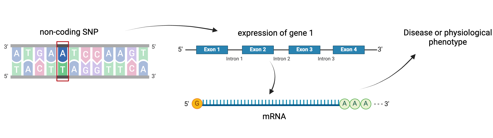

:::::::::::::::::::::::::::::::::::::: questions 

- What are expression quantitative trait loci (eQTL)?
- How are eQTL used in genetic studies?

::::::::::::::::::::::::::::::::::::::::::::::::

::::::::::::::::::::::::::::::::::::: objectives

- Describe how an expression quantitative trait locus (eQTL) impacts gene expression.
- Describe how eQTL are used in genetic studies.

::::::::::::::::::::::::::::::::::::::::::::::::

## Introduction

Differences in disease risk between individuals are often caused by genetic
variants. Identifying the effects of genetic variants is key to understanding 
disease phenotypes and their underlying biology. The effects of variants in many 
single-gene disorders, such as cystic fibrosis, are generally well-characterized
and their disease biology well understood. For example, in cystic fibrosis,
mutations in the coding region of the CFTR gene alter the three-dimensional 
structure of the chloride channel proteins in epithelial cells, affecting not
only chloride transport, but also sodium and potassium transport in the lungs, 
pancreas and skin. The path from gene mutation to altered protein to disease 
phenotype is relatively simple and well understood. 

{alt="Cystic fibrosis is caused by a mutation in the CFTR gene that prevents passage of chloride ions from the airway lumen of the lungs. This results in a loss of water from the airway lumens and a thick sticky mucus in the airway."}
Created in [BioRender](https://BioRender.com)

The most common human disorders, however, involve many genes interacting with
each other and with the environment, a far more complicated path to follow than
the path from a single gene mutation to its protein to a disease phenotype. 
Cardiovascular disease, Alzheimer's disease, arthritis, diabetes and cancer
involve a complex interplay of genes with environment, and their mechanisms are 
not well understood. One method of understanding the relationship between 
genetic variants and disease is a genome-wide association study (GWAS), which 
associates genetic variants with disease traits. It is tempting to think that 
these genetic variants would fall in coding regions. However, most GWAS variants 
for common diseases like diabetes are located in **non-coding** regions of the 
genome. These variants are therefore likely to fall in regulatory sequences 
which are involved in gene regulation. 

{alt="Figures showing the GWAS Catalog"}

{alt="Figure showing regulation of gene by a SNP"}
Created in [BioRender](https://BioRender.com)

Gene regulation controls the quantity, timing and locale of gene expression. 
Analyzing the association between gene expression and genetic variants is known 
as expression quantitative trait locus (eQTL) mapping. eQTL mapping searches for
associations between the expression of one or more genes and a genetic locus.
Specifically, genetic variants underlying eQTL peak explain some of the 
variation in gene expression levels. eQTL studies can reveal the architecture 
of quantitative traits, connect DNA sequence variation to phenotypic variation,
and shed light on transcriptional regulation and regulatory variation.
Traditional analytic techniques like linkage and association mapping can be 
applied to thousands of gene expression traits (transcripts) in eQTL analysis,
such that gene expression can be mapped in much the same way as a physiological
phenotype like blood pressure or heart rate. Joining gene expression and 
physiological phenotypes with genetic variation can identify genes with variants
affecting disease phenotypes.

To the simple diagram above we'll add two more details. Non-coding SNPs can 
regulate gene expression from nearby locations on the same chromosome (in cis):

{alt="Figure showing SNP regulating gene which affects disease"}
Created in [BioRender](https://BioRender.com)

SNPs that affect gene expression from afar, often from a different chromosome 
from the gene that they regulate are called distal (trans) regulators.

{alt="Figure showing trans regulation"}

Created in [BioRender](https://BioRender.com)

::::::::::::::::::::::::::::::::::::: keypoints 

- An expression quantitative trait locus (eQTL) explains part of the variation 
in gene expression.
- Traditional linkage and association mapping can be applied to gene expression 
traits (transcripts).
- Genetic variants, such as single nucleotide polymorphisms (SNPs), that 
underlie eQTL illuminate transcriptional regulation and variation.

::::::::::::::::::::::::::::::::::::::::::::::::

