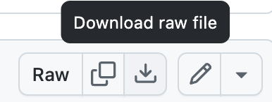

## Software Setup

R is a programming language that is especially powerful for data exploration, 
visualization, and statistical analysis. To interact with R, we use RStudio. 

1. Install the latest version of R from [CRAN](https://cran.r-project.org/).

2. Install the latest version of [RStudio](https://www.rstudio.com/products/rstudio/download/). 
Choose the free RStudio Desktop version for Windows, Mac, or Linux. 

3. Start RStudio. 

4. Install packages. 
    a. The [qtl2](https://github.com/rqtl/qtl2) package contains code for
    haplotype reconstruction, QTL mapping and plotting. 
    b. The [qtl2convert](https://github.com/rqtl/qtl2convert) package contains
    code for converting data objects from one format to another.
    c. Bioconductor packages and BiocManager if not already installed.
    c. Install all by copying and pasting the following code in the R console.

```r
install.packages(c("tidyverse", "ggbeeswarm", "knitr", "qtl2", "qtl2convert"))

if (!require("BiocManager", quietly = TRUE))
    install.packages("BiocManager")

BiocManager::install("AnnotationHub")
BiocManager::install("DeSeq2")
BiocManager::install("rtracklayer")
```

Once the installation is complete, load the libraries to make sure that they 
installed correctly. 

```r
library(tidyverse)
library(ggbeeswarm)
library(knitr)
library(qtl2)
library(qtl2convert)
library(AnnotationHub)
library(DESeq2)
library(rtracklayer)
```

If the libraries don't load and you received errors during the installation,
please contact the workshop instructors before the workshop to help you.

## Project organization

1. Create a new project in your Desktop called `eqtl_mapping`. 
- Click the `File` menu button, then `New Project`.
- Click `New Directory`. 
- Click `New Project`.
- Type `eqtl_mapping` as the directory name. Browse to your Desktop to create the project there.
- Click the `Create Project` button.

2. Use the `Files` tab to create  a `data` folder to hold the data, a `scripts` folder to 
house your scripts, and a `results` folder to hold results. Alternatively, you can use the 
R console to run the following commands for step 2 only. You still need to create a 
project with step 1.

```r
dir.create("./data")
dir.create("./scripts")
dir.create("./results")
```

## Data Sets

For this course, we will have several data files which you will need to 
download to the `data` directory in the project folder on your Desktop.

1. Download all files from the 
[Github lesson repository](https://github.com/smcclatchy/eqtl-mapping/tree/main/episodes/data).
You will need to download them one by one. Click on the file name and locate the
download button at upper right.

{alt="Graphic showing the download button at right on the Github data file page"}

Repeat this process for each file. Then move the files from wherever your 
downloads go (*e.g.* `Downloads`) to the `data` directory in the `eqtl_mapping` 
project. You can use a graphical user interface (*e.g.* Windows File Explorer, 
Mac Finder) to move the files.

Copy, paste, and run the following code in the RStudio console.

```r
download.file(url      = "https://thejacksonlaboratory.box.com/shared/static/4hy4hbjyrxjbrzh570i4g02r62bx3lgk.rds",
              destfile = "data/",
              mode     = "wb")
```