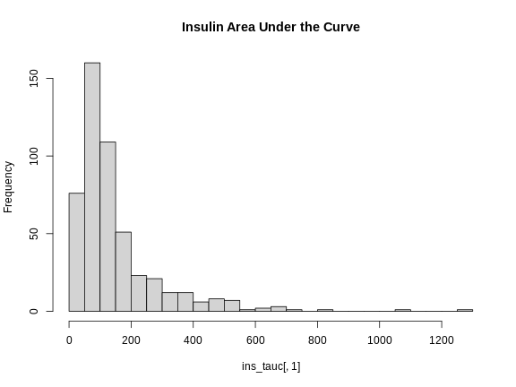
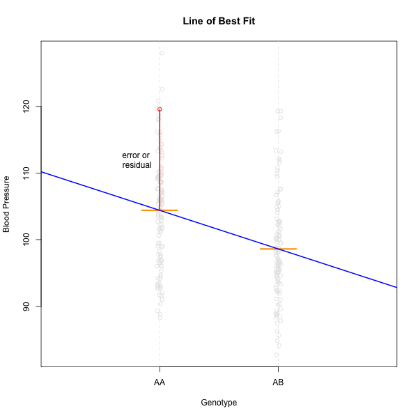

:::::::::::::::::::::::::::::::::::::: questions 

- What data are required for eqtl mapping?

::::::::::::::::::::::::::::::::::::::::::::::::

::::::::::::::::::::::::::::::::::::: objectives

- To provide an example and exploration of data used for eqtl mapping.

::::::::::::::::::::::::::::::::::::::::::::::::


``` r
library(knitr)
library(ggbeeswarm)
library(tidyverse)
library(qtl2)
library(DESeq2)
```

## Physiological Phenotypes

You should have downloaded data files already when following the 
[setup instructions](https://smcclatchy.github.io/eqtl-mapping/index.html). 
The complete data used in these analyses are available from 
[Data Dryad](https://doi.org/10.5061/dryad.pj105). The files we will use are in
a simpler format than those on Data Dryad.

Load in the physiological phenotypes.


``` r
# load the data
pheno       <- readRDS(file = 'data/attie_do_pheno.rds')
pheno_dict  <- readRDS(file = 'data/attie_do_pheno_dict.rds')
covar       <- readRDS(file = 'data/attie_do_covar.rds')
```

## Physiological Phenotypes

In this data set, we have 20 phenotypes for 500 Diversity Outbred mice. `pheno` 
is a data frame containing the phenotype data as well as covariates. Click on 
the triangle to the left of `pheno` in the Environment pane to view its 
contents. Run `names(pheno)` to list the variables. 

`pheno_dict` is the phenotype dictionary.  This data frame contains information 
on each variable in `pheno`, including `name`, `short name`, `pheno_type`,  
`formula` (if used) and `description`.  You can view a table of the data 
dictionary.


``` r
pheno_dict |> 
  select(description, formula) |> 
  kable()
```


|                   |description                                                                                                                                                                                                                                             |formula                          |
|:------------------|:-------------------------------------------------------------------------------------------------------------------------------------------------------------------------------------------------------------------------------------------------------|:--------------------------------|
|mouse              |Animal identifier.                                                                                                                                                                                                                                      |NA                               |
|sex                |Male (M) or female (F).                                                                                                                                                                                                                                 |NA                               |
|sac_date           |Date when mouse was sacrificed; used to compute days on diet, using birth dates.                                                                                                                                                                        |NA                               |
|partial_inflation  |Some mice showed a partial pancreatic inflation which would negatively effect the total number of islets collected from these mice.                                                                                                                     |NA                               |
|coat_color         |Visual inspection by Kathy Schuler on coat color.                                                                                                                                                                                                       |NA                               |
|oGTT_date          |Date the oGTT was performed.                                                                                                                                                                                                                            |NA                               |
|FAD_NAD_paired     |A change in the method that was used to make this measurement by Matt Merrins' lab. Paired was the same islet for the value at 3.3mM vs. 8.3mM glucose; unpaired was where averages were used for each glucose concentration and used to compute ratio. |NA                               |
|FAD_NAD_filter_set |A different filter set was used on the microscope to make the fluorescent measurement; may have influenced the values.                                                                                                                                  |NA                               |
|crumblers          |Some mice store food in their bedding (hoarders) which would be incorrectly interpreted as consumed.                                                                                                                                                    |NA                               |
|birthdate          |Birth date                                                                                                                                                                                                                                              |NA                               |
|diet_days          |Number of days.                                                                                                                                                                                                                                         |NA                               |
|num_islets         |Total number of islets harvested per mouse; negatively impacted by those with partial inflation.                                                                                                                                                        |NA                               |
|Ins_per_islet      |Amount of insulin per islet in units of ng/ml/islet.                                                                                                                                                                                                    |NA                               |
|WPIC               |Derived number; equal to total number of islets times insulin content per islet.                                                                                                                                                                        |Ins_per_islet * num_islets       |
|HOMA_IR_0min       |glucose*insulin/405 at time t=0 for the oGTT                                                                                                                                                                                                            |Glu_0min * Ins_0min / 405        |
|HOMA_B_0min        |360 * Insulin / (Glucose - 63) at time t=0 for the oGTT                                                                                                                                                                                                 |360 * Ins_0min / (Glu_0min - 63) |
|Glu_tAUC           |Area under the curve (AUC) calculation without any correction for baseline differences.                                                                                                                                                                 |complicated                      |
|Ins_tAUC           |Area under the curve (AUC) calculation without any correction for baseline differences.                                                                                                                                                                 |complicated                      |
|Glu_6wk            |Plasma glucose with units of mg/dl; fasting.                                                                                                                                                                                                            |NA                               |
|Ins_6wk            |Plasma insulin with units of ng/ml; fasting.                                                                                                                                                                                                            |NA                               |
|TG_6wk             |Plasma triglyceride (TG) with units of mg/dl; fasting.                                                                                                                                                                                                  |NA                               |
|Glu_10wk           |Plasma glucose with units of mg/dl; fasting.                                                                                                                                                                                                            |NA                               |
|Ins_10wk           |Plasma insulin with units of ng/ml; fasting.                                                                                                                                                                                                            |NA                               |
|TG_10wk            |Plasma triglyceride (TG) with units of mg/dl; fasting.                                                                                                                                                                                                  |NA                               |
|Glu_14wk           |Plasma glucose with units of mg/dl; fasting.                                                                                                                                                                                                            |NA                               |
|Ins_14wk           |Plasma insulin with units of ng/ml; fasting.                                                                                                                                                                                                            |NA                               |
|TG_14wk            |Plasma triglyceride (TG) with units of mg/dl; fasting.                                                                                                                                                                                                  |NA                               |
|food_ave           |Average food consumption over the measurements made for each mouse.                                                                                                                                                                                     |complicated                      |
|weight_2wk         |Body weight at indicated date; units are gm.                                                                                                                                                                                                            |NA                               |
|weight_6wk         |Body weight at indicated date; units are gm.                                                                                                                                                                                                            |NA                               |
|weight_10wk        |Body weight at indicated date; units are gm.                                                                                                                                                                                                            |NA                               |
|DOwave             |Wave (i.e., batch) of DO mice                                                                                                                                                                                                                           |NA                               |

Since the paper is interested in type 2 diabetes and insulin secretion, we will 
choose insulin AUC (area  under the curve which was calculated without any
correction for baseline differences) for this review.

### Phenotype Distributions

Many statistical models, including the QTL mapping model in `qtl2`, expect that 
the incoming data will be normally distributed. You may use transformations such 
as log or square root to make your data more normally distributed. Here, we will 
log transform the data. 

Let's make a variable for insulin AUC so that we don't have to type as much.


``` r
ins_tauc <- pheno[, 'Ins_tAUC', drop = FALSE]
```

Next, let's look at the distribution of insulin AUC using a histogram.


``` r
hist(ins_tauc[,1], 
     breaks = 20,
     main   = "Insulin Area Under the Curve")
```



This is clearly **not** normally distributed. In fact, this type of distribution
is often log normal. 

Now, let's apply the `log()` function to this data in an effort to make the
distribution more normal. By default the `log()` function calculates the natural
log (base *e*).


``` r
ins_tauc$Ins_tAUC_log <- log(ins_tauc$Ins_tAUC)
```

Let's make a histogram of the log-transformed data.


``` r
hist(ins_tauc$Ins_tAUC_log, 
     breaks = 20,
     main   = "insulin AUC (log-transformed)")
```


This looks much better! The data has a somewhat Gaussian shape. Technically, the
assumptions of a linear model require that the **residuals** be normally
distributed. In practice, transforming the input data to be normally distributed
helps to make the residuals normally distributed. As a reminder, a residual is 
the vertical distance from a data point to the line described by a linear model.

{alt="a residual for one data point located above the line described by a linear model"}

Boxplots are another great way to view the distribution of the data and to 
identify any outliers. We will log-transform insulin AUC using the 
[`scale_y_log10()`](https://ggplot2.tidyverse.org/reference/scale_continuous.html)
function. This transforms the data using base 10 and creates a base 10 y-axis 
for plotting. We have overlaid the data points using `ggbeeswarm`'s
[`geom_beeswarm`](https://www.rdocumentation.org/packages/ggbeeswarm/versions/0.7.2/topics/geom_beeswarm).
We have told `geom_beeswarm()` to plot the points with some transparency using 
the argument `alpha = 0.2`. The `alpha` argument ranges between 0 (completely 
transparent) to 1 (completely opaque). A value of 0.1 means mostly transparent.


``` r
# plot Insulin on a log 10 scale
ggplot(pheno, aes(sex, Ins_tAUC)) +
  geom_boxplot() +
  geom_beeswarm(alpha = 0.2) +
  scale_y_log10() +
  labs(title = "Insulin area under the curve", y = "insulin AUC") +
  theme(text = element_text(size = 20))
```


::::::::::::::::::::::::::::::::::::: challenge 

## Challenge 1

How many orders of magnitude (powers of 10) does insulin AUC span?  

:::::::::::::::::::::::: solution 

insulin AUC spans three orders of magnitude, from near 10 to over 1000.  

:::::::::::::::::::::::::::::::::


## Challenge 2

Which sex has higher median insulin AUC values?  

:::::::::::::::::::::::: solution 

Males have higher insulin AUC than females.  

:::::::::::::::::::::::::::::::::
::::::::::::::::::::::::::::::::::::::::::::::::

::::::::::::::::::::::::::::::::::::: challenge 

## Challenge 3

What does the heavy line bisecting the boxes indicate?  
What do the lines at the top and bottom of the boxes indicate?  
What does the *whisker* extending from the top and bottom of the boxes indicate?    
What do the black dots extending from the whiskers indicate? 

:::::::::::::::::::::::: solution 

The heavy line bisecting the boxes shows the median value (not the mean!). Half
of the data points are above and half are below this line.   
The lines at the top and bottom of the boxes indicate the first and 3rd 
quartiles of the data (the *hinges*). One-fourth of the data points are 
beneath the box and another one-fourth are above the box. The box itself 
contains 50% of the data points.  
The whiskers represent some multiple of the interquartile range (IQR), which is 
the height of the box between the first and third quartiles. `geom_boxplot()`
produces *Tukey-style boxplots* in which the whiskers are 1.5 $\times$ the IQR.
Any data points that lie beyond the whiskers are considered outliers and are
shown as heavy black dots.


:::::::::::::::::::::::::::::::::

:::::::::::::::::::::::::::::::::::::

The boxplot is a useful plot to visualize the distribution of your data.

### Quality Control of Data

Many statistical tests rely upon the data having a normal (or Gaussian) 
distribution. Many biological phenotypes do not follow this distribution and
must be transformed before analysis. This is why we log-transformed the data
in the plots above. 

While we can "eyeball" the distributions in the boxplot, it would be  better to 
use a *quantile-quantile* plot. 


``` r
pheno |> 
  ggplot(aes(sample = Ins_tAUC)) +
    stat_qq() +
    geom_qq_line() +
    facet_wrap(~sex) +
    labs(title = "Quantile-Quantile Plot of Ins_tAUC",
         x     = "Normal Quantiles",
         y     = "Ins_tAUC") +
    theme(text = element_text(size = 20))
```


In these plots, the *quantiles* of the normal distribution are plotted on the 
X-axis and the data are plotted on the Y-axis. A quantile evenly divides data
observations into a specific number of groups. The boxplot above evenly divides
the observations into quartiles, a quantile containing four groups that each
contain one-fourth of the data. A percentile similarly divides data into 100 
quantiles, with each percentile containing 1% of the observations. 

In a quantile-quantile (Q-Q) plot the straight line indicates the quantiles a 
normal distribution would follow. The untransformed insulin AUC data values do 
**not** follow a normal distribution because the points are far from the line.
If they were reasonably normally distributed, most of the data points would fall
directly on the straight line.

Next, we will log-transform the data and then create a quantile-quantile plot.


``` r
pheno |> 
  mutate(Ins_tAUC = log(Ins_tAUC)) |> 
  ggplot(aes(sample = Ins_tAUC)) +
    stat_qq() +
    geom_qq_line() +
    facet_wrap(~sex) +
    labs(title = "Quantile-Quantile Plot of log(Ins_tAUC)",
         x     = "Normal Quantiles",
         y     = "log(Ins_tAUC)") +
    theme(text = element_text(size = 20))
```


::::::::::::::::::::::::::::::::::::: challenge 

## Challenge 4

Does the log transformation make the data more normally distributed? Explain 
your answer.

:::::::::::::::::::::::: solution 

Yes. The log transformation makes the data more normally distributed because
the data points follow the normality line more closely. 

:::::::::::::::::::::::::::::::::

## Challenge 5

Do any data points look suspicious to you? Explain your answer.

:::::::::::::::::::::::: solution 

The data points that deviate from the normality line would be worth
investigating. All data deviates somewhat from normality, but the three lowest 
points in the male data plot would be worth investigating. They may be real, but
there may also have been mishap in the assay.

:::::::::::::::::::::::::::::::::
::::::::::::::::::::::::::::::::::::::::::::::::

Another way to identify outliers is to standardize the data and look for data 
points that are more than four standard deviations from the mean.

To do this, we will log transform and standardize insulin AUC. 


``` r
ins_tauc = pheno |> 
             select(mouse, sex, Ins_tAUC) |>
             group_by(sex) |> 
             mutate(Ins_tAUC = log(Ins_tAUC),
                    Ins_tAUC = scale(Ins_tAUC))

ins_tauc |> 
  ggplot(aes(x = sex, y = Ins_tAUC)) +
    geom_boxplot() +
    geom_beeswarm(alpha = 0.2) +
    geom_hline(aes(yintercept = -4), color = 'red') +
    geom_hline(aes(yintercept =  4), color = 'red') +
    labs(title = "Distribution of Standardized Ins_tAUC") +
    theme(text = element_text(size = 20))
```


There are no data points outside of the four standard deviation limits.

## Gene Expression Data

Let's read in the gene expression data.


``` r
annot <- readRDS(file = 'data/attie_do_expr_annot.rds')
raw   <- readRDS(file = 'data/attie_do_expr_raw.rds')
```

We have loaded in two data objects: 

1. `annot`: a data frame containing gene annotation, and
2. `raw`: a numeric matrix containing the un-normalized expression counts.

::::::::::::::::::::::::::::::::::::: challenge 

## Challenge 6: How many samples and genes are there?

:::::::::::::::::::::::: solution 

Use the `dim` command or the Environment tab to determine the number of samples 
and genes in `raw`.


``` r
dim(raw)
```

``` output
[1]   378 21771
```

There are 378 samples and 21,771 genes.

:::::::::::::::::::::::::::::::::
::::::::::::::::::::::::::::::::::::::::::::::::

The expression objects that we have loaded in are organized such that the 
transcripts and samples are aligned between the objects. The figure below may
help you to visualize the relationship between the expression, annotation,
and covariates.

{alt="Figure showing relationship between samples, expression, and transcripts."}

Let's look at the rows in the gene annotation object.


``` r
head(annot)
```

``` output
                              gene_id symbol chr     start       end strand
ENSMUSG00000000001 ENSMUSG00000000001  Gnai3   3 108.10728 108.14615     -1
ENSMUSG00000000028 ENSMUSG00000000028  Cdc45  16  18.78045  18.81199     -1
ENSMUSG00000000037 ENSMUSG00000000037  Scml2   X 161.11719 161.25821      1
ENSMUSG00000000049 ENSMUSG00000000049   Apoh  11 108.34335 108.41440      1
ENSMUSG00000000056 ENSMUSG00000000056   Narf  11 121.23725 121.25586      1
ENSMUSG00000000058 ENSMUSG00000000058   Cav2   6  17.28119  17.28911      1
                      middle nearest.marker.id        biotype      module
ENSMUSG00000000001 108.12671       3_108090236 protein_coding   darkgreen
ENSMUSG00000000028  18.79622       16_18817262 protein_coding        grey
ENSMUSG00000000037 161.18770       X_161182677 protein_coding        grey
ENSMUSG00000000049 108.37887      11_108369225 protein_coding greenyellow
ENSMUSG00000000056 121.24655      11_121200487 protein_coding       brown
ENSMUSG00000000058  17.28515        6_17288298 protein_coding       brown
                   hotspot
ENSMUSG00000000001    <NA>
ENSMUSG00000000028    <NA>
ENSMUSG00000000037    <NA>
ENSMUSG00000000049    <NA>
ENSMUSG00000000056    <NA>
ENSMUSG00000000058    <NA>
```

There are many columns in the gene annotation file, including the Ensembl ID,
gene symbol, chromosome, start and end of the gene.

Next, let's look at the sample covariates.


``` r
head(covar)
```

``` output
      mouse sex DOwave diet_days
DO021 DO021   F      1       112
DO022 DO022   F      1       112
DO023 DO023   F      1       112
DO024 DO024   F      1       112
DO025 DO025   F      1       114
DO026 DO026   F      1       114
```

The sample covariates have information about the sex and DO generation, 
indicated as `DOwave`, of each mouse. These are *metadata*, or data about the 
data.

In order to make reasonable gene comparisons between samples, the count data 
needs to be normalized. In the quantile-quantile (Q-Q) plot below, count data 
for the first gene are plotted over a diagonal line tracing a normal 
distribution for those counts. Notice that most of the count data values lie off
of this line, indicating that these gene counts are not normally distributed. 


Q-Q plots for the first six genes show that count data for these genes are not
normally distributed. They are also not on the same scale. The y-axis values for
each subplot range to 20,000 counts in the first subplot, 250 in the second, 90
in the third, and so on. 


``` r
raw |> 
  as.data.frame() |>
  select(ENSMUSG00000000001:ENSMUSG00000000058) |> 
  pivot_longer(cols = everything(), names_to = 'gene', values_to = 'value') |> 
  ggplot(aes(sample = value)) +
    stat_qq() +
    geom_qq_line() +
    facet_wrap(~gene, scales = 'free') +
    labs(title = 'Count distribution for six genes',
         xlab = 'Normal percentiles', y = 'Count percentiles') +
    theme(text = element_text(size = 20))
```


Since each gene has a different distribution, we will need to normalize the gene
expression data. We will do this in a future lesson.

::::::::::::::::::::::::::::::::::::: keypoints 

- It is important to inspect the phenotype distributions and to transform them
to be nearly normal.

::::::::::::::::::::::::::::::::::::::::::::::::
