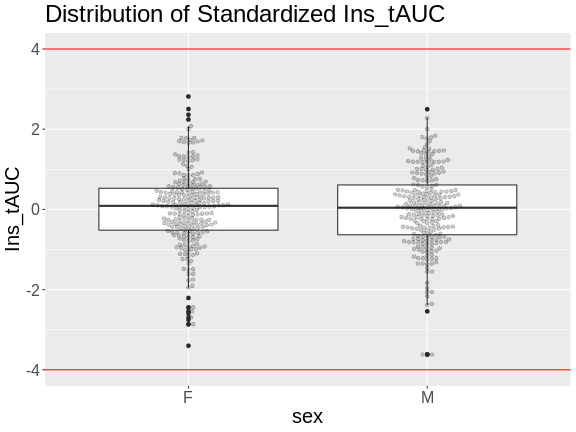

:::::::::::::::::::::::::::::::::::::: questions 

- What data are required for eqtl mapping?

::::::::::::::::::::::::::::::::::::::::::::::::

::::::::::::::::::::::::::::::::::::: objectives

- To provide an example and exploration of data used for eqtl mapping.

::::::::::::::::::::::::::::::::::::::::::::::::


``` r
suppressPackageStartupMessages(library(ggbeeswarm))
suppressPackageStartupMessages(library(tidyverse))
suppressPackageStartupMessages(library(knitr))
suppressPackageStartupMessages(library(corrplot))
suppressPackageStartupMessages(library(DESeq2))
```

``` warning
Warning: replacing previous import 'S4Arrays::makeNindexFromArrayViewport' by
'DelayedArray::makeNindexFromArrayViewport' when loading 'SummarizedExperiment'
```

## Physiological Phenotypes

The complete data used in these analyses are available from 
[Data Dryad](https://doi.org/10.5061/dryad.pj105). 

Load in the physiological phenotypes.


``` r
# load the data
pheno       <- readRDS(file = 'data/attie_do_pheno.rds')
pheno_dict  <- readRDS(file = 'data/attie_do_pheno_dict.rds')
covar       <- readRDS(file = 'data/attie_do_covar.rds')
```

See the [data dictionary](data/Attie-232_Attie_DO_Islets-dictionary.csv) to 
see a description of each of these phenotypes. You can also view a table of
the data dictionary.


``` r
pheno_dict |> 
  select(description, formula) |> 
  kable()
```


|                   |description                                                                                                                                                                                                                                             |formula                          |
|:------------------|:-------------------------------------------------------------------------------------------------------------------------------------------------------------------------------------------------------------------------------------------------------|:--------------------------------|
|mouse              |Animal identifier.                                                                                                                                                                                                                                      |NA                               |
|sex                |Male (M) or female (F).                                                                                                                                                                                                                                 |NA                               |
|sac_date           |Date when mouse was sacrificed; used to compute days on diet, using birth dates.                                                                                                                                                                        |NA                               |
|partial_inflation  |Some mice showed a partial pancreatic inflation which would negatively effect the total number of islets collected from these mice.                                                                                                                     |NA                               |
|coat_color         |Visual inspection by Kathy Schuler on coat color.                                                                                                                                                                                                       |NA                               |
|oGTT_date          |Date the oGTT was performed.                                                                                                                                                                                                                            |NA                               |
|FAD_NAD_paired     |A change in the method that was used to make this measurement by Matt Merrins' lab. Paired was the same islet for the value at 3.3mM vs. 8.3mM glucose; unpaired was where averages were used for each glucose concentration and used to compute ratio. |NA                               |
|FAD_NAD_filter_set |A different filter set was used on the microscope to make the fluorescent measurement; may have influenced the values.                                                                                                                                  |NA                               |
|crumblers          |Some mice store food in their bedding (hoarders) which would be incorrectly interpreted as consumed.                                                                                                                                                    |NA                               |
|birthdate          |Birth date                                                                                                                                                                                                                                              |NA                               |
|diet_days          |Number of days.                                                                                                                                                                                                                                         |NA                               |
|num_islets         |Total number of islets harvested per mouse; negatively impacted by those with partial inflation.                                                                                                                                                        |NA                               |
|Ins_per_islet      |Amount of insulin per islet in units of ng/ml/islet.                                                                                                                                                                                                    |NA                               |
|WPIC               |Derived number; equal to total number of islets times insulin content per islet.                                                                                                                                                                        |Ins_per_islet * num_islets       |
|HOMA_IR_0min       |glucose*insulin/405 at time t=0 for the oGTT                                                                                                                                                                                                            |Glu_0min * Ins_0min / 405        |
|HOMA_B_0min        |360 * Insulin / (Glucose - 63) at time t=0 for the oGTT                                                                                                                                                                                                 |360 * Ins_0min / (Glu_0min - 63) |
|Glu_tAUC           |Area under the curve (AUC) calculation without any correction for baseline differences.                                                                                                                                                                 |complicated                      |
|Ins_tAUC           |Area under the curve (AUC) calculation without any correction for baseline differences.                                                                                                                                                                 |complicated                      |
|Glu_6wk            |Plasma glucose with units of mg/dl; fasting.                                                                                                                                                                                                            |NA                               |
|Ins_6wk            |Plasma insulin with units of ng/ml; fasting.                                                                                                                                                                                                            |NA                               |
|TG_6wk             |Plasma triglyceride (TG) with units of mg/dl; fasting.                                                                                                                                                                                                  |NA                               |
|Glu_10wk           |Plasma glucose with units of mg/dl; fasting.                                                                                                                                                                                                            |NA                               |
|Ins_10wk           |Plasma insulin with units of ng/ml; fasting.                                                                                                                                                                                                            |NA                               |
|TG_10wk            |Plasma triglyceride (TG) with units of mg/dl; fasting.                                                                                                                                                                                                  |NA                               |
|Glu_14wk           |Plasma glucose with units of mg/dl; fasting.                                                                                                                                                                                                            |NA                               |
|Ins_14wk           |Plasma insulin with units of ng/ml; fasting.                                                                                                                                                                                                            |NA                               |
|TG_14wk            |Plasma triglyceride (TG) with units of mg/dl; fasting.                                                                                                                                                                                                  |NA                               |
|food_ave           |Average food consumption over the measurements made for each mouse.                                                                                                                                                                                     |complicated                      |
|weight_2wk         |Body weight at indicated date; units are gm.                                                                                                                                                                                                            |NA                               |
|weight_6wk         |Body weight at indicated date; units are gm.                                                                                                                                                                                                            |NA                               |
|weight_10wk        |Body weight at indicated date; units are gm.                                                                                                                                                                                                            |NA                               |
|DOwave             |Wave (i.e., batch) of DO mice                                                                                                                                                                                                                           |NA                               |

### Phenotype Distributions

Boxplots are a great way to view the distribution of the data and to identify 
any outliers. We will be using the total area under the curve of insulin from 
the glucose tolerance test (Ins_tAUC). 

We will log-transform the data using the 
[scale_y_log10()](https://ggplot2.tidyverse.org/reference/scale_continuous.html)
function. We have also overlaid the data points using ggbeeswarm's
[geom_beeswarm](https://www.rdocumentation.org/packages/ggbeeswarm/versions/0.7.2/topics/geom_beeswarm).
We have told `geom_beeswarm()` to plot the points with some transparency using 
the argument "alpha = 0.2". The alpha argument ranges between 0 (completely 
transparent) to 1 (completely opaque). A value of 0.1 means mostly transparent.


``` r
# plot Insulin on a log 10 scale
ggplot(pheno, aes(sex, Ins_tAUC)) +
  geom_boxplot() +
  geom_beeswarm(alpha = 0.2) +
  scale_y_log10() +
  labs(title = "Insulin tAUC", y = "Insulin tAUC") +
  theme(text = element_text(size = 20))
```


::::::::::::::::::::::::::::::::::::: challenge 

## Challenge 1

How many orders of magnitude (powers of 10) does Insulin tAUC span?  

:::::::::::::::::::::::: solution 

Insulin tAUC spans three orders of magnitude, from near 10 to over 1000.  

:::::::::::::::::::::::::::::::::


## Challenge 2

Which sex has higher median Insulin tAUC values?  

:::::::::::::::::::::::: solution 

Males have higher Insulin tAUC than females.  

:::::::::::::::::::::::::::::::::
::::::::::::::::::::::::::::::::::::::::::::::::

The boxplot is a useful visualizations which you can use to visualize 
the distribution of your data.

### Quality Control of Data

Many statistical tests rely upon the data having a "normal" (or Gaussian) 
distribution. Many biological phenotypes do not follow this distribution and
must be transformed before analysis. This is why we log-transformed the data
in the plots above. 

While we can "eyeball" the distributions in the boxplot, it would be 
better to use a "quantile-quantile" plot. 


``` r
pheno |> 
  ggplot(aes(sample = Ins_tAUC)) +
    stat_qq() +
    geom_qq_line() +
    facet_wrap(~sex) +
    labs(title = "Quantile-Quantile Plot of Ins_tAUC",
         x     = "Normal Quantiles",
         y     = "Ins_tAUC") +
    theme(text = element_text(size = 20))
```


In these plots, the "quantiles" of the normal distribution are plotted on the
X-axis and the data are plotted on the Y-axis. The line indicates the 
quantiles that would be followed by a normal distribution. The untransformed
data do **not** follow a normal distribution because the points are far from
the line.  

Next, we will log-transform the data and then create a quantile-quantile plot.


``` r
pheno |> 
  mutate(Ins_tAUC = log(Ins_tAUC)) |> 
  ggplot(aes(sample = Ins_tAUC)) +
    stat_qq() +
    geom_qq_line() +
    facet_wrap(~sex) +
    labs(title = "Quantile-Quantile Plot of log(Ins_tAUC)",
         x     = "Normal Quantiles",
         y     = "log(Ins_tAUC)") +
    theme(text = element_text(size = 20))
```


::::::::::::::::::::::::::::::::::::: challenge 

## Challenge 3

Does the log transformation make the data more normally distributed? Explain 
your answer.

:::::::::::::::::::::::: solution 

Yes. The log transformation makes the data more normally distributed because
the data points follow the normality line more closely. 

:::::::::::::::::::::::::::::::::

## Challenge 4

Do any data points look suspicious to you? Explain your answer.

:::::::::::::::::::::::: solution 

The data points that deviate from the normality line would be worth
investigating. All data deviates somewhat from normality, but the three
lowest points in the male data plot would be worth investigating. They may
be real, but there may also have been mishap in the assay.

:::::::::::::::::::::::::::::::::
::::::::::::::::::::::::::::::::::::::::::::::::

Another way to identify outliers is to standardize the data and look for data 
points that are more than four standard deviations from the mean.

To do this, we will log transform and standardize Insulin tAUC. 


``` r
ins_tauc = pheno |> 
             select(mouse, sex, Ins_tAUC) |>
             group_by(sex) |> 
             mutate(Ins_tAUC = log(Ins_tAUC),
                    Ins_tAUC = scale(Ins_tAUC))

ins_tauc |> 
  ggplot(aes(x = sex, y = Ins_tAUC)) +
    geom_boxplot() +
    geom_beeswarm(alpha = 0.2) +
    geom_hline(aes(yintercept = -4), color = 'red') +
    geom_hline(aes(yintercept =  4), color = 'red') +
    labs(title = "Distribution of Standardized Ins_tAUC") +
    theme(text = element_text(size = 20))
```



There are no data points outside of the four standard deviation limits.

## Gene Expression Data

Let's read in the gene expression data. This has been compiled in


``` r
annot <- readRDS(file = 'data/attie_do_expr_annot.rds')
raw   <- readRDS(file = 'data/attie_do_expr_raw.rds')
```

We have loaded in two data objects: 

1. annot: data.frame containing gene annotation,
2. raw: numeric matrix containing the un-normalized expression counts,

::::::::::::::::::::::::::::::::::::: challenge 

## Challenge 5: How many samples and genes are there?

:::::::::::::::::::::::: solution 

Use the `dim` command or the Environment tab to determine the number of samples 
and genes in `norm`.


``` r
dim(norm)
```

``` output
NULL
```

There are 378 samples and 21,771 genes.

:::::::::::::::::::::::::::::::::
::::::::::::::::::::::::::::::::::::::::::::::::

The expression objects that we have loaded in are organized such that the 
transcripts and samples are aligned between the objects. The figure below may
help you to visualize the relationship between the expression, annotation,
and covariates.

{alt="Figure showing relationship between samples, expression, and transcripts."}

Let's look at the rows in the gene annotation object.


``` r
head(annot)
```

``` output
                              gene_id symbol chr     start       end strand
ENSMUSG00000000001 ENSMUSG00000000001  Gnai3   3 108.10728 108.14615     -1
ENSMUSG00000000028 ENSMUSG00000000028  Cdc45  16  18.78045  18.81199     -1
ENSMUSG00000000037 ENSMUSG00000000037  Scml2   X 161.11719 161.25821      1
ENSMUSG00000000049 ENSMUSG00000000049   Apoh  11 108.34335 108.41440      1
ENSMUSG00000000056 ENSMUSG00000000056   Narf  11 121.23725 121.25586      1
ENSMUSG00000000058 ENSMUSG00000000058   Cav2   6  17.28119  17.28911      1
                      middle nearest.marker.id        biotype      module
ENSMUSG00000000001 108.12671       3_108090236 protein_coding   darkgreen
ENSMUSG00000000028  18.79622       16_18817262 protein_coding        grey
ENSMUSG00000000037 161.18770       X_161182677 protein_coding        grey
ENSMUSG00000000049 108.37887      11_108369225 protein_coding greenyellow
ENSMUSG00000000056 121.24655      11_121200487 protein_coding       brown
ENSMUSG00000000058  17.28515        6_17288298 protein_coding       brown
                   hotspot
ENSMUSG00000000001    <NA>
ENSMUSG00000000028    <NA>
ENSMUSG00000000037    <NA>
ENSMUSG00000000049    <NA>
ENSMUSG00000000056    <NA>
ENSMUSG00000000058    <NA>
```

There are many columns in the gene annotation file, including the Ensembl ID,
gene symbol, chromosome, start and end of the gene.

Next, let's look at the sample covariates.


``` r
head(covar)
```

``` output
      mouse sex DOwave diet_days
DO021 DO021   F      1       112
DO022 DO022   F      1       112
DO023 DO023   F      1       112
DO024 DO024   F      1       112
DO025 DO025   F      1       114
DO026 DO026   F      1       114
```

The sample covariates have information about the sex and DO generation, 
indicated as "DOwave", of each mouse.

In order to make reasonable gene comparisons between samples, the count data 
needs to be normalized. In the quantile-quantile (Q-Q) plot below, count data for 
the first gene are plotted over a diagonal line tracing a normal distribution 
for those counts. Notice that most of the count data values lie off of this 
line, indicating that these gene counts are not normally distributed. 


Q-Q plots for the first six genes show that count data for these genes are not
normally distributed. They are also not on the same scale. The y-axis values for
each subplot range to 20,000 counts in the first subplot, 250 in the second, 90
in the third, and so on. 


``` r
raw |> 
  as.data.frame() |>
  select(ENSMUSG00000000001:ENSMUSG00000000058) |> 
  pivot_longer(cols = everything(), names_to = 'gene', values_to = 'value') |> 
  ggplot(aes(sample = value)) +
    stat_qq() +
    geom_qq_line() +
    facet_wrap(~gene, scales = 'free') +
    labs(title = 'Count distribution for six genes',
         xlab = 'Normal percentiles', y = 'Count percentiles') +
    theme(text = element_text(size = 20))
```


Since each gene has a different distribution and range, and the distributions
are not Gaussian, we need to normalize the counts. Further, the total counts
in each sample is not uniform. This affects our ability to compare values
between samples. For example, say that we look at the expression of "Gene1" in
two samples and find that both samples have 500 counts for Gene1. It appears
that Gene1 is equally expressed in both samples. However, suppose that the total
counts (i.e. the sum of counts for all genes in each sample) is 10 million for
sample 1 and 20 million for sample 2. The sum of all counts across all genes in 
a sample is also called the "library size." Then we need to scale the counts for 
Gene1 by the total counts. This is shown in the table below.


 Sample | Gene1 Counts | Total Counts | Proportion
--------+--------------+--------------+------------
    1   |     500      |    10e6      |   5e-05
    2   |     500      |    20e6      |  2.5e-05

In this case, we can see that Gene1 has lower expression in sample 2 compared
to sample 1. Although the actual adjustment for library size, or the total
counts, is more complicated, this is the rationale for adjusting each sample.

To recap, before we perform any analysis using the transcript expression data,
we need to normalize it by adjusting for library size and transforming the
expression of each gene to be Gaussian.

### Normalizing Gene Expression

We will use the [DESeq2](https://bioconductor.org/packages/release/bioc/html/DESeq2.html) 
package to adjust the counts for library size. DESeq2 is a large package which
performs many types of analyses. Further details are in the
[DESeq2 Tutorial](https://bioconductor.org/packages/devel/bioc/vignettes/DESeq2/inst/doc/DESeq2.html).

First, we must create a DESeq object. We need the raw counts, rounded so that
all values are integers, and the sample covariate data. We will have to subset
the sample covariates to include only the expression samples.


``` r
expr_covar = subset(covar, mouse %in% rownames(raw))
expr_covar = expr_covar[match(rownames(raw), expr_covar$mouse),]
```

In order to create the DESeq2 object, we will need to transpose the expression
data. This is because DESeq2 requires that the samples be in columns and the 
genes in rows. We will also tell DESeq2 which the design variables are for our
data, although they are not used in this case. These would be used if we were
searching for differentially expression genes.


``` r
dds  = DESeqDataSetFromMatrix(countData = t(round(raw)), colData = expr_covar, 
                              design = ~ 1)
```

``` output
converting counts to integer mode
```

Next, we will run DESeq2 and let is adjust the expression data for differing
library sizes.


``` r
dds  = DESeq(dds)
```

``` warning
Warning in DESeq(dds): the design is ~ 1 (just an intercept). is this intended?
```

``` output
estimating size factors
```

``` output
estimating dispersions
```

``` output
gene-wise dispersion estimates
```

``` output
mean-dispersion relationship
```

``` output
final dispersion estimates
```

``` output
fitting model and testing
```

``` output
-- replacing outliers and refitting for 155 genes
-- DESeq argument 'minReplicatesForReplace' = 7 
-- original counts are preserved in counts(dds)
```

``` output
estimating dispersions
```

``` output
fitting model and testing
```

Once this is done, we will get the expression data after it has been transformed
using the
[Variance Stabilizing Transformation](https://en.wikipedia.org/wiki/Variance-stabilizing_transformation)
(VST). The VST adjusts the variance of the genes such that it is not related to
the mean gene expression level.

:::::::::::::::::::::::::::::::::::::::::::::::::::::::: instructor

The students don't have to type the next block. You can show the plow in the 
lesson or type it to show the plot live.

:::::::::::::::::::::::::::::::::::::::::::::::::::::::::::::::::::


``` r
expr = assays(dds)[[1]]
tibble(mean = rowMeans(expr),
       sd   = apply(expr, 1, sd)) |>
  ggplot(aes(mean, sd)) +
    geom_point() +
    scale_x_log10() +
    scale_y_log10() +
    labs(title = "Mean vs. Std. Dev. of Before VST",
         x     = "log(Mean)", y = "log(Std. Dev.)") +
    theme(text = element_text(size = 20))
```

``` warning
Warning in scale_x_log10(): log-10 transformation introduced infinite values.
```

``` warning
Warning in scale_y_log10(): log-10 transformation introduced infinite values.
```


``` r
rm(expr)
```

The plot above shows the mean expression value for each gene versus the 
standard deviation of each gene. Both axes are log-transformed. As you can see,
there is a positive correlation between the mean and the standard deviation. We
would like each gene to have the same variance, regardless of the mean, for each
gene.

Next, we will apply the variance stabilizing transformation and will transpose
the expression values.


``` r
expr = assays(vst(dds))[[1]]
expr = t(expr)
```

Let's look at the mean versus the standard deviation of each gene after 
normalization.


``` r
tibble(mean = colMeans(expr),
       sd   = apply(expr, 2, sd)) |>
  ggplot(aes(mean, sd)) +
    geom_point() +
    scale_x_log10() +
    scale_y_log10() +
    labs(title = "Mean vs. Std. Dev. of After VST",
         x     = "log(Mean)", y = "log(Std. Dev.)") +
    theme(text = element_text(size = 20))
```

``` warning
Warning in scale_y_log10(): log-10 transformation introduced infinite values.
```


The standard deviation is now largely unrelated to the mean. At lower expression
levels, the standard deviation is somewhat related to the mean.

At this point, while each gene has been normalized, each gene has a different 
distribution. In QTL mapping, we often use permutations to estimate significance
thresholds. This approach works for one phenotype. However, if other phenotypes
have different distributions, then the significance threshold for one phenotype
cannot be used for another. This means that we would have to perform 
1,000 permutations for **each** gene. While modern computing clusters can do 
this, it is time consuming. 

Another approach is to force the distribution of each gene to be identical. Then,
we can perform permutations on one gene and get a significance threshold for
all genes. 

We can force the distribution of each gene to be Gaussian and identical for all
genes using an inverse-normal or rank-Z transformation.


``` r
rankZ = function(x) {
  x = rank(x, na.last = "keep", ties.method = "average") / (sum(!is.na(x)) + 1)
  return(qnorm(x))
}

expr_rz = apply(expr, 2, rankZ)
```

Q-Q plots of the normalized expression data for the first six genes show that 
the data values match the diagonal line well, meaning that they are now normally
distributed. They are also all on the same scale now as well.

::::::::::::::::::::::::::::::::::::::::::::::::instructor

Show this in the lesson website. Don't type all of this out or have the 
students type it either.

::::::::::::::::::::::::::::::::::::::::::::::::::::::::::


``` r
expr |> 
  as.data.frame() |>
  select(ENSMUSG00000000001:ENSMUSG00000000058) |> 
  pivot_longer(cols = everything(), names_to = 'gene', values_to = 'value') |> 
  ggplot(aes(sample = value)) +
    stat_qq() +
    geom_qq_line() +
    facet_wrap(~gene, scales = 'free') +
    labs(title = 'Normalized count distribution for six genes',
         xlab = 'Normal percentiles', y = 'Count percentiles') +
    theme(text = element_text(size = 20))
```


Boxplots of raw counts for six example genes are shown at left below. Notice that 
the median count values (horizontal black bar in each boxplot) are not 
comparable between the genes because the counts are not on the same scale. At
right, boxplots for the same genes show normalized count data on the same 
scale.

::::::::::::::::::::::::::::::::::::::::::::::::instructor

Show this in the lesson website. Don't type all of this out or have the 
students type it either.

::::::::::::::::::::::::::::::::::::::::::::::::::::::::::


``` r
tmp = raw |> 
        as.data.frame() |> 
        select(ENSMUSG00000000001:ENSMUSG00000000058) |> 
        pivot_longer(cols = everything(), names_to = 'gene', values_to = 'value') |> 
        mutate(type = 'raw')

norm = expr |> 
         as.data.frame() |> 
         select(ENSMUSG00000000001:ENSMUSG00000000058) |> 
         pivot_longer(cols = everything(), names_to = 'gene', values_to = 'value') |> 
         mutate(type = 'normalized')

bind_rows(tmp, norm) |>
  mutate(type = factor(type, levels = c('raw', 'normalized'))) |> 
  ggplot(aes(gene, value)) +
    geom_boxplot() +
    facet_wrap(~type, scales = 'free') +
    labs(title = 'Count distributions for example genes') +
    theme(text = element_text(size = 20),
          axis.text.x = element_text(angle = 90, hjust = 0.5, vjust = 1))
```


``` r
rm(tmp, norm)
```

In the rankZ-transformed data, every gene has the same distribution.

::::::::::::::::::::::::::::::::::::::::::::::::instructor

Show this in the lesson website. Don't type all of this out or have the 
students type it either.

::::::::::::::::::::::::::::::::::::::::::::::::::::::::::


``` r
expr_rz |> 
  as.data.frame() |> 
  select(ENSMUSG00000000001:ENSMUSG00000000058) |> 
  pivot_longer(cols = everything(), names_to = 'gene', values_to = 'value') |>
  ggplot(aes(gene, value)) +
    geom_boxplot() +
    labs(title = 'RankZ distributions for example genes') +
    theme(text = element_text(size = 20),
          axis.text.x = element_text(angle = 90, hjust = 0.5, vjust = 1))
```


::::::::::::::::::::::::::::::::::::: keypoints 

- It is important to inspect the phenotype distributions and to transform them
to be nearly normal.
- Gene expression values must be normalized to account for the library size of
each sample.
- After normalization, gene expression values can be rankZ transformed to make
the distribution of every gene the same.

::::::::::::::::::::::::::::::::::::::::::::::::

[r-markdown]: https://rmarkdown.rstudio.com/
