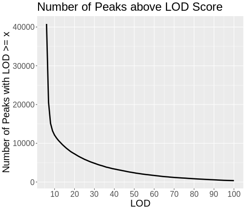

:::::::::::::::::::::::::::::::::::::: questions 

- How do I map all of the genes in my data set?
- What resources do I need to map all of the genes in my data set?

::::::::::::::::::::::::::::::::::::::::::::::::

::::::::::::::::::::::::::::::::::::: objectives

- To map several genes at the same time

::::::::::::::::::::::::::::::::::::::::::::::::


### Mapping All Genes

Most people have laptops with enough memory and computing power to map hundreds
of genes. However, we have over 20,000 genes in our data set. This would either
take a very long time or would use up all of the memory on most peoples' 
laptops.  

To map all of the genes, you will need to use a computing cluster, such as
*sumner2* at JAX. Since mapping all of the genes took 12 hours, you will not 
perform this operation in this workshop. Instead, we will show you how to set up
a computing job to run this analysis.

*sumner2* uses [slurm](https://slurm.schedmd.com/overview.html) to schedule 
computing jobs. `slurm` is software that runs on the cluster and manages how
computing jobs are run. Users submit job requests and `slurm` checks whether 
the requested memory, number of processors, and time are available and then 
decides when to run the job. It also balances the needs of different users so 
that everyone can get their computing jobs done.

*sumner2* also uses software containers to run software. JAX uses 
[Singularity](https://docs.sylabs.io/guides/3.5/user-guide/introduction.html)
containers. These contain software without the need to install it on the cluster.
The Computational Sciences group makes a large number of containers available
on *sumner2* and we will use their `qtl2` container.

If you are unfamiliar with the JAX computing cluster, Research IT has 
[excellent documentation](https://jacksonlaboratory.sharepoint.com/sites/ResearchIT/SitePages/Documentation.aspx)
that explains how the cluster works, how to submit jobs using `slurm`, and how
to use `Singularity` containers.

#### bash Script

<!-- DMG: Notes from sumner run. 11 hours with 20 cores & 100GB of memory.
11.4 G output file. 69005 rows x 21771 columns. -->

To run a batch job on the cluster, we will create a bash script which will
request resources from `slurm` and will call an R script, which will perform
the mapping. The script that we used is shown below.

```
#!/bin/bash
#SBATCH --qos batch
#SBATCH --partition compute
#SBATCH --nodes 1
#SBATCH --ntasks 1
#SBATCH --cpus-per-task 22
#SBATCH --mem 200G
#SBATCH --time 1-0:00

CONTAINER=/projects/omics_share/meta/containers/quay.io-jaxcompsci-r-qtl2-deseq-biomart-tidy-v4.img

module load singularity

singularity exec ${CONTAINER} Rscript eqtl.R
```

For each data set, you will need to determine the number of cores to use. `qtl2`
can perform the QTL mapping in parallel on one node, so you will typically
request only one node. In this case, we requested 22 cores on one node. 
*sumner2* has nodes with up to 70 cores, but there is a point of diminishing 
returns when parallelizing too much. We performed a short test run and found
that we used abouty 100GB of memory, so we requested twice that amount in case
there were memory surges during computation. And we requested one day (24 hours)
of compute time. 

Overall, the job took 12 hours and used 100GB of memory. 

Note that there are many ways to set up a computing job, including starting 
many separate mapping jobs and combining the results. We have chosen to show 
you one simple way in this course. If you have `slurm` expertise, you can try
other methods of breaking up the work.

Next, we call the R script using "singularity exec" to execute the command
which follows the container name. We call "Rscript" to run the eQTL mapping
script, which we placed in the same directory as the bash script.

The inputs to the script are the genoprobs, expression data, covariates, 
kinship matrix, and the marker map. You should have all of these pre-computed
and saved on the cluster in the same directory.

#### R Script

```
################################################################################
# Script to map all of the Attic DO 500 pancreatic islet RNASeq data.
#
# Daniel Gatti
# dan.gatti@jax.org
# 2024-11-01
################################################################################

##### LIBRARIES #####

library(qtl2)

##### VARIABLES #####

# Base directory for project.
base_dir = '/projects/compsci/eqtl_course'

# Number of cores. MUST MATCH SLURM REQUEST.
n_cores = 20

# Read in pre-built data files.

probs = readRDS(file.path(base_dir, 'attie_DO500_genoprobs_v5.rds'))
K     = readRDS(file.path(base_dir, 'attie_do_kinship.rds'))
covar = readRDS(file.path(base_dir, 'attie_do_covar.rds'))
expr  = readRDS(file.path(base_dir, 'attie_do_expr_rz.rds'))
map   = readRDS(file.path(base_dir, 'attie_do_map.rds'))

##### MAIN #####

# Convert covariates to factors.
covar$sex    = factor(covar$sex)
covar$DOwave = factor(covar$DOwave)

# Craete a matrix of additive covariates.
addcovar     = model.matrix(~sex + DOwave, data = covar)[,-1]

# Map all genes.
lod = scan1(genoprobs = probs, 
            pheno     = expr,
            kinship   = K, 
            addcovar  = addcovar,
            cores     = n_cores)

# Save the LOD scores for all genes.
saveRDS(lod, file = file.path(base_dir, 'attie_do_eqtl_lod.rds'))

# Get the peaks with LOD >= 6.
peaks = find_peaks(scan1_output = lod, 
                   map          = map, 
                   threshold    = 6, 
                   prob         = 0.95)

# Save the harvested LOD peaks.
saveRDS(peaks, file = file.path(base_dir, 'attie_do_eqtl_peaks.rds'))
```

The output of this script is two files.

1. attie_do_eqtl_lod.rds: This is numeric matrix containing LOD scores for all
genes at all markers. We save it as a compressed R data file (*.rds). In this 
case, the file is 11 GB.
2. attie_do_eqtl_peaks.rds: This is a data.frame containing the peaks with LOD
over 6. We save it as a compressed R data file (*.rds). In this case, the file
is 674 KB. You should have downloaded this file into your "data" directory.

### Finding QTL Peaks

Let's load in the QTL peaks that we pre-computed.


``` r
peaks <- readRDS(file = "data/attie_do_eqtl_peaks.rds")
```

`peaks` is a data.frame which contains all of the peaks in the same format as
we saw in the previous lesson. Let's remind ourselves what the peaks table 
looks like.


``` r
head(peaks)
```

``` output
  lodindex          lodcolumn chr       pos       lod      ci_lo     ci_hi
1        2 ENSMUSG00000000028   6  71.73759  7.358089  64.958691  77.39716
2        2 ENSMUSG00000000028  11  40.54754  6.424368   5.107459 106.64066
3        2 ENSMUSG00000000028  16  18.54468  8.001125  15.918386  20.83108
4        3 ENSMUSG00000000037   5  99.00918  6.524121  92.704924 102.15720
5        3 ENSMUSG00000000037  12  77.55794  6.123602  76.998817 110.18071
6        3 ENSMUSG00000000037   X 161.30209 28.383984 160.417579 161.39338
```

Each row contains information for one peak, including the gene ID, chromosome,
peak position, LOD, and support interval.

Notice that both genes `ENSMUSG00000000028` and `ENSMUSG00000000037` have more 
than one peak.

:::::::::::::::::::::::::::::::::::::::::::::::::::: challenge

#### Challenge 1: How many genes have QTL peaks?

Look at how many genes we have and how many rows there are in peaks. Is this the
same number? If not, can you explain why the numbers are different.

::::::::::::::::::::::::::::::::::::::: solution

Get the number of genes from `expr_rz`.


``` r
ncol(expr_rz)
```

``` output
[1] 21771
```

Get the number of QTL peaks in `peaks`.


``` r
nrow(peaks)
```

``` output
[1] 40850
```

There are more peaks than there are genes.

There are several different possibilities when mapping a gene.

1. A gene may have no QTL peaks over a LOD of 6, and so it will not appear in
the list of peaks.
2. A gene may have more than one QTL peak with a LOD greater than 6, and so 
will appear many times in the list of peaks.

::::::::::::::::::::::::::::::::::::::::::::::::
::::::::::::::::::::::::::::::::::::::::::::::::::::::::::::::

Let's count the number of peaks that each gene has.


``` r
dplyr::count(peaks, lodcolumn) |>
  dplyr::count(n)
```

``` output
  n   nn
1 1 6992
2 2 6814
3 3 3827
4 4 1441
5 5  445
6 6   95
7 7   20
8 8    4
9 9    2
```

From the table above, we can see that most genes have one or two peaks. However,
some genes have 9 peaks with LOD > 6!

When we built this table, we selected all of the peaks with LOD > 6. This is 
well below the alpha = 0.05 significance threshold. Let's get that threshold
and filter the list of peaks.


``` r
ethr <- summary(object = eperm,
                alpha  = 0.05)
ethr
```

``` output
LOD thresholds (1000 permutations)
     ENSMUSG00000020679
0.05               7.47
```

Now filter the peaks to retain peaks with LOD greater than or equal to 7.4745761.


``` r
peaks_filt <- filter(peaks, lod >= ethr[1,1])
```

:::::::::::::::::::::::::::::::::::::::::::::::::::: challenge

#### Challenge 2: How many peaks are there after filtering?

Get the number of QTL peaks that we have after filtering.

::::::::::::::::::::::::::::::::::::::: solution


``` r
nrow(peaks_filt)
```

``` output
[1] 17192
```

There are now fewer peaks.

::::::::::::::::::::::::::::::::::::::::::::::::

#### Challenge 3: How many peaks does each gene have?

Use the code above to count the number of QTL peaks that each gene has.

::::::::::::::::::::::::::::::::::::::: solution


``` r
dplyr::count(peaks_filt, lodcolumn) |>
  dplyr::count(n)
```

``` output
  n    nn
1 1 12680
2 2  1962
3 3   166
4 4    20
5 5     2
```

Now most genes have only one peak and only two genes have five peaks.

::::::::::::::::::::::::::::::::::::::::::::::::
::::::::::::::::::::::::::::::::::::::::::::::::::::::::::::::

Let's look at the number of genes with LOD scores above a certain value. We do
this by counting the number of peaks with LOD > 6, then > 7, etc.

::::::::::::::::::::::::::::::::::::::::::::::::::::: callout

Do not try to type the next block. We will look at it on the workshop website.

:::::::::::::::::::::::::::::::::::::::::::::::::::::::::::::


``` r
lod_brks <- 1:100
results  <- data.frame(lod_brks, n = 0)

for(i in lod_brks) {
  
  results$n[i] <- sum(peaks$lod >= i)
  
} # for(i)

results |>
  filter(lod_brks >= 6) |>
  ggplot(aes(lod_brks, n)) +
    geom_line(size = 1.25) +
    scale_x_continuous(breaks = 0:10 * 10) +
    labs(title = "Number of Peaks above LOD Score",
         x     = "LOD",
         y     = "Number of Peaks with LOD >= x") +
    theme(text = element_text(size = 20))
```

``` warning
Warning: Using `size` aesthetic for lines was deprecated in ggplot2 3.4.0.
ℹ Please use `linewidth` instead.
This warning is displayed once every 8 hours.
Call `lifecycle::last_lifecycle_warnings()` to see where this warning was
generated.
```



``` r
rm(lod_brks, results)
```

As you can see from the plot above, most peaks have LODs less than 10. However,
about 12,000 peaks have LODs over 10. As we increase the LOD score, we see that
fewer genes have high LODs. Let's look at how many peaks each gene
has as we increase the LOD threshold.

::::::::::::::::::::::::::::::::::::::::::::::::::::: callout

Do not try to type the next block. We will look at it on the workshop website.

:::::::::::::::::::::::::::::::::::::::::::::::::::::::::::::


``` r
lod_brks <- 0:100
result   <- data.frame(lod_brks = -1, n = 0, nn = 0)

for(i in lod_brks) {
  smry <- peaks |>
            filter(lod > i) |>
            dplyr::count(lodcolumn) |>
            dplyr::count(n) |>
            mutate(lod_brks = i)
  
  result <- bind_rows(result, smry)
} # for(i)

result |>
  filter(lod_brks >= 6) |>
  mutate(n = as.character(n)) |>
  ggplot(aes(lod_brks, nn, color = n)) +
    geom_line(aes(group = n), size = 1.25) +
    geom_point() +
    scale_x_continuous(breaks = 0:10 * 10) +
    labs(title = "Number of Peaks per Gene by LOD Threshold",
         x     = "LOD",
         y     = "Number of Peaks per Gene",
         color = "Number of Peaks") +
    theme(text = element_text(size = 20))
```


``` r
rm(lod_brks, result)
```

From this plot, we can see that higher LOD scores occur only once per gene. 
This makes sense since a high LOD score implies that the peak explains a large
proportion of the gene's variance. 

### Summary

In this episode, you learned how to run an eQTL analysis on a computing 
cluster and started to look at the resulting peaks. When we filter the peaks
by higher LOD scores, we tend to get fewer peaks per gene.

::::::::::::::::::::::::::::::::::::: keypoints 

- Mapping all genes in a study requires a computing cluster.
- Genes may have more than one QTL peak.
- High LOD scores often occur only once per gene.

::::::::::::::::::::::::::::::::::::::::::::::::
