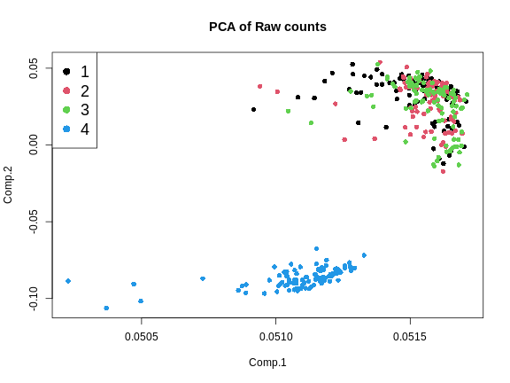
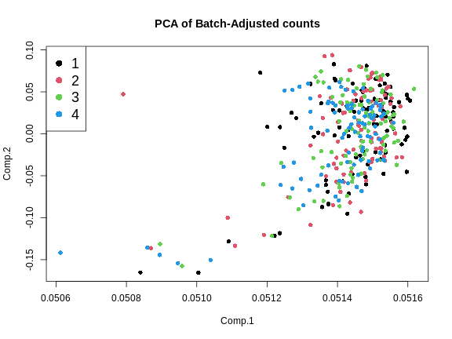
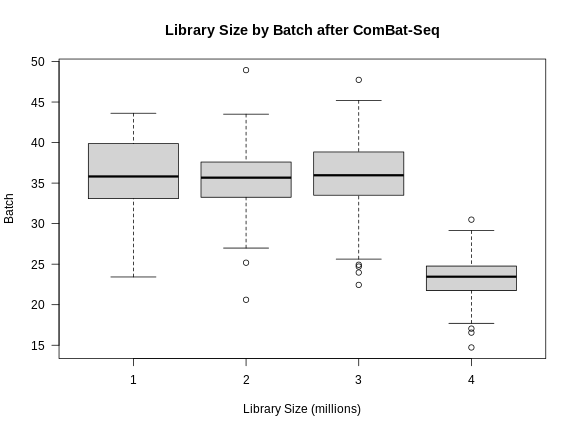
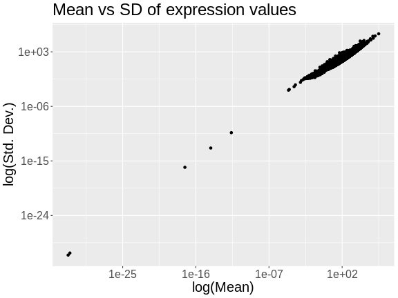

:::::::::::::::::::::::::::::::::::::: questions 

- What are the steps in QTL mapping?
- How do I map one gene expression trait?

::::::::::::::::::::::::::::::::::::::::::::::::

::::::::::::::::::::::::::::::::::::: objectives

- Review the steps in QTL mapping.
- Run a QTL analysis for expression data.

::::::::::::::::::::::::::::::::::::::::::::::::


## Expression Data

In this lesson we review mapping steps and apply those steps to a gene 
expression trait. In a previous lesson, we loaded in the raw transcript
expression data and noticed that the distribution of each gene was non-Gaussian
and different.

There is another issue that we must also address. Each sample has a 
different total number of counts. This affects our ability to compare values 
between samples. For example, say that we look at the expression of Gene1 in 
two samples and find that both samples have 500 counts for Gene1. It appears 
that Gene1 is equally expressed in both samples. However, suppose that the total
counts (_i.e._ the sum of counts for all genes in each sample) is 10 million for
sample 1 and 20 million for sample 2. The sum of all counts across all genes in 
a sample is also called the *library size*. Then we need to scale the counts for Gene1 by the total counts. This is shown in the table below.

 Sample | Gene1 Counts | Total Counts | Proportion
--------+--------------+--------------+------------
    1   |     500      |    10e6      |   5e-05
    2   |     500      |    20e6      |  2.5e-05

In this case, we can see that Gene1 has lower expression in sample 2 compared
to sample 1. Although the actual adjustment for library size (i.e. total
counts) is more complicated, this is the rationale for adjusting each sample.

Let's plot a histogram of the total counts in each sample.


``` r
libsize <- rowSums(raw) * 1e-6
hist(libsize,
     breaks = 50, 
     main   = "Histogram of Total Counts per Sample (raw counts)",
     xlab   = "Total Counts (Millions)")
```


As you can see, total counts range from 15 to 50 million reads. The distribution
of counts seems to be bimodal as well, which is troubling. This may be due to 
a batch effect.

Perhaps we should plot total counts versus the batch information that we have
in the covariates. Recall that there are 500 mice in the covariate data. The 
mouse IDs are in the rownames of the raw expression data, but not all 500 mice 
have expression data.


``` r
sum(covar$mouse %in% rownames(raw))
```

``` output
[1] 378
```

Let's subset the covariates to include only those with expression data. 


``` r
expr_covar <- subset(covar, mouse %in% rownames(raw))
expr_covar <- expr_covar[match(rownames(raw), expr_covar$mouse),]
expr_covar$DOwave <- factor(expr_covar$DOwave)
```

Now we can plot the library size by batch.


``` r
boxplot(libsize ~ expr_covar$DOwave,
        las = 1,
        main = "Library Size by Batch",
        xlab = "Library Size (millions)",
        ylab = "Batch")
```


There is definitely a difference in library size by batch.

Another way to look at batch effects is to plot the first and second principal
components of the expression data and to color them by batch.


``` r
counts  <- log1p(t(raw))
counts  <- scale(counts)
pca_raw <- princomp(counts)
```

Let's plot the first two PCs and color the samples by batch.


``` r
plot(pca_raw$loadings, 
     pch = 16, col = expr_covar$DOwave,
     main = "PCA of Raw counts")
legend("topleft", pch = 16, cex = 1.5, legend = levels(expr_covar$DOwave),
       col = 1:4)
```



From the plot above, we can see that the first three batches cluster together
and the fourth batch is quite different.

### Batch Adjustment

We will use a tool called 
[ComBat-Seq](https://bioconductor.org/packages/release/bioc/vignettes/sva/inst/doc/sva.pdf)
to adjust for the batch differences.

ComBat-Seq requires the counts matrix, the experimental variables of interest,
and the batch structure.

First, we will make the sex covariate.


``` r
covar_mod <- model.matrix(~sex, data = expr_covar)[,-1,drop = FALSE]
```

Next, we will run ComBat.


``` r
expr_cbt <- ComBat_seq(counts    = t(raw), 
                       batch     = expr_covar$DOwave,
                       covar_mod = covar_mod)
```

``` output
Found 4 batches
Using null model in ComBat-seq.
Adjusting for 1 covariate(s) or covariate level(s)
Estimating dispersions
Fitting the GLM model
Shrinkage off - using GLM estimates for parameters
Adjusting the data
```

`expr_cbt` now contains batch-adjusted counts. Let's plot the first two PCs
of the batch-adjusted data.


``` r
counts  <- log1p(expr_cbt)
counts  <- scale(counts)
pca_cbt <- princomp(counts)
```


``` r
plot(pca_cbt$loadings, 
     pch = 16, col = expr_covar$DOwave,
     main = "PCA of Batch-Adjusted counts")
legend("topleft", pch = 16, cex = 1.5, legend = levels(expr_covar$DOwave),
       col = 1:4)
```



This looks much better because the four batches now largely overlap. We will 
move forward with the Combat-adjusted counts.

Note that the differences in library size have not changed greatly.


``` r
libsize2 <- colSums(expr_cbt) * 1e-6
boxplot(libsize2 ~ expr_covar$DOwave,
        las = 1,
        main = "Library Size by Batch after ComBat-Seq",
        xlab = "Library Size (millions)",
        ylab = "Batch")
```



### Normalizing Gene Expression

After batch-adjustment, we need to normalize the gene expression by adjusting
for differences in library sizes between samples and for the difference in 
variances between genes.

We will use the 
[DESeq2](https://bioconductor.org/packages/release/bioc/html/DESeq2.html) 
package to adjust the counts for library size. DESeq2 is a large package which
performs many types of analyses. Further details are in the
[DESeq2 Tutorial](https://bioconductor.org/packages/devel/bioc/vignettes/DESeq2/inst/doc/DESeq2.html).

First, we must create a DESeq object. We need the raw counts, rounded so that
all values are integers, and the sample covariate data. We will have to subset
the sample covariates to include only the expression samples, since we don't
have expression data for every mouse.

In order to create the DESeq2 object, we will need to transpose (using `t()`) 
the expression data so that the mouse IDs (samples) are moved to the columns.
This is because DESeq2 requires that the samples be in columns and the genes in 
rows. We will also tell DESeq2 what the design variables are for our data, 
although they are not used in this case. These would be used if we were 
searching for differentially expressed genes. We specify no design with 
`design = ~ 1`.


``` r
dds  = DESeqDataSetFromMatrix(countData = round(expr_cbt), 
                              colData   = expr_covar, 
                              design    = ~ 1)
```

``` output
converting counts to integer mode
```

The object `dds` contains the counts for all mice that have expression data. 
Genes are in rows and samples are in columns.


``` r
dds
```

``` output
class: DESeqDataSet 
dim: 21771 378 
metadata(1): version
assays(1): counts
rownames(21771): ENSMUSG00000000001 ENSMUSG00000000028 ...
  ENSMUSG00000099322 ENSMUSG00000099329
rowData names(0):
colnames(378): DO021 DO022 ... DO417 DO420
colData names(4): mouse sex DOwave diet_days
```

``` r
dim(dds)
```

``` output
[1] 21771   378
```

This is a complex data object. Let's look at the counts for the first gene in 
the first 5 samples.


``` r
dds@assays@data$counts[1, 1:5]
```

``` output
DO021 DO022 DO023 DO024 DO025 
 9012 10608 11309 11205 10018 
```

Now look at the counts for the first five genes in sample 1.


``` r
dds@assays@data$counts[1:5, 1]
```

``` output
ENSMUSG00000000001 ENSMUSG00000000028 ENSMUSG00000000037 ENSMUSG00000000049 
              9012                 96                 24                 11 
ENSMUSG00000000056 
               136 
```

Next, we will run DESeq2 and let it adjust the expression data for differing
library sizes.


``` r
dds  = DESeq(dds)
```

``` output
estimating size factors
```

``` output
estimating dispersions
```

``` output
gene-wise dispersion estimates
```

``` output
mean-dispersion relationship
```

``` output
final dispersion estimates
```

``` output
fitting model and testing
```

``` output
-- replacing outliers and refitting for 137 genes
-- DESeq argument 'minReplicatesForReplace' = 7 
-- original counts are preserved in counts(dds)
```

``` output
estimating dispersions
```

``` output
fitting model and testing
```

Once this is done, we will get the expression data after it has been transformed
using the
[Variance Stabilizing Transformation](https://en.wikipedia.org/wiki/Variance-stabilizing_transformation)
(VST). The VST adjusts the variance of the genes such that it is not related to
the mean gene expression level.

:::::::::::::::::::::::::::::::::::::::::::::::::::::::: instructor

The students don't have to type the next block. You can show the plot in the 
lesson or type it to show the plot live.

:::::::::::::::::::::::::::::::::::::::::::::::::::::::::::::::::::

First, let's look at the mean expression of each gene versus its standard
deviation.


``` r
tibble(mean = rowMeans(expr_cbt),
       sd   = apply(expr_cbt, 1, sd)) |>
  ggplot(aes(mean, sd)) +
    geom_point() +
    scale_x_log10() +
    scale_y_log10() +
    labs(title = "Mean vs SD of expression values",
         x     = "log(Mean)", y = "log(Std. Dev.)") +
    theme(text = element_text(size = 20))
```



The plot above shows the mean expression value for each gene versus the standard
deviation of each gene. Both axes are log-transformed. As you can see, there is 
a positive correlation between the mean and the standard deviation. We would 
like each gene to have the same variance, regardless of the mean, for each gene.

Next, we will apply the variance stabilizing transformation and will transpose
the expression values.


``` r
expr = assays(vst(dds))[[1]]
expr = t(expr)
```

Let's look at the mean versus the standard deviation of each gene after 
normalization.


``` r
tibble(mean = colMeans(expr),
       sd   = apply(expr, 2, sd)) |>
  ggplot(aes(mean, sd)) +
    geom_point() +
    scale_x_log10() +
    scale_y_log10() +
    labs(title = "Mean vs SD of expression after VST",
         x     = "log(Mean)", y = "log(Std. Dev.)") +
    theme(text = element_text(size = 20))
```


The standard deviation is now largely unrelated to the mean. At lower expression
levels, the standard deviation is somewhat related to the mean.

Let's look at a the distribution of total counts per sample after normalization.


``` r
hist(rowSums(expr) * 1e-6,
      breaks = 50, 
      main   = "Total Expression per Sample (after normalization)",
      xlab   = "Total Counts (Millions)")
```


Note that we no longer see a bimodal distribution, which indicates that the 
batch effects have largely been adjusted.

At this point, while each gene has been normalized, each gene has a different 
distribution. In QTL mapping, we often use permutations to estimate significance
thresholds. This approach works for one phenotype. However, if other phenotypes
have different distributions, then the significance threshold for one phenotype
cannot be used for another. This means that we would have to perform 1,000
permutations for **each** gene. While modern computing clusters can do  this, 
it is time consuming. 

Another approach is to force the distribution of each gene to be identical. 
Then, we can perform permutations on one gene and get a significance threshold 
for all genes. 

We can force the distribution of each gene to be Gaussian and identical for all
genes using an inverse-normal or rank-Z transformation.


``` r
source("https://raw.githubusercontent.com/smcclatchy/eqtl-mapping/refs/heads/main/episodes/code/rankz.R")

expr_rz = apply(expr, 2, rankZ)
```

Boxplots of raw counts for six example genes are shown at left below. Notice 
that the median count values (horizontal black bar in each boxplot) are not 
comparable between the genes because the counts are not on the same scale. At
right, boxplots for the same genes show normalized count data on the same 
scale.

::::::::::::::::::::::::::::::::::::::::::::::::instructor

Show this in the lesson website. Don't type all of this out or have the students
type it either.

:::::::::::::::::::::::::::::::::::::::::::::::::::


``` r
tmp = raw |> 
        as.data.frame() |> 
        select(ENSMUSG00000000001:ENSMUSG00000000058) |> 
        pivot_longer(cols      = everything(),
                     names_to  = 'gene',
                     values_to = 'value') |> 
        mutate(type = 'raw')

norm = expr |> 
         as.data.frame() |> 
         select(ENSMUSG00000000001:ENSMUSG00000000058) |> 
         pivot_longer(cols      = everything(),
                      names_to  = 'gene',
                      values_to = 'value') |> 
         mutate(type = 'normalized')

bind_rows(tmp, norm) |>
  mutate(type = factor(type, levels = c('raw', 'normalized'))) |> 
  ggplot(aes(gene, value)) +
    geom_boxplot() +
    facet_wrap(~type, scales = 'free') +
    labs(title = 'Count distributions for example genes') +
    theme(text = element_text(size = 20),
          axis.text.x = element_text(angle = 90, hjust = 0.5, vjust = 1))
```


``` r
rm(tmp, norm)
```

In the rankZ-transformed data, every gene has the same distribution.

::::::::::::::::::::::::::::::::::::::::::::::::instructor

Show this in the lesson website. Don't type all of this out or have the students
type it either.

::::::::::::::::::::::::::::::::::::::::::::::::::::::::::


``` r
expr_rz |> 
  as.data.frame() |> 
  select(ENSMUSG00000000001:ENSMUSG00000000058) |> 
  pivot_longer(cols      = everything(),
               names_to  = 'gene',
               values_to = 'value') |>
  ggplot(aes(gene, value)) +
    geom_boxplot() +
    labs(title = 'RankZ distributions for example genes') +
    theme(text = element_text(size = 20),
          axis.text.x = element_text(angle = 90, hjust = 0.5, vjust = 1))
```


Let's save the rankZ-transformed expression data so that we will have it when
we need it again.


``` r
saveRDS(expr_rz, file = "data/attie_do_expr_rz.rds")
```

Before moving on, let's remove data objects that we won't be using again.


``` r
rm(dds, raw, expr)
```


:::::::::::::::::::::::::::::::::::::::::::::::::::: callout

To recap, before we perform any analysis using the transcript expression data,
we need to:  

1. adjust for batch differences,
2. normalize it by adjusting for library size and,  
3. transform the expression of each gene to be Gaussian.

::::::::::::::::::::::::::::::::::::::::::::::::::::::::::::

### The Marker Map  

The marker map contains a list of the genetic marker positions for each marker
in the genoprobs. Let's read it in now.


``` r
map <- readRDS(file = 'data/attie_do_map.rds')
```

The marker map for each chromosome is stored in the `map` object. This is used 
to plot the LOD scores calculated at each marker during QTL mapping. Each list 
element is a numeric vector with each marker position in megabases (Mb). Here we 
are using the 69K grid marker file. Often when there are numerous genotype 
arrays used in a study, we interpolate all to a 69k grid file so we are able to 
combine all samples across different array types. 

Look at the structure of `map` in the Environment tab by clicking the triangle 
to the left or by running `str(map)` in the Console.  


``` r
str(map)
```

``` output
List of 20
 $ 1 : Named num [1:4711] 3 3.04 3.35 3.65 3.66 ...
  ..- attr(*, "names")= chr [1:4711] "1_3e+06" "1_3041392" "1_3346528" "1_3651663" ...
 $ 2 : Named num [1:4709] 3 3.04 3.08 3.51 3.51 ...
  ..- attr(*, "names")= chr [1:4709] "2_3e+06" "2_3038312" "2_3076624" "2_3510793" ...
 $ 3 : Named num [1:3811] 3 3.48 3.95 4.43 4.91 ...
  ..- attr(*, "names")= chr [1:3811] "3_3e+06" "3_3476607" "3_3953213" "3_4429820" ...
 $ 4 : Named num [1:3872] 3 3.04 3.08 3.12 3.16 ...
  ..- attr(*, "names")= chr [1:3872] "4_3e+06" "4_3039973" "4_3079946" "4_3119919" ...
 $ 5 : Named num [1:3837] 3 3.04 3.33 3.34 3.35 ...
  ..- attr(*, "names")= chr [1:3837] "5_3e+06" "5_3039177" "5_3333513" "5_3343035" ...
 $ 6 : Named num [1:3653] 3 3.04 3.41 3.77 4.14 ...
  ..- attr(*, "names")= chr [1:3653] "6_3e+06" "6_3040509" "6_3407400" "6_3774290" ...
 $ 7 : Named num [1:4006] 3 3.04 3.07 3.18 3.23 ...
  ..- attr(*, "names")= chr [1:4006] "7_3e+06" "7_3035905" "7_3071810" "7_3183355" ...
 $ 8 : Named num [1:3387] 3 3.04 3.08 3.4 3.41 ...
  ..- attr(*, "names")= chr [1:3387] "8_3e+06" "8_3037619" "8_3075238" "8_3402939" ...
 $ 9 : Named num [1:3414] 3 3.04 3.07 3.52 3.97 ...
  ..- attr(*, "names")= chr [1:3414] "9_3e+06" "9_3035823" "9_3071646" "9_3522909" ...
 $ 10: Named num [1:3450] 3 3.04 3.07 3.11 3.15 ...
  ..- attr(*, "names")= chr [1:3450] "10_3e+06" "10_3037150" "10_3074301" "10_3111451" ...
 $ 11: Named num [1:3796] 3 3.03 3.06 3.09 3.13 ...
  ..- attr(*, "names")= chr [1:3796] "11_3e+06" "11_3031502" "11_3063005" "11_3094507" ...
 $ 12: Named num [1:3124] 3 3.04 3.08 3.44 3.8 ...
  ..- attr(*, "names")= chr [1:3124] "12_3e+06" "12_3038001" "12_3076003" "12_3437198" ...
 $ 13: Named num [1:3229] 3 3.4 3.79 3.8 3.81 ...
  ..- attr(*, "names")= chr [1:3229] "13_3e+06" "13_3396518" "13_3793036" "13_3803732" ...
 $ 14: Named num [1:3019] 3 3.04 3.08 3.12 3.16 ...
  ..- attr(*, "names")= chr [1:3019] "14_3e+06" "14_3040840" "14_3081681" "14_3122521" ...
 $ 15: Named num [1:2761] 3 3.04 3.07 3.11 3.58 ...
  ..- attr(*, "names")= chr [1:2761] "15_3e+06" "15_3036880" "15_3073761" "15_3110641" ...
 $ 16: Named num [1:2688] 3 3.04 3.07 3.11 3.14 ...
  ..- attr(*, "names")= chr [1:2688] "16_3e+06" "16_3035541" "16_3071083" "16_3106624" ...
 $ 17: Named num [1:2873] 3 3.03 3.06 3.38 3.69 ...
  ..- attr(*, "names")= chr [1:2873] "17_3e+06" "17_3032196" "17_3064392" "17_3375528" ...
 $ 18: Named num [1:2588] 3 3.42 3.83 4.25 4.26 ...
  ..- attr(*, "names")= chr [1:2588] "18_3e+06" "18_3416510" "18_3833020" "18_4249530" ...
 $ 19: Named num [1:2434] 3 3.02 3.05 3.07 3.1 ...
  ..- attr(*, "names")= chr [1:2434] "19_3e+06" "19_3024080" "19_3048159" "19_3072239" ...
 $ X : Named num [1:3643] 3 3.05 3.09 3.14 3.19 ...
  ..- attr(*, "names")= chr [1:3643] "X_3e+06" "X_3046778" "X_3093557" "X_3140335" ...
```

Each element in map contains a list of marker positions and names.


``` r
head(map[[1]])
```

``` output
  1_3e+06 1_3041392 1_3346528 1_3651663 1_3657931 1_3664199 
 3.000000  3.041392  3.346528  3.651663  3.657931  3.664199 
```

The names of the markers consist of the chromosome and the bp position, 
separated by an underscore (_).

::::::::::::::::::::::::::::::::::::::::::: callout

The marker positions in the map must be in Mb.

:::::::::::::::::::::::::::::::::::::::::::::::::::

### Genotype probabilities  

Previously, we loaded in the physiological phenotypes, the sample covariates,
and the transcript expression data and annotation. We also normalized and rankZ 
transformed the expression data.

In order to perform QTL mapping, we also need the genotype probabilities 
(i.e genoprobs). In this lesson, we have already processed the genotypes and 
produced the genoprobs using 
[calc_genoprob](https://github.com/kbroman/qtl2/blob/main/R/calc_genoprob.R).

<!-- We don't evaluate this block when building the website because the file is 
too large (1.7 GB). We load the probs from Box above . -->


``` r
probs <- readRDS("data/attie_DO500_genoprobs_v5.rds")
```

At this point, you should have several data objects in your environment. Look at
the Environment tab to see what data objects are in your environment. It should
look like the figure below.

{alt="Picture of Environment tab with data objects."}
Each element of `probs` is a 3-dimensional array containing the founder allele 
dosages for each sample at each marker on one chromosome. These are the 8 state 
allele probabilities (not 32) using the 69k marker grid for the same 500 DO mice 
that also have clinical phenotypes. We have already calculated genotype 
probabilities for you, so you can skip the step for
[calculating genotype probabilities](https://smcclatchy.github.io/qtl-mapping/calc-genoprob/) 
and the optional step for calculating allele probabilities.

:::::::::::::::::::::::::::::::::::::::::::::::: challenge

#### Challenge 1: What is a genotype probability? Why do we need genotype probabilities in QTL mapping?

::::::::::::::::::::::::::: solution

A genotype probability is the probability of possible genotypes in between 
typed markers. We use genotype probabilities in QTL mapping to identify QTL in
between typed markers. 

::::::::::::::::::::::::::::::::::::
::::::::::::::::::::::::::::::::::::::::::::::::::::::::::

Next, we look at the dimensions of `probs` for chromosome 1: 


``` r
dim(probs[[1]])
```

``` output
[1]  500    8 4711
```

Each list element of the genoprobs has 500 samples, eight founders, and a 
variable number of markers, depending on the chromosome.

As a reminder, this is what the genoprobs of one mouse look like along one
chromosome.


``` r
plot_genoprob(probs, map, ind = 1, chr = 1)
```


In the plot above, the founder contributions, which range between 0 and 1, are 
colored from white (= 0) to black (= 1.0). A value of ~0.5 is grey. The markers 
are on the X-axis and the eight founders (denoted by the letters A through H) on 
the Y-axis. Starting at the left, we see that this sample has genotype GH 
because the rows for G and H are grey, indicating values of 0.5 for both 
alleles. Moving along the genome to the right, the genotype becomes HH where the 
row is black indicating a value of 1.0.  This is followed by CD, DD, DG, AD, AH,
CE, etc. The values at each marker sum to 1.0.  

### Kinship Matrix

We also use a kinship matrix in the mapping model to adjust for the relatedness
between mice. We also use a different kinship matrix on each chromosome by 
including all of the markers except the ones on the current chromosome. This 
is called the "Leave-One-Chromosome-Out" (LOCO) method. We use the genoprobs 
to create the kinship matrices in the 
[calc_kinship](https://github.com/kbroman/qtl2/blob/main/R/calc_kinship.R) 
function.

::::::::::::::::::::::::::::::::::::::::::::::::: instructor

We load in kinship at the top of the lesson to build the website. This will
take the students a while to build.

:::::::::::::::::::::::::::::::::::::::::::::::::


``` r
K <- calc_kinship(probs = probs,
                  type = 'loco')
```

:::::::::::::::::::::::::::::::::::::::::::::::: challenge

#### Challenge 2: Why do we calculate kinship? What purpose does it serve?

::::::::::::::::::::::::::: solution

Calculating kinship between individuals in a study corrects for known relatedness and unknown population structure. Without accounting for kinship, many false positives can occur due to genetic relatedness.

::::::::::::::::::::::::::::::::::::
::::::::::::::::::::::::::::::::::::::::::::::::::::::::::

And let's save the kinship matrices so that we don't have to build them again.


``` r
saveRDS(K, file = "data/attie_do_kinship.rds")
```

Let's look at a part of one of the kinship matrices.


``` r
n_samples <- 50
heatmap(K[[1]][1:n_samples, 1:n_samples], main = "Kinship Between Mice")
```


The figure above shows kinship between all pairs of samples. Light yellow 
indicates low kinship and dark red indicates higher kinship. Orange values 
indicate varying levels of kinship between 0 and 1. The dark red diagonal of the 
matrix indicates that each sample is identical to itself. The orange blocks 
along the diagonal may indicate close relatives (i.e. siblings or cousins).

### Covariates    

Next, we need to create additive covariates that will be used in the mapping 
model.  First, we need to see which covariates are significant. In the data set, 
we have `sex`, `DOwave` (_i.e._, batch) of DO mice) and `diet_days` 
(number of days on diet) to test whether there are any sex, batch or diet 
effects.

:::::::::::::::::::::::::::::::::::::::::::::::: challenge

#### Challenge 3: Why do we use covariates in the model? What purpose do they serve?

::::::::::::::::::::::::::: solution

Covariates are added into the model to explain variation in phenotypes. When
including sex in the model, for example, we allow the phenotype means of the 
two different sexes to vary rather than to be the same.

::::::::::::::::::::::::::::::::::::
::::::::::::::::::::::::::::::::::::::::::::::::::::::::::

We will use `sex` and `DOwave` as additive covariates. Sex and DO outbreeding
generation are often sensible covariates to add. We will convert `sex` and 
`DOwave` to factors and then use 
[model.matrix](https://rdrr.io/r/stats/model.matrix.html)
to create the covariates matrix that `qtl2` will use.


``` r
pheno$sex    <- factor(pheno$sex)
pheno$DOwave <- factor(pheno$DOwave)

addcovar     <- model.matrix(~sex + DOwave + diet_days, data = pheno)[,-1]
```

::::::::::::::::::::::::::::::::::::::::::::::: callout

The sample IDs must be in the rownames of `pheno`, `addcovar`, `genoprobs` and 
`K`. `qtl2` uses the sample IDs to align the samples between objects.

:::::::::::::::::::::::::::::::::::::::::::::::::::::::


``` r
head(addcovar)
```

``` output
      sexM DOwave2 DOwave3 DOwave4 DOwave5 diet_days
DO021    0       0       0       0       0       112
DO022    0       0       0       0       0       112
DO023    0       0       0       0       0       112
DO024    0       0       0       0       0       112
DO025    0       0       0       0       0       114
DO026    0       0       0       0       0       114
```

Let's save the additive covariates so that we don't have to create them agian.


``` r
saveRDS(addcovar, 'data/attie_do_addcovar.rds')
```


## Performing a Genome Scan

We will perform a genome scan for insulin AUC, comparing the results of the
untransformed and log-transformed results. Use the
[scan1](https://github.com/kbroman/qtl2/blob/main/R/scan1.R) function to map 
insulin AUC.

::::::::::::::::::::::::::::::::::::::::::::::::::::: instructor

This takes about 15 to 30 seconds.

::::::::::::::::::::::::::::::::::::::::::::::::::::::::::::::::


``` r
ins_lod <- scan1(genoprobs = probs,
                 pheno     = ins_tauc,
                 kinship   = K,
                 addcovar  = addcovar)
```

After the genome scan, `ins_lod` contains the LOD scores for both the 
untransformed and log-transformed insulin values. 


``` r
head(ins_lod)
```

``` output
          Ins_tAUC Ins_tAUC_log
1_3000000 5.174362     4.415858
1_3041392 5.174948     4.416144
1_3346528 5.113387     4.401578
1_3651663 4.879878     4.229782
1_3657931 4.928267     4.271351
1_3664199 4.977715     4.311565
```

Let's plot both LOD curves.

::::::::::::::::::::::::::::::::::::::::::::::::::::: instructor

You don't have to have the students type out the legend and title code. Also, 
use "red3" instead of "rgb(0.8, 0, 0, 0.5)".

:::::::::::::::::::::::::::::::::::::::::::::::::::::::::::::::


``` r
plot_scan1(x         = ins_lod, 
           map       = map,
           lodcolumn = "Ins_tAUC_log",
           main      = "insulin AUC")
plot_scan1(x         = ins_lod, 
           map       = map,
           lodcolumn = "Ins_tAUC",
           col       = rgb(0.8, 0, 0, 0.5),
           lty       = "dashed",
           add       = TRUE)
legend("topleft", 
       legend = c("log-transformed", "untransformed"), 
       col    = c("black",           "red3"), 
       lwd    = 2)
```


:::::::::::::::::::::::::::::::::::::::::::::::: challenge

#### Challenge 4: Which phenotype has the higher LOD score on chromosomes 11 and 17?

::::::::::::::::::::::::::: solution

The log-transformed data has a higher LOD score on chromosome 11. However,
the untransformed data has a higher LOD on chromosome 17.

::::::::::::::::::::::::::::::::::::
::::::::::::::::::::::::::::::::::::::::::::::::::::::::::

The challenge above shows the value of transforming data to make it more
normally distributed. We have a peak for `log(ins_tauc)` on chromosome 11 which
we will work with for the rest of the lesson.

Let's save this LOD profile in case we need it again. We will only save the
results from the log-transformed data since that produces a higher LOD at a peak
that we will use later.


``` r
saveRDS(ins_lod[, 2, drop = FALSE], file = "data/ns_tauc_lod.rds")
```


Because we are working with the insulin AUC phenotype, which has a QTL peak
on chromosome 11, we will map a gene on chromosome 11 which may influence 
insulin and glucose levels. This gene is called
[Hnf1b](https://www.alliancegenome.org/gene/MGI:98505). Since the expression
data uses Ensembl IDs in its column names, we need to find the Ensembl ID for 
this gene:


``` r
ensid <- annot |>
           subset(symbol == "Hnf1b") |>
           pull(gene_id)
ensid
```

``` output
[1] "ENSMUSG00000020679"
```

Next, we will create a variable which contains the rankZ-transformed Hnf1b 
expression values to reduce our typing.


``` r
hnf1b = expr_rz[, ensid, drop = FALSE]
```

:::::::::::::::::::::::::::::::::::::::::::::::::::: callout

Remember to use the `drop = FALSE` argument so that R will not convert the
expression data from a matrix to a vector.

::::::::::::::::::::::::::::::::::::::::::::::::::::::::::::


``` r
hnf1b_lod = scan1(genoprobs = probs,
                  pheno     = hnf1b,
                  kinship   = K,
                  addcovar  = addcovar)
```

:::::::::::::::::::::::::::::::::::::::::::::::: challenge

#### Challenge 5: Plot Hnf1b Genome Scan

Use the [plot_scan1](https://github.com/kbroman/qtl2/blob/main/R/plot_scan1.R) 
function to plot the Hnf1b genome scan.

::::::::::::::::::::::::::: solution


``` r
plot_scan1(x    = hnf1b_lod,
           map  = map,
           main = "Hnf1b")
```


::::::::::::::::::::::::::::::::::::
::::::::::::::::::::::::::::::::::::::::::::::::::::::::::

### Permutations

We now have a peaks on chromosome 11 for both insulin AUC and Hnf1b, but we do
not know if the LODs are significant. In order to assess significance, we will
use permutations.

:::::::::::::::::::::::::::::::::::::::::::::::::::: callout

Don't run the permutation block below. It will take hours to complete. We have
pre-computed the permutations and have code for you to load them in below.

::::::::::::::::::::::::::::::::::::::::::::::::::::::::::::


``` r
iperm <- scan1perm(genoprobs = probs, 
                   pheno     = ins_tauc[,2, drop = FALSE], 
                   addcovar  = addcovar,
                   n_perm    = 1000)
```

Since calculating permutations takes a long time, we will read in pre-computed
permutations.


``` r
iperm <- readRDS(file = 'data/ins_tauc_log_perm_1000.rds')
```

We then obtain the permutation thresholds using the 
[summary](https://github.com/kbroman/qtl2/blob/main/R/summary_scan1perm.R)
function.  Let's find the significance level for 0.1, 0.05 and 0.01.  


``` r
thr_ins <- summary(object = iperm,
                   alpha  = c(0.1, 0.05, 0.01))
thr_ins
```

``` output
LOD thresholds (1000 permutations)
     Ins_tAUC_log
0.1          7.06
0.05         7.42
0.01         8.34
```

We also need to perform permutations of the Hnf1b values since they have a 
different distribution than insulin AUC.

:::::::::::::::::::::::::::::::::::::::::::::::::::: callout

Don't run the permutation block below. It will take hours to complete. We have
pre-computed the permutations and have code for you to load them in below.

::::::::::::::::::::::::::::::::::::::::::::::::::::::::::::


``` r
eperm <- scan1perm(genoprobs = probs, 
                   pheno     = expr_rz[, ensid, drop = FALSE], 
                   addcovar  = addcovar,
                   n_perm    = 1000)
```


We will read in the pre-computed permutations.


``` r
eperm <- readRDS(file = str_c("data/", ensid, "_perm_1000.rds"))
```

Next, we will get the significance thresholds at the alpha = 0.1, 0.05, and 0.01
levels.


``` r
thr_hnf1b <- summary(eperm, 
                     alpha = c(0.1, 0.05, 0.01))
thr_hnf1b
```

``` output
LOD thresholds (1000 permutations)
     ENSMUSG00000020679
0.1                7.08
0.05               7.47
0.01               8.35
```

:::::::::::::::::::::::::::::::::::::::::::::::: challenge

#### Challenge 6: What does permutation do to the data? How do permutations aid in finding significant LOD scores?

::::::::::::::::::::::::::: solution

Permutations shuffle the data, breaking the relationship between genotype and
phenotype. Genome-wide maximum LOD scores are calculated with the permuted
(shuffled) data to determine how high a LOD score could occur by random chance.
This LOD score indicates the significance of LOD scores in a scan, indicating
which values might occur simply by random chance.

::::::::::::::::::::::::::::::::::::
::::::::::::::::::::::::::::::::::::::::::::::::::::::::::

### Finding Significant Peaks

Let's use `find_peaks` to identify the significant peaks in the insulin AUC
genome scan. We will use the 0.05 significance threshold.


``` r
peaks_ins <- find_peaks(scan1_output = ins_lod, 
                        map          = map, 
                        threshold    = thr_ins[2], 
                        prob         = 0.95)
peaks_ins |> 
  dplyr::select(-lodindex) |>
  arrange(chr, pos) |>
  kable(caption = "insulin AUC QTL Peaks")
```


Table: insulin AUC QTL Peaks

|lodcolumn    |chr |      pos|      lod|    ci_lo|    ci_hi|
|:------------|:---|--------:|--------:|--------:|--------:|
|Ins_tAUC_log |11  | 83.59467| 11.07456| 83.58167| 84.95444|

We can see that we have a peak for insulin AUC on chromosome 
11 at 83.594665 Mb.

:::::::::::::::::::::::::::::::::::::::::::::: challenge

#### Challenge 7: Significant Peaks for Hnf1b

Use the [find_peaks](https://github.com/kbroman/qtl2/blob/main/R/find_peaks.R) 
function to find the significant peaks for Hnf1b at the `alpha = 0.05` 
threshold. Make a note of the QTL support interval.

:::::::::::::::::::::::::::: solution


``` r
hnf1b_peaks <- find_peaks(scan1_output = hnf1b_lod,
                          map          = map,
                          threshold    = thr_hnf1b[2],
                          prob         = 0.95)

hnf1b_peaks |> 
  dplyr::select(-lodindex) |>
  arrange(chr, pos) |>
  kable(caption = "Hnf1b QTL Peaks")
```


Table: Hnf1b QTL Peaks

|lodcolumn          |chr |      pos|      lod|    ci_lo|    ci_hi|
|:------------------|:---|--------:|--------:|--------:|--------:|
|ENSMUSG00000020679 |11  | 84.40138| 35.70779| 83.59197| 84.40138|


:::::::::::::::::::::::::::::::::::::

#### Challenge 8: Genomic Position of Hnf1b

Find the position of the Hnf1b gene in the gene annotation. You may want to
use the `filter` or `subset` functions on the `annot` object.

Where is Hnf1b in relation to the QTL interval in Challenge 3?

::::::::::::::::::::::::::::: solution


``` r
hnf1b_pos <- filter(annot, symbol == "Hnf1b")
hnf1b_pos
```

``` output
                              gene_id symbol chr    start      end strand
ENSMUSG00000020679 ENSMUSG00000020679  Hnf1b  11 83.85006 83.90592      1
                     middle nearest.marker.id        biotype       module
ENSMUSG00000020679 83.87799       11_84097611 protein_coding midnightblue
                   hotspot
ENSMUSG00000020679    <NA>
```

The support interval ranges from 83.591972 to 84.401384
Mb. Hnf1b is located on chromosome 11 at 83.850063 Mb,
which is within the support interval.

::::::::::::::::::::::::::::::::::::::

::::::::::::::::::::::::::::::::::::::::::::::::::::::::

In the challenges above, we saw that Hnf1b has a QTL peak directly over the 
gene's genomic position. When this happens, we call is a *local eQTL* because
the QTL is co-located with the gene. We will revisit this phenomenon more in
later episodes.

### Estimating Founder Allele Effects

Let's look at the QTL effects for insulin AUC on chromosome 11.

:::::::::::::::::::::::::::::::::::::::::::::::::: instructor

This takes 40 minutes to run. Have the students read in the pre-computed
results.

:::::::::::::::::::::::::::::::::::::::::::::::::::::::::::::

Below is the code that you would use. It will take too long to run in this 
class, so we will read the results in below.


``` r
chr      <- peaks_ins$chr[1]
ins_blup <- scan1blup(genoprobs = probs[,chr],
                      pheno     = ins_tauc[,2,drop = FALSE],
                      kinship   = K[[chr]],
                      addcovar  = addcovar)
```

Read in the insulin AUC founder allele effects.


``` r
ins_blup <- readRDS(file = 'data/ins_tauc_blup_chr11.rds')
```

Next, we will plot the founder allele effects.


``` r
plot_coefCC(x      = ins_blup, 
            map    = map, 
            legend = "bottomleft",
            scan1_output = ins_lod[, 2, drop = FALSE],
            main   = "insulin AUC")
```


Next we will estimate the founder allele effects for Hnf1b.

:::::::::::::::::::::::::::::::::::::::::::::::::: instructor

This takes 10 minutes to run. Have the students read in the pre-computed
results.

:::::::::::::::::::::::::::::::::::::::::::::::::::::::::::::

Below is the code that you would use. It will take too long to run in this 
class, so we will read the results in below.


``` r
chr        <- hnf1b_peaks$chr[1]
hnf1b_blup <- scan1blup(genoprobs = probs[,chr],
                      pheno       = hnf1b,
                      kinship     = K[[chr]],
                      addcovar    = addcovar)
```

Read in the Hnf1b founder allele effects.


``` r
hnf1b_blup <- readRDS(file = 'data/hnf1b_blup_chr11.rds')
```

Next, we will plot the founder allele effects.


``` r
plot_coefCC(x      = hnf1b_blup, 
            map    = map, 
            legend = "bottomleft",
            scan1_output = hnf1b_lod,
            main   = "Hnf1b")
```


::::::::::::::::::::::::::::::::::::: challenge 

#### Challenge 9: Compare Founder Allele Effects

Compare at the pattern of founder allele effects at the QTL position for insulin
tAUC and Hnf1b.

:::::::::::::::::::::::: solution 

In the insulin AUC allele effects, the A/J, C57BL/6J, 129S1/SvmJ, and 
NOD/ShiLtJ alleles contribute to higher insulin AUC.

:::::::::::::::::::::::::::::::::

::::::::::::::::::::::::::::::::::::::::::::::::


::::::::::::::::::::::::::::::::::::: keypoints 

- Gene expression values must be normalized to account for the library size of
each sample.
- After normalization, gene expression values can be rankZ transformed to make
the distribution of every gene the same.

::::::::::::::::::::::::::::::::::::::::::::::::

