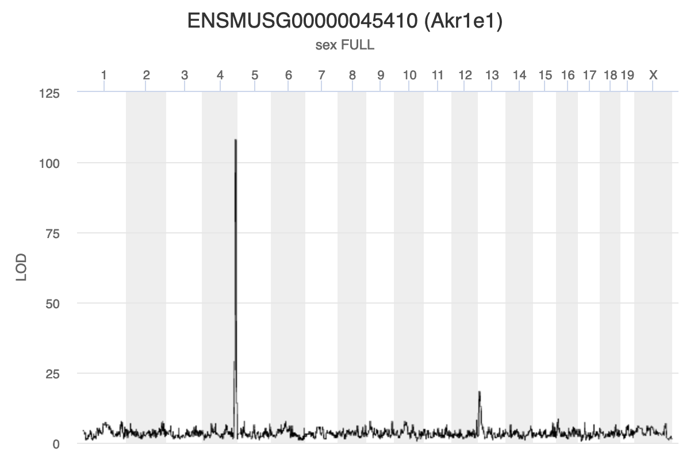
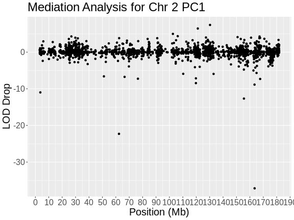

:::::::::::::::::::::::::::::::::::::: questions 

- What is mediation analysis?
- How do I explore causal relations with mediation analysis?

::::::::::::::::::::::::::::::::::::::::::::::::

::::::::::::::::::::::::::::::::::::: objectives

- Describe mediation analysis as applied in genetics and genomics.

::::::::::::::::::::::::::::::::::::::::::::::::


``` r
library(knitr)
library(tidyverse)
library(qtl2)
#library(enrichR)

pheno      <- readRDS(file = 'data/attie_do_pheno.rds')
pheno_dict <- readRDS(file = 'data/attie_do_pheno_dict.rds')
covar      <- readRDS(file = 'data/attie_do_covar.rds')
covar$DOwave <- factor(covar$DOwave)
addcovar   <- model.matrix(~sex + DOwave, data = covar)[,-1]
annot      <- readRDS(file = 'data/attie_do_expr_annot.rds')
expr_rz    <- readRDS(file = 'data/attie_do_expr_rz.rds')
map        <- readRDS(file = 'data/attie_do_map.rds')
probs      <- readRDS(file = url('https://thejacksonlaboratory.box.com/shared/static/4hy4hbjyrxjbrzh570i4g02r62bx3lgk.rds'))
K          <- readRDS(file = 'data/attie_do_kinship.rds')
ins_tauc   <- pheno[, 'Ins_tAUC', drop = FALSE]
ins_tauc$Ins_tAUC_log <- log(ins_tauc$Ins_tAUC)
ins_lod    <- readRDS(file = 'data/ins_tauc_lod.rds')
eperm      <- readRDS(file = 'data/ENSMUSG00000020679_perm_1000.rds')
hotspots   <- readRDS(file = 'data/eqtl_hotspots.rds')
pc1_2      <- readRDS(file = 'data/eqtl_hotspot_chr2_pc1.rds')
pc1_lod    <- readRDS(file = 'data/eqtl_hotspot_chr2_pc1_lod.rds')
```

## Introduction

GWAS studies show that most disease-associated variants are found in non-coding
regions. This fact leads to the idea that regulation of gene expression is an
important mechanism enabling genetic variants to affect complex traits. 
Mediation analysis can identify a causal chain from genetic variants to 
molecular and clinical phenotypes. The graphic below shows complete mediation,
in which a predictor variable does not directly impact the response variable.
Rather, it directly influences the mediator (path a). The mediator has a direct 
impact on the response variable (path b). We would see (path c) the relationship 
between predictor and response, not knowing that a mediator intervenes in this
relationship.

{alt="Mediation Analysis"}

Mediation analysis is widely used in the social sciences including psychology. 
In biomedicine, mediation analysis has been employed to investigate how gene 
expression mediates the effects of genetic variants on complex phenotypes and 
disease.

For example, a genetic variant (non-coding SNP) indirectly regulates expression 
of gene 2 through a mediator, gene 1. The SNP regulates expression of gene 1 in 
cis, and expression of gene 1 influences expression of gene 2 in trans.  

{alt="mediation figure"}

Instead of the expression of one gene impacting another, expression of gene 1 in
the graphic above could impact a physiological phenotype like blood glucose. 
Expression of gene 1 would mediate the relationship between the non-coding SNP
and the glucose phenotype.

Gene Akr1e1 is located on chromosome 13 in mouse. 

{alt="Akr1e1 QTL plot"}

:::::::::::::::::::::::::::::::::::::::::::::::::::::::::: challenge

### Challenge 1: Interpreting *Akr1e1* eQTL plot.

How would you interpret the *Akr1e1* LOD plot above? On which chromosome(s) 
would you expect to find the driver gene(s)? The SNP(s)?

:::::::::::::::::::::::::::::::::::::::::: solution

*Ark1e1* expression is regulated by some variants on chromosome 13 and other 
variants on chromosome 4. The largest driver gene occurs on chromosome 4 because
the LOD peak is higher there, indicating that the genotype on chromosome 4 
explains more of the variance than the one on chromosome 13.

:::::::::::::::::::::::::::::::::::::::::::::::::::
::::::::::::::::::::::::::::::::::::::::::::::::::::::::::::::::::::

Myo15b is located on chromosome 11.

{alt="Myo15b QTL plot"}

:::::::::::::::::::::::::::::::::::::::::::::::::::::::::: challenge

### Challenge 2: Interpreting *Myo15b* eQTL plot.

How would you interpret the *Myo15b* LOD plot above? On which chromosome(s) 
would you expect to find the driver gene(s)? The SNP(s)?

:::::::::::::::::::::::::::::::::::::::::: solution

*Myo15b* is regulated by variants on chromosome 2 because the largest LOD peak
is located there.

:::::::::::::::::::::::::::::::::::::::::::::::::::
::::::::::::::::::::::::::::::::::::::::::::::::::::::::::::::::::::

## Using Gene Expression as a Covariate

When we are searching for a gene whose expression influences a physiological 
phenotype, we may not be looking for a missense SNP in the the gene. Instead,
we may be looking for a SNP in a regulatory region which influence the 
expression of the gene, which in turn influences the physiological phenotype.
However, the exact sequence of regulatory regions and the genes that they 
influence is not as well annotated as protein-coding regions of genes. So, 
rather than search for the regulatory SNP, we will search for genes which 
influence the trait and we will not seek to identify the causal SNP.

Next, we are going to create our own mediation function. We will walk through it
step-by-step so that you understand why we are performing each step.

Mediation analysis bring together a lot of information, to the function will
have a LOT of variables.

First, we need to pass in the chromosome, position, and LOD socre of the QTL
at which we are mapping. Remember, in a mediation scan, we map a phenotype at 
**ONE** locus and use different genes as covariates.

Next, since we are mapping, we need to pass in the genoprobs, the original 
phenotype which produced the QTL peak, the kinship matrices, the covariates
matrix, and the markers map. In this case, our "phenotype" will be PC1 from the
genes in the chromosome 2 eQTL hotspot.

The last two arguments will be the expression matrix and the gene annotation.

With all of those pieces in place, we will build the function below.


``` r
# Perform mediation analysis on one locus using all of the available genes on
# the corresponding chromosome.
# qtl_chr: character string containing one of the chromosome names in genoprobs.
#      Must be 1:19 or X.
# qtl_pos: floating point number that is the Mb position of the QTL to map at.
# qtl_lod: floating point number that is the LOD score at the QTL.
# genoprobs: qtl2-style list containing genoprobs for all chromosomes.
# pheno: numeric matrix containing one column with the phenotype values. Sample
#        IDs must be in rownames.
# K: qtl2-style list of LOCO kinship matrices.
# addcovar: numeric matrix of additive covariate created with something like
#           model.matrix(). Must be ready to pass into scan1() directly.
# map: qtl2-style list containing marker map. Markers must match the markers in
#      genoprobs.
# expr: numeric matrix of normalized expression values. Sample in rows and genes
#       in columns.
# annot: data.frame containing the gene annotation. Genes in rows must be in the
#        same order as the genes in columns in "expr".
mediation <- function(qtl_chr, qtl_pos, qtl_lod, genoprobs, pheno, K, addcovar, 
                      map, expr, annot) {

  # Get the genoprobs at the QTL peak.
  pr <- pull_genoprobpos(genoprobs = probs,
                         map       = map, 
                         chr       = qtl_chr, 
                         pos       = qtl_pos)

  # Get the genes on chromosome 11.
  genes_chr <- annot |>
                 filter(chr == qtl_chr) |>
                 pull(gene_id)
  expr_chr  <- expr_rz[, genes_chr]

  # Subset the covariates to include only the samples in the expression data.
  addcovar_expr <- addcovar[rownames(expr_chr),]

  # Create the results.
  results <- data.frame(gene_id  = colnames(expr_chr),
                        base_lod = qtl_lod,
                        med_lod  = 0) |>
             left_join(select(annot, gene_id, symbol, middle))
  
  # Loop through each gene, add it to the covariates, and map it at the QTL 
  # marker.
  t_init <- proc.time()[3]
  
  for(i in 1:ncol(expr_chr)) {
    
    # Show progress.
    if(i %% 50 == 0) {
      
      t2 <- proc.time()[3]
      print(paste(i, 'of', ncol(expr_chr), ":", (t2 - t_init), "seconds elapsed."))
      
    } # for(i)
  
    # Create covariates with the current gene's expression.
    addcovar_tmp = cbind(addcovar_expr, expr_chr[,i])

    # Fit the QTL model at the QTL marker with the new covariates.
    mod <- fit1(genoprobs = pr,
                pheno     = pheno,
                kinship   = K[[qtl_chr]],
                addcovar  = addcovar_tmp)
  
    # Add the LOD to the results.
    results$med_lod[i] <- mod$lod
    
  } # for(i)

  # Subtract the meditation LODs from the baseline LOD.
  results <- results |>
               mutate(lod_drop = med_lod - base_lod)
  
  # Return the results.
  return(results)

} # mediation()
```


``` r
qtl_pos <- mean(hotspots[["2"]]$qtl_pos)

med_2 <- mediation(qtl_chr  = "2", 
                   qtl_pos  = qtl_pos,
                   qtl_lod  = max(pc1_lod), 
                   genoprobs = probs, 
                   pheno    = pc1_2, 
                   K        = K, 
                   addcovar = addcovar, 
                   map      = map, 
                   expr     = expr_rz, 
                   annot    = annot)
```

``` output
[1] "50 of 1892 : 3.401 seconds elapsed."
[1] "100 of 1892 : 6.768 seconds elapsed."
[1] "150 of 1892 : 10.143 seconds elapsed."
[1] "200 of 1892 : 13.656 seconds elapsed."
[1] "250 of 1892 : 17.038 seconds elapsed."
[1] "300 of 1892 : 20.52 seconds elapsed."
[1] "350 of 1892 : 23.906 seconds elapsed."
[1] "400 of 1892 : 27.241 seconds elapsed."
[1] "450 of 1892 : 30.65 seconds elapsed."
[1] "500 of 1892 : 33.985 seconds elapsed."
[1] "550 of 1892 : 37.315 seconds elapsed."
[1] "600 of 1892 : 40.679 seconds elapsed."
[1] "650 of 1892 : 44.02 seconds elapsed."
[1] "700 of 1892 : 47.343 seconds elapsed."
[1] "750 of 1892 : 50.672 seconds elapsed."
[1] "800 of 1892 : 53.989 seconds elapsed."
[1] "850 of 1892 : 57.32 seconds elapsed."
[1] "900 of 1892 : 60.657 seconds elapsed."
[1] "950 of 1892 : 63.977 seconds elapsed."
[1] "1000 of 1892 : 67.303 seconds elapsed."
[1] "1050 of 1892 : 70.621 seconds elapsed."
[1] "1100 of 1892 : 73.94 seconds elapsed."
[1] "1150 of 1892 : 77.27 seconds elapsed."
[1] "1200 of 1892 : 80.612 seconds elapsed."
[1] "1250 of 1892 : 83.948 seconds elapsed."
[1] "1300 of 1892 : 87.283 seconds elapsed."
[1] "1350 of 1892 : 90.627 seconds elapsed."
[1] "1400 of 1892 : 93.984 seconds elapsed."
[1] "1450 of 1892 : 97.311 seconds elapsed."
[1] "1500 of 1892 : 100.639 seconds elapsed."
[1] "1550 of 1892 : 103.972 seconds elapsed."
[1] "1600 of 1892 : 107.31 seconds elapsed."
[1] "1650 of 1892 : 110.654 seconds elapsed."
[1] "1700 of 1892 : 113.977 seconds elapsed."
[1] "1750 of 1892 : 117.326 seconds elapsed."
[1] "1800 of 1892 : 120.808 seconds elapsed."
[1] "1850 of 1892 : 124.168 seconds elapsed."
```

Now that we have the change in LOD scores associated with using each gene as a
covariate, we can plot the LOD change along chromosome 11.


``` r
end  <- ceiling(max(med_2$middle / 10))

med_2 |>
  ggplot(aes(middle, lod_drop)) +
    geom_point() +
    scale_x_continuous(breaks = 0:end * 10) +
    labs(title = "Mediation Analysis for Chr 2 PC1",
         x     = "Position (Mb)",
         y     = "LOD Drop") +
    theme(size = element_text(size = 20))
```

``` warning
Warning in plot_theme(plot): The `size` theme element is not defined in the
element hierarchy.
```



In the plot above, the position of each gene along chromosome 2 is shown on the
X-axis and the LOD drop is shown on the Y-axes. Most genes don't change the LOD
score by very much. It seems that, by chance, LOD scores can vary by plus or
minus 3. In this case, we are searching for genes which decrease the LOD score
by the largest amount. In this case, there is one gene which reduces the LOD .


``` r
med_2 |>
  filter(lod_drop < -20)
```

``` output
             gene_id base_lod med_lod symbol    middle  lod_drop
1 ENSMUSG00000017950 97.61195 60.5270  Hnf4a 163.53986 -37.08495
2 ENSMUSG00000035000 97.61195 73.3269   Dpp4  62.37115 -24.28505
```

::::::::::::::::::::::::::::::::::::: challenge 

#### Challenge 1: Keller et al chromosome 2 hotspot candidate gene?

Look at Figure 4C in 
[Keller et al](https://pmc.ncbi.nlm.nih.gov/articles/PMC5937189/) and see 
which gene the selected in their mediaiton analysis.

:::::::::::::::::::::::: solution 

The authors found that *Hnf4a* reduces the LOD more than any other gene.

:::::::::::::::::::::::::::::::::

#### Challenge 2: Look up *Dpp4* in [Pubmed](https://pubmed.ncbi.nlm.nih.gov/) 
or 
[Alliance Genome](https://www.alliancegenome.org/) and see if it has any
known association with type 2 diabetes or insulin metabolism.

:::::::::::::::::::::::: solution 

[Alliance Genome](https://www.alliancegenome.org/gene/MGI:94919) says that 
"Human ortholog(s) of this gene implicated in ... type 2 diabetes mellitus."

:::::::::::::::::::::::::::::::::
::::::::::::::::::::::::::::::::::::::::::::::::

Let's look more closely at *Hnf4a*. First, let's map the expresson of *Hnf4a*.


``` r
hnf4a     <- annot[annot$symbol == "Hnf4a",]$gene_id
hnf4a_lod <- scan1(genoprobs = probs,
                  pheno     = expr_rz[,hnf4a, drop = FALSE],
                  kinship   = K,
                  addcovar  = addcovar)
plot(hnf4a_lod, map, title = "Hnf4a Genome Scan")
```

``` warning
Warning in plot.xy(xy.coords(x, y), type = type, ...): "title" is not a
graphical parameter
Warning in plot.xy(xy.coords(x, y), type = type, ...): "title" is not a
graphical parameter
Warning in plot.xy(xy.coords(x, y), type = type, ...): "title" is not a
graphical parameter
Warning in plot.xy(xy.coords(x, y), type = type, ...): "title" is not a
graphical parameter
Warning in plot.xy(xy.coords(x, y), type = type, ...): "title" is not a
graphical parameter
Warning in plot.xy(xy.coords(x, y), type = type, ...): "title" is not a
graphical parameter
Warning in plot.xy(xy.coords(x, y), type = type, ...): "title" is not a
graphical parameter
Warning in plot.xy(xy.coords(x, y), type = type, ...): "title" is not a
graphical parameter
Warning in plot.xy(xy.coords(x, y), type = type, ...): "title" is not a
graphical parameter
Warning in plot.xy(xy.coords(x, y), type = type, ...): "title" is not a
graphical parameter
Warning in plot.xy(xy.coords(x, y), type = type, ...): "title" is not a
graphical parameter
Warning in plot.xy(xy.coords(x, y), type = type, ...): "title" is not a
graphical parameter
Warning in plot.xy(xy.coords(x, y), type = type, ...): "title" is not a
graphical parameter
Warning in plot.xy(xy.coords(x, y), type = type, ...): "title" is not a
graphical parameter
Warning in plot.xy(xy.coords(x, y), type = type, ...): "title" is not a
graphical parameter
Warning in plot.xy(xy.coords(x, y), type = type, ...): "title" is not a
graphical parameter
Warning in plot.xy(xy.coords(x, y), type = type, ...): "title" is not a
graphical parameter
Warning in plot.xy(xy.coords(x, y), type = type, ...): "title" is not a
graphical parameter
Warning in plot.xy(xy.coords(x, y), type = type, ...): "title" is not a
graphical parameter
Warning in plot.xy(xy.coords(x, y), type = type, ...): "title" is not a
graphical parameter
```


In the plot above, we can see that *Hnf4a* has a QTL peak on chromosome 2.

::::::::::::::::::::::::::::::::::::::::::::::::::::::::: challenge

#### Challenge 3: Find the *Hnf4a* QTL peak location.

Use find_peaks() to find the position of the *Hnf4a* QTL peak. What kind of eQTL
would you call this peak? Local or distant? How does this peak location compare
with the location of the chromosome 2 eQTL hotspot?

::::::::::::::::::::::::::::::::::::: solution


``` r
find_peaks(hnf4a_lod, map = map, threshold = 8)
```

``` output
  lodindex          lodcolumn chr      pos      lod
1        1 ENSMUSG00000017950   2 164.0224 49.60808
```

*Hnf4a* has a QTL peak on chromosome 2 at 164 Mb. 

This is the same position as the chromosome 2 eQTL hotspot.

Since *Hnf4a* is located at 163.4 Mb and its largest eQTL is located at 164 Mb,
we could call this a local eQTL.

::::::::::::::::::::::::::::::::::::::::::::::
:::::::::::::::::::::::::::::::::::::::::::::::::::::::::::::::::::


These are the primary steps in mediation analysis. As you can see, sometimes,
meditation analysis can point to a candidate gene that is plausible. It is 
always important to remember that there may be more than one causal gene and
that causal genes may contain missense or splice SNPs which affect gene
expression levels.


``` r
# dbs <- c("GO_Biological_Process_2018", 
#          "GO_Cellular_Component_2018", 
#          "GO_Molecular_Function_2018")
# 
# hot_2 <- hotspots[["2"]] |>
#            filter(abs(qtl_pos - 164) < 0.1)
# 
# enr_res <- enrichr(hot_2$symbol, dbs)
```


``` r
#head(enr_res$GO_Biological_Process_2018)
```


### Interactive QTL Viewer

The [QTL Viewer](https://churchilllab.jax.org/qtlviewer/attie/islets#) 
for the Attie islet data integrates mediation into exploration of the data. 
Below, mediation analysis identifies gene Hnf4a as the chromosome 2 gene that 
impacts Myo15b expression.

{alt="Hnf4a mediation"}

::::::::::::::::::::::::::::::::::::: keypoints 

- Mediation analysis investigates an intermediary between an independent 
variable and its effect on a dependent variable.
- Mediation analysis is used in high-throughput genomics studies to identify 
molecular phenotypes, such as gene expression or methylation traits, that 
mediate the effect of genetic variation on disease phenotypes or other outcomes 
of interest.

::::::::::::::::::::::::::::::::::::::::::::::::
