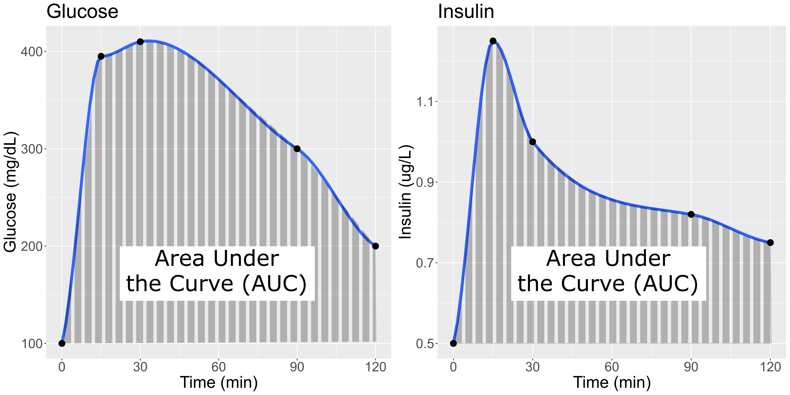

---
title: "Genetic Drivers of Pancreatic Islet Function"
teaching: 15
exercises: 15
---

:::::::::::::::::::::::::::::::::::::: questions 

- What is the hypothesis of an example eQTL study?

::::::::::::::::::::::::::::::::::::::::::::::::

::::::::::::::::::::::::::::::::::::: objectives

- Describe an example eQTL study in Diversity Outbred mice.
- State the hypothesis from an example eQTL study in Diversity Outbred mice.

::::::::::::::::::::::::::::::::::::::::::::::::

Genome-wide association studies (GWAS) often identify variants in non-coding 
regions of the genome, indicating that regulation of gene expression 
predominates in common diseases like type II diabetes. Most of the more than 100 
genetic loci associated with type II diabetes affect the function of pancreatic 
islets, which produce insulin for regulating blood glucose levels. 
Susceptibility to type II diabetes (T2D) increases with obesity, such that 
T2D-associated genetic loci operate mainly under conditions of obesity (See 
[Keller, Mark P et al. “Genetic Drivers of Pancreatic Islet Function.” Genetics vol. 209,1 (2018): 335-356](https://www.ncbi.nlm.nih.gov/pmc/articles/PMC5937189/)). Like 
most GWAS loci, the T2D-associated genetic loci identified from genome-wide 
association studies (GWAS) have very small effect sizes and odds ratios just 
slightly more than 1.

This study explored islet gene expression in diabetes. The authors hypothesized 
that gene expression changes in response to dietary challenge would reveal 
signaling pathways involved in stress responses. The expression of many genes
often map to the same locus, indicating that expression of these genes is
controlled in common. If their mRNAs encode proteins with common physiological 
functions, the function of the controlling gene(s) is revealed. Variation in 
expression of the controlling gene(s), rather than a genetic variant, can be 
tested as an immediate cause of a disease-related phenotype.

In this study, Diversity Outbred (DO) mice were fed a high-fat, high-sugar diet 
as a stressor, sensitizing the mice to develop diabetic traits. Body weight and 
plasma glucose, insulin, and triglyceride measurements were taken biweekly. 
Food intake could be measured since animals were individually housed. A glucose 
tolerance test at 18 weeks of age provided measurement of dynamic glucose and 
insulin changes at 5, 15, 30, 60 and 120 minutes after glucose administration. 
Area under the curve (AUC) was determined from these time points for both plasma 
glucose and insulin levels. Homeostatic model assessment (HOMA) of insulin 
resistance (IR) and pancreatic islet function (B) were determined after the 
glucose tolerance test was given. Islet cells were isolated from pancreas, and 
RNA extracted and libraries constructed from isolated RNA for gene expression 
measurements.

{alt="Figure showing glucose and insulin changes over time."}

In the figure above, time is plotted on the X-axis and glucose or insulin levels
are plotted on the Y-axis. Blood is taken at the beginning of the test and at
several time points after the glucose bolus. The glucose or insulin
AUC is the area under the measured points down to the baseline level.

Genome scans were performed with the leave-one-chromosome-out (LOCO) method for
kinship correction. Sex and experimental cohort (DO wave) were used as 
covariates. The results of one scan for insulin area under the curve (AUC) is 
shown below with a strong peak on chromosome 11. In this lesson, we will look
into genes located under this peak.

  
In this lesson we revisit genetic mapping of quantitative traits and apply its
methods to gene expression. The examples are from 
[Genetic Drivers of Pancreatic Islet Function](https://doi.org/10.1534/genetics.118.300864)
by Keller, et al. In Type 2 diabetes (T2D) the pancreas produces less insulin 
and the body becomes less responsive to insulin.

{alt="Figure showing Type 2 diabetes and insulin."}
Created in [BioRender](https://BioRender.com)

This study offers supporting evidence for type 2 diabetes-associated loci in 
human GWAS, most of which affect pancreatic islet function. Pancreatic islet
cells produce endocrine hormones including insulin. A feedback loop of glucose
and insulin activates beta cells that produce insulin and inhibits alpha cells.

{alt="Figure showing the Islet of Langerhans in the pancreas, which is composed of alpha, beta, delta and gamma cells."}
Created in [BioRender](https://BioRender.com)

The study assessed pancreatic islet gene expression in Diversity Outbred mice on 
either a regular chow or high-fat, high-sugar diet. Islet mRNA abundance was 
quantified and analyzed. The study identified more than 18,000 eQTL peaks.

Genome-wide association studies (GWAS) often identify variants in non-coding 
regions of the genome, indicating that regulation of gene expression 
predominates in common diseases like type II diabetes. Most of the more than 100 
genetic loci associated with type II diabetes affect the function of pancreatic 
islets, which produce insulin for regulating blood glucose levels. 
Susceptibility to type II diabetes (T2D) increases with obesity, such that 
T2D-associated genetic loci operate mainly under conditions of obesity (See 
[Keller, Mark P et al. “Genetic Drivers of Pancreatic Islet Function.” Genetics vol. 209,1 (2018): 335-356](https://www.ncbi.nlm.nih.gov/pmc/articles/PMC5937189/)). Like 
most GWAS loci, the T2D-associated genetic loci identified from genome-wide 
association studies (GWAS) have very small effect sizes and odds ratios just 
slightly more than 1.

This study explored islet gene expression in diabetes. The authors hypothesized 
that gene expression changes in response to dietary challenge would reveal 
signaling pathways involved in stress responses. The expression of many genes
often map to the same locus, indicating that expression of these genes is
controlled in common. If their mRNAs encode proteins with common physiological 
functions, the function of the controlling gene(s) is revealed. Variation in 
expression of the controlling gene(s), rather than a genetic variant, can be 
tested as an immediate cause of a disease-related phenotype.

In this study, Diversity Outbred (DO) mice were fed a high-fat, high-sugar diet 
as a stressor, sensitizing the mice to develop diabetic traits. Body weight and 
plasma glucose, insulin, and triglyceride measurements were taken biweekly. 
Food intake could be measured since animals were individually housed. A glucose 
tolerance test at 18 weeks of age provided measurement of dynamic glucose and 
insulin changes at 5, 15, 30, 60 and 120 minutes after glucose ingestion. 
Area under the curve (AUC) was determined from these time points for both plasma 
glucose and insulin levels. 

{alt="A plot showing four different curves reflecting insulin levels after administration of glucose starting at time zero"}

[Homeostatic model assessment](https://en.wikipedia.org/wiki/Homeostatic_model_assessment)
(HOMA) quantifies insulin resistance (IR) and beta cell ($\beta$) function. For
IR, the equation quantifying insulin resistance is the product of glucose and
insulin in mg/dL divided by 405.

$HOMA-IR = (glucose \times insulin) / 405$

For beta cell function, the equation is 

$HOMA-\beta = (360 \times insulin) / (glucose - 63)$

expressed as a percentage. Insulin resistance and beta cell function were 
determined after the glucose tolerance test was given. Islet cells were isolated 
from pancreas, and RNA extracted and libraries constructed from isolated RNA for 
gene expression measurements.

Genome scans were performed with the leave-one-chromosome-out (LOCO) method for
kinship correction. Sex and experimental cohort (DO wave) were used as 
covariates. The results of one scan for insulin area under the curve (AUC) is 
shown below with a strong peak on chromosome 11. In this lesson, we will look
into genes located under this peak.

{alt="Insulin AUC LOD plot"}
::::::::::::::::::::::::::::::::::::: keypoints 

- Many GWAS studies identify SNPs which to no lie within coding regions of the
genome.
- This implies that the SNPs lie within regulatory sequences which affect gene
expression levels.
- Merging gene expression with physiological trait QTL mapping can help to
identify genes which affect physiological trait variation.

::::::::::::::::::::::::::::::::::::::::::::::::
