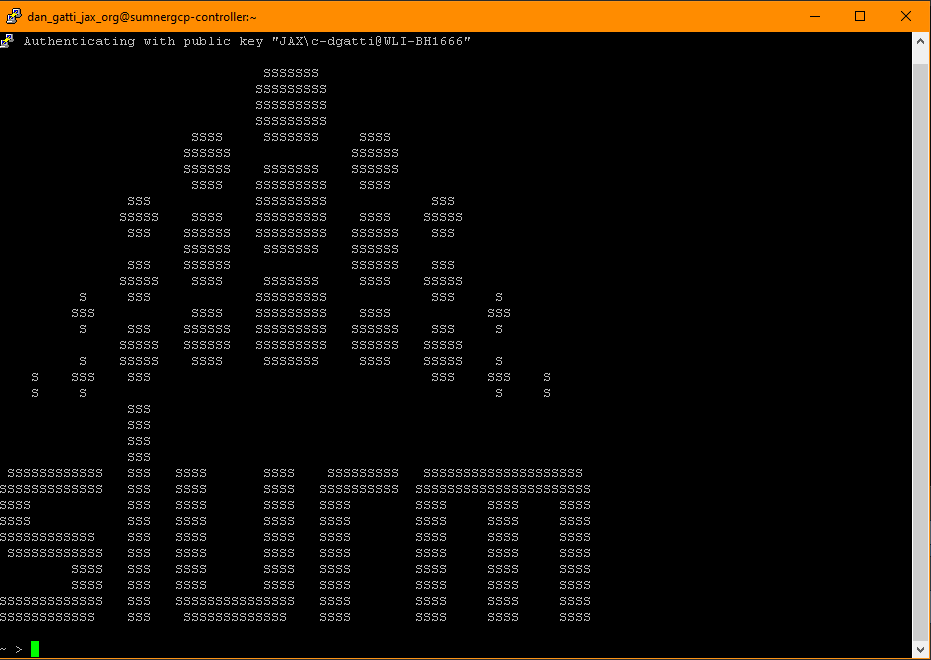

## Data Sets

<!--
FIXME: place any data you want learners to use in `episodes/data` and then use
       a relative link ( [data zip file](data/lesson-data.zip) ) to provide a
       link to it, replacing the example.com link.
-->
Download the [data zip file](https://example.com/FIXME) and unzip it to your Desktop

## Software Setup

Install Gcloud tools.

Open a Google Cloud SDK Shell window and run the following command:

```
gcloud compute ssh --zone "us-east1-b" "sumnergcp-controller" --tunnel-through-iap --project "jax-presgraves-edusumner2"
```

This will open another terminal window which will connect to the Google Cloud
Platform (GCP).

{alt="Picture of slurm window open on GCP"}

Next, type the following command:

```
module load rstudio
```

This will produce the following message:

```
Rstudio 4.4.1 loaded. Use the command 'sbatch -w sumnergcp-computenodeset-1 
rstudio-session.job' to start a new session on node 2. You can change the node 
number if you want to run on a different node. The cluster has 30 compute nodes
ranging from 0 to 29
```

Follow the instructions in the message by typing the following command into
the GCP window.

```
sbatch -w sumnergcp-computenodeset-1 rstudio-session.job
```

This will start a compute queue job which will be reported as:

```
Submitted batch job <N>
```

where <N> is an integer that is your slurm job ID. The login node is spawning
a compute node where RStudio will run.

After about two minutes, you should see a file like this in your home directory:

```
rstudio-server.job.<N>
```

where <N> is the same integer as your batch job ID.

View the contents of the file using teh `cat` command:

```
cat rstudio-server.job.<N>
```

You will be instructions which tell you how to access your GCP RStudio 
instance along with a user name and password.

```
> cat rstudio-server.job.53 
**********************************************************************
  RStudio server IP address: 35.196.22.80
  The name of the compute instance running the server is sumnergcp-computenodeset-1
***********************************************************************

Follow the instaructions below to connect to your 
rstudio instance:

1. point your web browser to http://35.196.22.80:8787
2. log in to RStudio Server using the following credentials:

  user: dan_gatti_jax_org
  password: Dw7Qr3ejbOwBmtOPHxQt

When done using RStudio Server, terminate the job by:

1. Exit the RStudio Session ("power" button in the top right corner of the RStudio window)
2. Issue the following command on the login node:

      scancel -f 53
```

Install R packages:

```{r eval=FALSE}
install.packages(c('BiocManager', 'remotes', 'tidyverse', 'qtl2'))
```

```{ eval=FALSE}
remotes::install_github('churchill-lab/intermediate')
```

<!-- DMG: STOPPED HERE -->

::::::::::::::::::::::::::::::::::::::: discussion

### Details

Setup for different systems can be presented in dropdown menus via a `spoiler`
tag. They will join to this discussion block, so you can give a general overview
of the software used in this lesson here and fill out the individual operating
systems (and potentially add more, e.g. online setup) in the solutions blocks.

:::::::::::::::::::::::::::::::::::::::::::::::::::

:::::::::::::::: spoiler

### Windows

Use PuTTY

::::::::::::::::::::::::

:::::::::::::::: spoiler

### MacOS

Use Terminal.app

::::::::::::::::::::::::


:::::::::::::::: spoiler

### Linux

Use Terminal

::::::::::::::::::::::::

